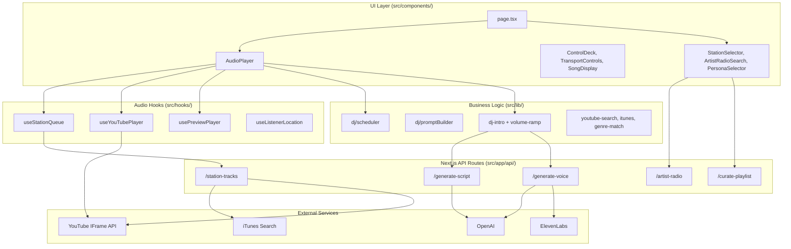
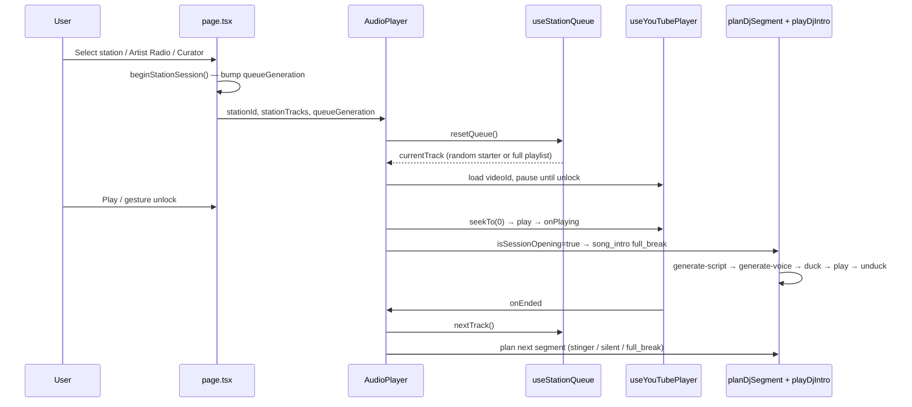
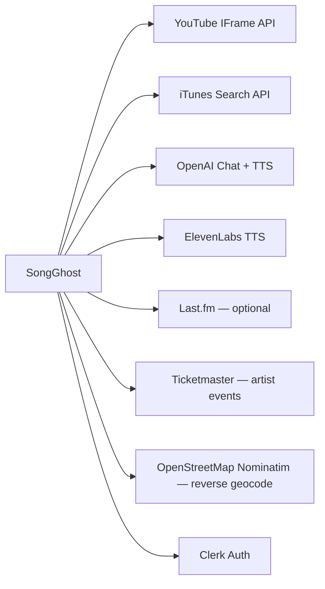

# SongGhost Architecture

SongGhost is an AI-powered broadcast radio platform built on Next.js 15. It delivers zero-gap-style continuous playback, dynamic DJ voice overlays, and multiple station launch paths (preset genres, Artist Radio, and AI Curator). This document describes how the system is structured today (Phase 1) and how interfaces are laid out for future milestones.

For milestone sequencing, see [ROADMAP.md](./ROADMAP.md).

---

## Tech Stack

| Layer | Technology |
|-------|------------|
| Framework | Next.js 15 (App Router), React 19 |
| Language | TypeScript 5.8 |
| Styling | Tailwind CSS 4 — "CA Dreamin'" warm vintage radio aesthetic |
| Auth | Clerk (`@clerk/nextjs`) |
| LLM | OpenAI GPT-4o-mini (DJ scripts, AI Curator) |
| TTS | OpenAI `tts-1` (Free tier), ElevenLabs REST (Pro tier) |
| Music sources | YouTube IFrame API, iTunes Search API (preview fallback) |
| Similar artists | Last.fm (optional) |
| Local events | Ticketmaster / artist-events API |
| Testing | Vitest (DJ scheduler unit tests) |

---

## High-Level System Diagram



---

## Architectural Principles

These guardrails are enforced across the codebase and documented in `.cursor/rules/songghost.mdc`.

1. **Audio engine isolation** — Queue logic, YouTube/preview playback, and DJ voice nodes stay decoupled. UI components glue hooks together; they do not embed playback logic.

2. **Interface-first design** — Track providers and voice providers are defined in `src/types/audio.ts` and `src/types/dj.ts`. Adapters (YouTube, Spotify, ElevenLabs, Cartesia) must remain interchangeable.

3. **Stable React dependencies** — Custom audio hooks stabilize props and callbacks in refs at the top of the hook. Raw inline arrays, objects, or unstable callbacks never appear in `useEffect` dependency arrays.

4. **Throttled failure handling** — YouTube embed failures trigger bounded retry/skip logic, not infinite loops.

5. **Phase discipline** — Phase 2+ features (sidechain engine abstraction, WebSocket streaming, Spotify SDK) are typed but not implemented until their milestone.

---

## Directory Structure

```text
src/
├── app/
│   ├── page.tsx              # Main radio console (session orchestration)
│   ├── layout.tsx            # Clerk + UserPreferences providers
│   ├── globals.css           # CA Dreamin' theme tokens
│   └── api/                  # Server-side integrations (see API Routes)
├── components/               # Presentational UI — no business logic
├── context/
│   └── UserPreferencesContext.tsx
├── data/
│   ├── stations.ts           # Preset stations + StationTrack type
│   ├── personas.ts           # DJ personas (voice + system prompt)
│   ├── presets.ts
│   ├── extra-genres.ts       # Paginated genre expansion (50+)
│   └── extra-decades.ts      # Paginated decades expansion (15+)
├── hooks/
│   ├── useStationQueue.ts    # Infinite queue + replenishment
│   ├── useYouTubePlayer.ts   # YouTube IFrame API lifecycle
│   ├── usePreviewPlayer.ts   # iTunes 30s preview fallback
│   ├── usePreviewPlayer.ts
│   └── useListenerLocation.ts
├── lib/
│   ├── dj/
│   │   ├── scheduler.ts      # DJ pacing state machine
│   │   ├── promptBuilder.ts  # LLM prompt variety engine
│   │   └── __tests__/
│   ├── dj-intro.ts           # Script → voice → duck/unduck orchestration
│   ├── dj-script.ts          # Sanitization + TTS formatting
│   ├── volume-ramp.ts        # Smooth volume transitions
│   ├── audio-unlock.ts       # Browser autoplay unlock coordination
│   ├── youtube-search.ts     # YouTube video resolution
│   ├── youtube.ts            # Thumbnail + ID validation
│   ├── itunes.ts             # iTunes Search API adapter
│   ├── artist-radio.ts       # Artist Radio result builder
│   ├── genre-match.ts        # Station genre filtering
│   ├── station-genre-profiles.ts
│   ├── similar-artists.ts    # Last.fm integration
│   ├── artist-events.ts      # Local concert lookup
│   ├── track-quality.ts      # Artist Radio title filtering
│   └── failed-youtube-ids.ts # Client-side failure tracking
└── types/
    ├── audio.ts              # TrackProvider, VoiceNode, DualTrackMix
    ├── dj.ts                 # DJPromptContext, DjSegmentPlan
    ├── voice.ts              # TtsProvider, VoiceOption
    ├── user.ts               # UserPreferences, tiers
    └── curator.ts            # AI Curator result shape
```

---

## Core Type Contracts

### Music pipeline (`src/types/audio.ts`)

| Type | Purpose |
|------|---------|
| `AudioTrack` | Canonical track shape (provider-agnostic id, title, artist, metadata) |
| `TrackProvider` | Interchangeable music adapter interface (YouTube, Spotify, iTunes, Apple Music) |
| `VolumeController` | Normalized 0–1 bus with `rampVolume()` for sidechain ducking |
| `VoiceNode` | DJ voice layer — buffered today, stream-ready for Phase 3 |
| `DualTrackMix` | Phase 2+ wiring of music + voice buses with ducking config |

Current implementation uses concrete hooks (`useYouTubePlayer`, `usePreviewPlayer`) rather than a formal `TrackProvider` class, but all new adapters should implement the interface.

### DJ pipeline (`src/types/dj.ts`)

| Type | Purpose |
|------|---------|
| `DjSegmentPlan` | Planned break: kind, tracks to announce, duration, local event |
| `DjTransitionType` | `full_break` \| `stinger` \| `silent` |
| `DJPromptContext` | Full LLM input contract including persona, pacing, hyper-local context |
| `HyperLocalContext` | Phase 3 fields (time of day, weather, news) — typed, not yet injected |

---

## Session Lifecycle

A listening session begins when the user selects a station, launches Artist Radio, or loads an AI Curator playlist.



### Queue generation rules (`useStationQueue.ts`)

| Launch path | Station ID prefix | Queue behavior |
|-------------|-------------------|----------------|
| Preset genre/decade | (none) | Random single starter from seeds → API replenishment |
| Artist Radio | `artist-radio-` | Preserve API order; no replenishment |
| AI Curator | `ai-curator-` | Shuffle full playlist; no replenishment |

Replenishment triggers when fewer than 3 tracks remain ahead of the playhead. Preset stations call `GET /api/station-tracks` with an exclude list of recently played IDs (last 100).

---

## Audio Pipeline

### YouTube playback (`useYouTubePlayer.ts`)

The YouTube player mounts imperatively inside a hidden off-screen container. Key behaviors:

- **First-song invariant**: Pause until audio unlock → single `seekTo(0)` → play → emit `onPlaying` once per track load.
- **Audio unlock**: Coordinates with `audio-unlock.ts` via retry loop (400ms intervals, max 30 attempts).
- **Error throttling**: `onError` fires at most once per 2s; code-2 errors within 2.5s of load are ignored.
- **DJ ducking**: When `djIntroActiveRef` is true, master volume sync is skipped so ramp logic is not overridden.

### iTunes preview fallback (`usePreviewPlayer.ts`)

When a track has no resolvable YouTube embed but has an iTunes `previewUrl`, playback switches to an HTML5 `<audio>` element. Used automatically when YouTube fails and a preview exists, or as the primary source for preview-only tracks.

### Volume ducking (`dj-intro.ts` + `volume-ramp.ts`)

| Parameter | Value |
|-----------|-------|
| Duck target | 25% of master volume |
| Duck ramp in | 300ms |
| Restore ramp out | 1500ms |

Flow: fetch script → fetch voice blob → ramp music down → play voice → ramp music back up. Aborts cleanly on track skip or station change.

---

## DJ System

### Scheduler (`src/lib/dj/scheduler.ts`)

Pure state machine — no side effects. `planDjSegment(state, input)` returns a transition, optional plan, and next state.

**Pacing frequency** (`djPacingFrequency` from user preferences):

| Pacing | Behavior |
|--------|----------|
| 1 | Alternate `full_break` ↔ `stinger` after opening intro |
| 2 | 1 silent track between each `full_break` |
| 3 | 2 silent tracks between each `full_break` |

**First-song invariant**: `sessionOpeningDjRef` is set `true` only on `stationId` or `queueGeneration` change — never on track advance. Track 1 always receives a `full_break` with `kind: "song_intro"`.

When `planDjSegment()` returns `silent` or `plan: null`, AudioPlayer does not force any DJ intro.

### Prompt variety engine (`src/lib/dj/promptBuilder.ts`)

Rotates commentary styles (`station_banter`, `historical_context`, `artist_trivia`, etc.) and enforces banned opener phrases ("Fun fact:", "Did you know:", etc.). Segment-specific prompts handle recaps, up-next previews, stingers, and local concert mentions.

### Script → voice pipeline

```text
AudioPlayer.onPlaying
  → planDjSegment()
  → playDjIntro()
      → POST /api/generate-script  (GPT-4o-mini)
      → POST /api/generate-voice   (OpenAI tts-1 or ElevenLabs)
      → HTMLAudioElement + volume ramps
```

Pro users (`userTier === "Pro"`) receive ElevenLabs voices; Free tier uses OpenAI TTS. Persona voice mapping lives in `src/data/personas.ts` and `src/types/voice.ts`.

---

## Launch Paths

### 1. Preset stations

Static station definitions in `src/data/stations.ts` plus `src/data/extra-genres.ts` (50+ genres with pagination) and `src/data/extra-decades.ts` (15+ decades with pagination). Each station has seed tracks, a default persona, accent color, and FM frequency.

Catalog depth is expanded at runtime via `/api/station-tracks`, which:

1. Searches YouTube with genre-specific queries
2. Falls back to iTunes catalog search when YouTube results are thin
3. Resolves iTunes songs to YouTube IDs or preview URLs
4. Caches full catalogs for 15 minutes per station

### 2. Artist Radio

`GET /api/artist-radio?artist=...&mode=mixed|artist-only`

- Resolves artist via iTunes Search
- Builds primary track list (strict artist match)
- In `mixed` mode, interleaves similar artists from Last.fm (2 primary : 1 similar)
- Falls back to iTunes 30s previews when YouTube embeds fail
- Promotes a preview-capable track to lead position when the first YouTube-only track would fail silently

Station ID format: `artist-radio-{slug}`.

### 3. AI Curator

`POST /api/curate-playlist` — user prompt → GPT-4o-mini returns station name, persona, accent color, and 10 real songs. Tracks are resolved to YouTube IDs server-side before launch.

Station ID format: `ai-curator-{slug}`.

---

## API Routes

| Route | Method | Purpose |
|-------|--------|---------|
| `/api/generate-script` | POST | LLM DJ script from segment plan + persona |
| `/api/generate-voice` | POST | TTS audio blob (OpenAI or ElevenLabs) |
| `/api/station-tracks` | GET | Infinite catalog replenishment for preset stations |
| `/api/artist-radio` | GET | Build Artist Radio playlist |
| `/api/artist-suggest` | GET | Artist name autocomplete |
| `/api/artist-events` | GET | Local concert lookup for DJ mentions |
| `/api/curate-playlist` | POST | AI Curator station generation |
| `/api/song-search` | GET | On-demand song search for queue insertion |

All routes requiring LLM/TTS keys return 500 when env vars are missing. Keys are server-side only (`OPENAI_API_KEY`, `ELEVENLABS_API_KEY`, `LASTFM_API_KEY`, etc.).

---

## UI Composition

The main console (`src/app/page.tsx`) is a two-column layout:

- **Control deck** (left): Now playing, progress bar, persona selector, transport, volume knob, VU meter
- **Station scroll area** (right): Artist Radio search + genre station grid

`AudioPlayer` is the sole integration point for audio. It exposes an imperative handle:

```typescript
type AudioPlayerHandle = {
  skipNext / skipPrev
  unlockAudio
  getQueue / removeTrack / insertTrackNext / appendTrack
};
```

Components under `src/components/` are presentational. They receive callbacks from `page.tsx` and do not call API routes directly (except modals that initiate searches before session launch).

---

## State Management

| State | Location | Persistence |
|-------|----------|-------------|
| Session (station, playing, volume, queue) | `page.tsx` local state | Session only |
| User preferences (persona, pacing, tier, likes, history) | `UserPreferencesContext` | `localStorage` keyed by Clerk userId or guest |
| Listener location | `useListenerLocation` | `sessionStorage` |
| DJ scheduler state | `AudioPlayer` ref | Session only |
| Failed YouTube IDs | `failed-youtube-ids.ts` | In-memory per session |

Clerk middleware (`src/middleware.ts`) wraps all routes. Auth is available but the app functions for guest users with local preference storage.

---

## Error Handling & Resilience

| Failure | Behavior |
|---------|----------|
| YouTube embed error | Record failed ID; retry with iTunes preview if available; else remove track after 400ms throttle |
| 5 consecutive playback errors | Halt auto-advance |
| DJ intro failure | Log warning; restore volume; continue music |
| Track skip during intro | AbortController cancels fetch + voice playback |
| Replenish API failure | Log warning; queue may exhaust (triggers urgent re-fetch on next advance) |
| Local event lookup timeout | 2.5s race; DJ segment proceeds without local mention |

---

## External Service Dependencies



---

## Testing

| Scope | Tool | Location |
|-------|------|----------|
| DJ scheduler state machine | Vitest | `src/lib/dj/__tests__/scheduler.test.ts` |
| Smoke test (build + routes) | Node script | `scripts/smoke-test.mjs` |

Run: `npm test` / `npm run smoke-test`.

---

## Phase Roadmap Alignment

The type system anticipates future milestones without implementing them yet.

| Phase | Architectural addition | Status |
|-------|------------------------|--------|
| **1** (current) | Preset queues, DJ pacing, prompt variety, iTunes fallback, CA Dreamin' UI | Implemented |
| **2** | Formal `TrackProvider` / `VoiceNode` adapters, `DualTrackMix`, prefetch 20s before track end, stinger SFX | Typed in `audio.ts`; ducking uses ad-hoc ramps today |
| **3** | Cartesia/ElevenLabs WebSocket streaming (`VoiceDeliveryMode: "stream"`), `HyperLocalContext` injection, phoneme dictionary | Typed in `audio.ts` / `dj.ts` |
| **4** | Spotify Web Playback SDK, DJ Studio Builder, voice cloning, public station URLs | Not started |
| **5** | Media Session API, PWA background audio, CarPlay/Android Auto | Not started |

When implementing Phase 2+, migrate `useYouTubePlayer` and `playDjIntro` behind `TrackProvider` and `VoiceNode` implementations in a new `src/lib/audio/` directory rather than expanding component logic.

---

## Key Invariants (Do Not Regress)

1. **First-song playback**: YouTube pause → unlock → `seekTo(0)` → play → single `tryEmitOnPlaying()` per load.
2. **`sessionOpeningDjRef`**: Set only on `stationId` / `queueGeneration` change, never on `videoId` advance.
3. **Track 1 DJ**: Always `full_break` / `song_intro` with `isSessionOpening: true`.
4. **Silent segments**: No forced DJ intro when scheduler returns `silent` or `plan: null`.
5. **Hook stability**: Stabilize callbacks and props in refs inside audio hooks; never put unstable values in effect deps.
6. **Duck timing**: 25% over 300ms in; 100% over 1500ms out.

---

## Environment Variables

| Variable | Required for |
|----------|--------------|
| `OPENAI_API_KEY` | DJ scripts, AI Curator, OpenAI TTS |
| `ELEVENLABS_API_KEY` | Pro-tier TTS |
| `LASTFM_API_KEY` | Artist Radio similar-artist mixing |
| Clerk keys | Auth (from Clerk dashboard) |

Ticketmaster and other event API keys are configured in `src/lib/artist-events.ts` when available.
