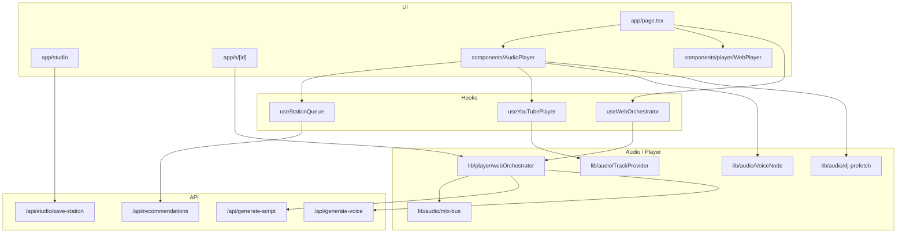

# SongGhost / SongHost Architecture

Technical blueprint of the SongGhost codebase (product brand: **SongHost**). This document reflects the repository as of Phase 4 complete (native Spotify / Apple Music companions, studio manifests, shared `/s/[id]` links) with Phase 5 infrastructure scaffolding in place. Milestone sequencing lives in [ROADMAP.md](./ROADMAP.md).

> There is no root-level `ARCHITECTURE.md`; this file under `docs/` is the canonical blueprint.

---

## 1. System Overview & Tech Stack

SongGhost is an AI-powered broadcast radio platform: continuous music playback, dynamic DJ voice overlays, hyper-local / catalog-aware scripting, custom station authoring, and multi-source streaming (YouTube embed fallback, Spotify Web Playback SDK, Apple MusicKit).

| Layer | Technology |
|-------|------------|
| Framework | **Next.js 15** (App Router), **React 19**, **TypeScript 5.8** |
| Styling | **Tailwind CSS 4** — dark charcoal canvas, brand accent `#2992cf` |
| Auth | **Clerk** (`@clerk/nextjs`) — guest mode still works via local preferences |
| Music (legacy / free) | YouTube IFrame API, iTunes Search (preview + catalog dating) |
| Streaming transports | **Spotify Web Playback SDK** + Web API companion; **Apple MusicKit JS** |
| Speech & AI | **OpenAI GPT-4o-mini** (scripts / curator), **OpenAI `tts-1`** (Free), **ElevenLabs** REST (`eleven_turbo_v2_5`, Pro). **Cartesia** is typed (`VoiceProviderId`) but not wired. |
| Storage & cache | **PostgreSQL** via Drizzle (`DATABASE_URL`), **Cloudflare R2** (studio assets / manifests / lore audio), browser **localStorage** / **sessionStorage**. Supabase is a roadmap target for cloud sync (Phase 5B), not a current runtime dependency. |
| Optional catalog / events | Last.fm (similar artists), Ticketmaster (local events), YouTube Data API |
| Testing | Vitest + `scripts/smoke-test.mjs` / `scripts/check-env.mjs` |

### High-level diagram



### Architectural principles

Enforced in `.cursor/rules/songghost.mdc`:

1. **Audio engine isolation** — Queue, music providers, and DJ voice stay decoupled; UI glues hooks.
2. **Interface-first adapters** — `TrackProvider` / `VoiceNode` in `src/types/audio.ts`; DJ contracts in `src/types/dj.ts`.
3. **Stable React deps** — Stabilize props/callbacks in refs inside audio hooks; never put raw inline objects/arrays in effect deps.
4. **Throttled failure handling** — YouTube / SDK errors use bounded retry/skip, not infinite loops.
5. **First-song & DJ pacing invariants** — See [Key Invariants](#9-key-invariants-do-not-regress).

---

## 2. Project Directory & Key Modules Map

```text
src/
├── app/
│   ├── page.tsx                 # Main radio console / session orchestration
│   ├── layout.tsx               # Clerk + prefs + MusicSource + AppleMusic providers
│   ├── globals.css              # Design tokens (brand accent, surfaces, z-index helpers)
│   ├── studio/page.tsx          # Ghost Studio authoring console
│   ├── s/[id]/page.tsx          # Shared studio station permalink
│   ├── call/[id]/page.tsx        # Call-in surface
│   └── api/                     # Route handlers (see §5)
├── components/
│   ├── player/                  # WebPlayer, HostBar, MobilePlayerSheet, liner notes…
│   ├── search/                  # SmartSearchBar, SearchModePills
│   ├── studio/                  # Track sequence, break cards, share modal
│   ├── visualizer/              # Canvas spectrum / ambient / oscilloscope
│   ├── AudioPlayer.tsx          # YouTube/iTunes dual-track integration point
│   ├── ControlDeck.tsx          # On-air deck chrome
│   └── MemoryToolbar.tsx        # 1–6 physical dial presets
├── context/
│   ├── UserPreferencesContext.tsx
│   ├── MusicSourceContext.tsx   # Spotify / Apple Music auth + active source
│   ├── AppleMusicContext.tsx
│   └── TierContext.tsx
├── data/                        # Preset stations, personas, seeds, genres, decades
├── hooks/
│   ├── useStationQueue.ts       # Infinite queue, replenish, recentTrackIds
│   ├── useYouTubePlayer.ts      # YouTube IFrame lifecycle + duck fold-in
│   ├── useWebOrchestrator.ts    # Spotify/Apple companion + SDK wiring
│   ├── usePreviewPlayer.ts      # iTunes 30s preview fallback
│   ├── useMemoryPresets.ts
│   └── useDjState.ts / useListenerLocation.ts / useMediaRecorder.ts / useStudioStations.ts
├── lib/
│   ├── audio/                   # Dual-track engine (mix-bus, VoiceNode, TrackProvider, prefetch, stingers)
│   ├── player/                  # webOrchestrator, spotifyRemote, appleMusicRemote
│   ├── dj/                      # scheduler, promptBuilder, teleprompter, broadcast-state
│   ├── queue/                   # builder, shuffle, recent-tracks
│   ├── spotify/                 # App-auth client credentials + recommendation pool
│   ├── studio/                  # Manifest schema + R2/local store
│   ├── storage/r2.ts            # Cloudflare R2 uploads
│   ├── db/                      # Drizzle schema (users, memory slots, cached lore)
│   ├── user/                    # Preferences helpers, feedback / bans
│   └── visuals/                 # Spectrum math + theme palettes
└── types/
    ├── audio.ts                 # TrackProvider, VoiceNode, DualTrackMix, ducking
    ├── dj.ts                    # DjSegmentPlan, pacing / knowledge / mood
    ├── station.ts               # ChatterPacing, EraLock, MemoryPreset, Studio voice overrides
    ├── user.ts                  # UserPreferences
    ├── voice.ts / visuals.ts / curator.ts / studio-search.ts
```

### Core entry points

| Entry | Role |
|-------|------|
| `src/app/page.tsx` | Home console: station launch, search modes, ControlDeck, AudioPlayer / WebPlayer |
| `src/components/AudioPlayer.tsx` | YouTube + iTunes path: queue + scheduler + VoiceNode + prefetch |
| `src/components/player/WebPlayer.tsx` | Companion now-playing chrome bound to orchestrator track state |
| `src/hooks/useWebOrchestrator.ts` | Loads Spotify SDK, owns `WebOrchestrator` lifecycle |
| `src/lib/player/webOrchestrator.ts` | Duck–Talk–Swell for Spotify / Apple Music companion streams |
| `src/hooks/useStationQueue.ts` | Queue generation, replenish, anti-repeat |
| `src/lib/audio/mix-bus.ts` | Music / voice / SFX gain staging + master analyser |
| `src/lib/audio/VoiceNode.ts` | DJ speech node with duck ownership + preload |
| `src/lib/audio/dj-prefetch.ts` | 20s lookahead DJ break warming |
| `src/lib/audio/TrackProvider.ts` | `BaseTrackProvider` + YouTube / HTML5 adapters |
| `src/app/s/[id]/page.tsx` | Shared station gate + hydrated custom DJ audio |
| `src/app/studio/page.tsx` | Authoring UI → `/api/studio/save-station` |

---

## 3. Audio Orchestration & Web Audio Pipeline

### Dual-track architecture

Broadcast audio is two (plus SFX) buses, never one fused stream:

| Bus | Owner | Duckable? |
|-----|-------|-----------|
| **Music Track Node** | `TrackProvider` (YouTube / HTML5) or companion transport (Spotify SDK / MusicKit via `WebOrchestrator`) | Yes — only duck target |
| **DJ Voice Node** | `BufferedVoiceNode` (`src/lib/audio/VoiceNode.ts`) or orchestrator-owned `HTMLAudioElement` | Never |
| **SFX / Stingers** | `StingerEngine` (`vinyl_scratch`, `frequency_sweep`, `station_chime`) | Never (marks break edges) |

Contracts live in `src/types/audio.ts` (`TrackProvider`, `VoiceNode`, `DualTrackMix`, `DuckingConfig`).

### Sidechain ducking (`mix-bus.ts` + `VoiceNode` / `dj-intro.ts`)

| Parameter | Constant | Value |
|-----------|----------|-------|
| Duck target | `DUCK_RATIO` | **18%** of master |
| Duck ramp in | `DUCK_RAMP_MS` | **300 ms** |
| Restore ramp out | `RESTORE_RAMP_MS` | **1500 ms** |
| Voice headroom | `VOICE_HEADROOM_BOOST` | **1.35×** (clamped ≤ 1.0 on the element) |
| Voice floor | `MIN_VOICE_GAIN` | 0.1 |

`musicGain(master, duckGain)` keeps ducked music tracking the fader. `voiceGain(master)` takes **no** duck parameter — structural guarantee that speech is never sidechained.

Spotify companion path uses parallel constants in `webOrchestrator.ts` (`SPOTIFY_DUCK_RATIO = 0.18`, duck/restore ramps via REST volume — slightly different timing: ~400 ms duck / ~600 ms restore) because the SDK exposes volume over the Web API rather than a local GainNode.

### Pre-fetch sequence (20s before track end)

`LOOKAHEAD_SECONDS = 20` in `src/lib/audio/dj-prefetch.ts`.

```text
position clock → shouldStartLookahead(duration - position ≤ 20)
  → DjPrefetchController.start(trackKey, task)
      → planDjSegment() once  (state + randomness travel with the clip)
      → generateDjBreak()     (script + TTS)
      → VoiceNode.preload(blob)
  → on transition: take(trackKey) → play warmed blob (or live fallback)
```

Rules:

- At most **one** break in flight; a new target aborts the previous slot.
- Scheduler decision is **not** re-taken at the transition (would double-count pacing and change the break).
- Failures degrade to live generation; they do not stall music.
- Companion path: `WebOrchestrator.prefetchDjBreak` (~15s near-end via `SPOTIFY_NEAR_END_MS`) with the same Duck–Talk–Swell consume path.

### Buffer / completion guards

- Prefetch decode timeout: **8s** (`PRELOAD_DECODE_TIMEOUT_MS` in `VoiceNode`).
- Abort on skip / station change / queue edit via `AbortController` + `retain(keys)` / `clear()`.
- Voice duck release runs on every exit path (ended, error, abort, superseded) so music cannot stick at 18%.
- Fresh TTS `HTMLAudioElement` per break on the orchestrator path (browser buffer reuse after Track 1 can hard-lock).
- Stinger buffers cache per id; truncated decays fade at buffer edge to avoid clicks.
- Master analyser `captureMediaElement()` **refuses a suspended** `AudioContext` — visualization must never silence a break.

### Transition flow (current vs planned)

**Current (Phases 2–4): Duck–Talk–Swell**

1. Music keeps playing.
2. Music ducks to 18% over ~300 ms.
3. DJ clip plays at `voiceGain`.
4. On speech end (+ small tail), music restores over ~1500 ms; optional stinger on restore boundary.

**Planned (Phase 6 — not implemented):** Dual-phase orchestration

1. **Phase 1 — Speech Spotlight:** music yields hard for host focus.
2. **Phase 2 — Ducked Track Lead-In:** next track enters under a ducked bed while speech finishes.

Do not document Phase 6 as live behavior; only Duck–Talk–Swell is in production code today.

### YouTube first-song invariant (`useYouTubePlayer.ts`)

Pause until audio unlock → single `seekTo(0)` → play → `tryEmitOnPlaying()` **once per track load**. Duck gain is re-asserted on ready / load-settle / PLAYING because embeds reset to 100% volume on module load.

---

## 4. State Management & Data Flow

### Session / queue

| State | Location | Lifetime |
|-------|----------|----------|
| Active station, playhead, volume, `queueGeneration` | `page.tsx` + `AudioPlayer` / orchestrator | Session |
| Queue + current index | `useStationQueue` | Session (reset on `stationId:queueGeneration`) |
| `recentTrackIds` (last **100**) | `src/lib/queue/recent-tracks.ts` (+ mirrored in queue hook) | In-memory page session; fed to `/api/recommendations` `exclude` |
| DJ scheduler state | `AudioPlayer` / broadcast-state refs | Session |
| Companion track / DJ status | `WebOrchestrator` + `useSyncExternalStore` in WebPlayer | Session |
| Failed YouTube IDs | `failed-youtube-ids.ts` | Session |
| Starter first-track history | `starter-history.ts` | `localStorage` (rotation window 20) |

Queue launch rules (`useStationQueue`):

| Path | ID prefix | Behavior |
|------|-----------|----------|
| Preset genre/decade | (none) | Random starter + catalog replenish |
| Artist Radio | `artist-radio-` | Preserve API order |
| AI Curator | `ai-curator-` | Shuffle full playlist |
| Song / Album radio | mode-specific | Built via song-radio / album-radio helpers |

`sessionOpeningDjRef` is set **only** on `stationId` or `queueGeneration` change — never on `videoId` / track advance.

### User preferences

`UserPreferences` (`src/types/user.ts`) in `UserPreferencesContext`:

- Tier, preferred TTS voice, active persona, chatter pacing, visualizer mode
- Play history, liked tracks, saved stations
- **`memoryPresets`** — always exactly **6** slots
- **`stationConfigs`** — per-station overrides (host, pacing, era, vibe); never mutate a preset `Station` in place

Persistence: `localStorage` keyed by Clerk `userId` or guest. `resolveStationSettings()` is the single precedence fold (station override > global > station default).

Pinned home presets: `songghost:pinned-presets` via `src/lib/user/preferences.ts`.

### 1–6 radio physical presets

| Slot | Index | Contract |
|------|-------|----------|
| Buttons 1–6 | `memoryPresets[0..5]` | `MemoryPreset \| null` |
| Shape lock | `MEMORY_PRESET_COUNT = 6` | `normalizeMemoryPresets()` before any index |
| UI | `MemoryToolbar.tsx` | Tap = tune; long-press / right-click = park |
| Cloud foreshadow | `user_memory_slots` (Drizzle) | Phase 5 sync target |

Only preset / saved stations may be parked; ephemeral artist-radio / curator launches cannot be recalled from the dial.

Listener location (`useListenerLocation`) uses `sessionStorage` for hyper-local DJ mentions.

---

## 5. API Routes & Backend Services Index

### Catalog & search

| Route | Method | Purpose |
|-------|--------|---------|
| `/api/recommendations` | GET | Anti-repetition Spotify pool: seeds → exclude `recentTrackIds` → random `target_popularity` ∈ [45,85] → **Fisher–Yates** shuffle (`lib/spotify/recommendations.ts`). Used by Song Radio / Artist Radio oversampling. |
| `/api/song-radio` | GET | Song Radio catalog build (Spotify + iTunes resolve) |
| `/api/artist-radio` | GET | Artist Mix (`artist-only`) / Artist Radio (`mixed` + Last.fm) |
| `/api/album-radio` | GET | Full Album deep-dive queue |
| `/api/album-suggest` | GET | Album autocomplete |
| `/api/artist-suggest` | GET | Artist autocomplete |
| `/api/station-tracks` | GET | Preset station replenishment (era-locked → iTunes-dated catalog) |
| `/api/song-search` | GET | On-demand queue insertion search |
| `/api/search` | GET | Unified search helper |
| `/api/curate-playlist` | POST | AI Curator (GPT-4o-mini → resolved tracks) |
| `/api/user/top-tracks` | GET | Listener top tracks (auth-aware) |

**Search modes** (UI: `SearchModePills`): Song Radio · Artist Mix · Artist Radio · Full Album · AI Curator.

### Speech & AI

| Route | Method | Purpose |
|-------|--------|---------|
| `/api/generate-script` | POST | LLM DJ script (+ optional lore cache / embedded TTS audio URL) |
| `/api/generate-voice` | POST | TTS dispatch (OpenAI `tts-1` or ElevenLabs). **There is no `/api/tts` route** — clients use these two. |
| `/api/liner-notes` | POST | Album / track liner notes copy |
| `/api/artist-events` | GET | Ticketmaster local events for DJ mentions |

Script formatting / soft pauses: `src/lib/tts.ts` / `dj-script.ts` (OpenAI has no SSML breaks; ellipsis / punctuation cue release). Full SSML pipelines are Phase 7 roadmap.

### Studio & auth

| Route | Method | Purpose |
|-------|--------|---------|
| `/api/studio/save-station` | GET/POST | Serialize `StudioStationManifest` (tracks, `djBreaks` cues, caller URLs, `djConfig`) → R2 `studio-stations/{id}.json` (+ user index). Returns id used by **`/s/[id]`**. |
| `/api/studio/upload-cover` | POST | Cover art → R2 |
| `/api/studio/upload-voice` | POST | Custom voice stem → R2 |
| `/api/studio/upload-voicemail` | POST | Call-in / voicemail clip → R2 |
| `/api/auth/spotify/callback` | GET | Spotify OAuth + PKCE token exchange |

### Persistence services

- **R2** — `src/lib/storage/r2.ts`, manifest store under CDN URL.
- **Postgres** — `src/lib/db/schema.ts`: `users`, `user_memory_slots`, `cached_lore_breaks` (trackId + voiceId unique lore cache).

---

## 6. Design System & Theme Tokens

Defined in `src/app/globals.css`:

```css
:root {
  --background: #09090b;
  --surface: #121215;
  --surface-elevated: #18181b;
  --surface-border: rgba(255, 255, 255, 0.08);
  --foreground: #f4f4f5;
  --muted-foreground: #a1a1aa;
  --brand-accent: #2992cf;
  --brand-accent-hover: #227cb1;
  --brand-accent-glow: rgba(41, 146, 207, 0.25);
  --station-accent: var(--brand-accent);
}
```

Tailwind `@theme inline` maps:

| CSS variable | Tailwind token |
|--------------|----------------|
| `--brand-accent` | `accent` / `bg-accent` / `text-accent` / `border-accent` |
| `--brand-accent-hover` | `accent-hover` |
| `--brand-accent-glow` | `accent-glow` (shadows) |

Fonts: **Plus Jakarta Sans** (`--font-sans`), **Space Mono** (`--font-mono`). Logo duality animation crossfades SongHost ↔ SonGhost with accent glow on `g`.

### Z-index stacking guidelines

Keep overlays ordered so search never loses to the player, and modals never lose to drawers:

| Layer | Typical `z-*` | Examples |
|-------|---------------|----------|
| Deck / sticky chrome | `z-[60]` | Control deck sticky bars, `StationEditDrawer`, history / liner drawers, mobile player sheet |
| Standard modals | `z-[70]` / panel `z-[71]` | Host settings, share station |
| Billing / upgrade | `z-[80]` / `z-[81]` | `ProUpgradeModal` |
| Top-level blocking UI | `z-[100]` | `SmartSearchBar` results dropdown, `MusicSourceModal` |

Search dropdowns must sit **above** the player bar (`z-[100]`). Player sheets sit at `z-[60]` so they do not cover search. Avoid inventing one-off layers without updating this table.

### Visualizer palettes

Genre-adaptive colors are keyed by **host** (`lib/visuals/theme-palette.ts`), not station id — every launch path already resolves a `PersonaId`.

---

## 7. Environment Variables & External Keys Checklist

Copy `.env.example` → `.env.local`. Phase 5 infra keys are validated by `npm run check-env` / `src/lib/env.ts` (Clerk required when that schema is parsed; DB/R2 optional when blank).

### Core broadcast

| Variable | Required for |
|----------|--------------|
| `OPENAI_API_KEY` | DJ scripts, AI Curator, Free-tier TTS, liner notes |
| `ELEVENLABS_API_KEY` | Pro-tier TTS |
| `ELEVENLABS_VOICE_SLOANE` / `_JOHNNY` / `_DEVON` / `_KIRA` / `_JASPER` | Optional persona voice overrides |
| `YOUTUBE_API_KEY` | YouTube search / embed validation |
| `LASTFM_API_KEY` | Artist Radio similar-artist mix |
| `TICKETMASTER_API_KEY` | Local concert mentions |

### Spotify

| Variable | Required for |
|----------|--------------|
| `NEXT_PUBLIC_SPOTIFY_CLIENT_ID` | PKCE authorize + Web Playback SDK |
| `SPOTIFY_CLIENT_SECRET` | Token exchange / app-auth recommendations |
| `NEXT_PUBLIC_SPOTIFY_REDIRECT_URI` / `SPOTIFY_REDIRECT_URI` | Must be `…/api/auth/spotify/callback` |
| `NEXT_PUBLIC_SPOTIFY_SCOPES` | Optional; `streaming` + `user-modify-playback-state` always appended |

### Apple Music

| Variable | Required for |
|----------|--------------|
| `NEXT_PUBLIC_APPLE_MUSIC_DEVELOPER_TOKEN` | MusicKit JS (alias: `NEXT_PUBLIC_APPLE_DEVELOPER_TOKEN`) |

### Auth & Phase 5 infra

| Variable | Required for |
|----------|--------------|
| `NEXT_PUBLIC_CLERK_PUBLISHABLE_KEY` | Clerk client |
| `CLERK_SECRET_KEY` | Clerk server |
| `DATABASE_URL` | Postgres (`postgres://` / `postgresql://`) — optional locally |
| `R2_ACCOUNT_ID` (or `R2_ENDPOINT`) | Cloudflare R2 |
| `R2_ACCESS_KEY_ID` / `R2_SECRET_ACCESS_KEY` | R2 credentials |
| `R2_BUCKET_NAME` | Bucket |
| `NEXT_PUBLIC_R2_CDN_URL` | Public CDN base for manifests & uploads |

Cartesia / Deepgram / Stripe keys are not required by the current runtime (typed or roadmap only).

---

## 8. DJ System (quick reference)

`planDjSegment()` in `src/lib/dj/scheduler.ts` is a pure state machine.

**Chatter pacing** (wins when set):

| Level | Behavior |
|-------|----------|
| `talkative` | Alternate `full_break` ↔ `stinger` every track |
| `standard` | Voiced break every 2–4 tracks |
| `music_focused` | Every 5–7 tracks |
| `music_only` | Host muted — **only** case that may skip opening `song_intro` |

Legacy `djPacingFrequency`: `minGap = pacing`, `maxGap = pacing + 1`, stinger alternation at pacing 1.

Track 1 of a session (non–`music_only`): always `full_break` / `kind: "song_intro"` with `isSessionOpening: true`.

---

## 9. Key Invariants (Do Not Regress)

1. YouTube first song: pause → unlock → `seekTo(0)` → play → single `tryEmitOnPlaying()` per load.
2. `sessionOpeningDjRef` only on `stationId` / `queueGeneration` change.
3. Opening DJ is `song_intro` unless `chatterPacing === "music_only"`.
4. `silent` / `plan: null` → AudioPlayer must not force a DJ intro.
5. Stabilize audio-hook callbacks in refs; no unstable effect deps.
6. Duck: **18% / 300 ms in**, **100% / 1500 ms out** (YouTube/HTML5 path); never duck the voice bus.
7. Prefetch plans the break **once**; consumer commits `nextState` at take time.
8. Era lock rejects undated candidates; under lock, source dated catalogs (iTunes), not bare YouTube search.
9. `memoryPresets` is always length 6 after `normalizeMemoryPresets()`.
10. Analyser capture never routes into a suspended graph.

---

## 10. Phase Alignment

| Phase | Status | Architectural note |
|-------|--------|--------------------|
| 1 — Core foundation & UI polish | ✅ | Shuffle, presets, charcoal + `#2992cf` tokens |
| 2 — Zero-gap dual-track engine | ✅ | VoiceNode, mix-bus ducking, 20s prefetch, stingers |
| 3 — Visualizer, personalization, mobile, search modes | ✅ | Steps 3A–3E |
| 4 — Spotify / Apple / `/s/[id]` / Studio | ✅ | `webOrchestrator`, MusicKit, save-station |
| 5 — SaaS / Clerk cloud / billing / launch | 🔜 | Drizzle + R2 scaffolding present |
| 6 — Dual-phase spotlight → ducked lead-in | 📋 | Not implemented |
| 7+ — Extended lore, SSML, Live Ghost, CarPlay | 📋 | Typed / roadmap only |

When extending the engine, prefer adapters under `src/lib/audio/` and `src/lib/player/` over growing UI components.
