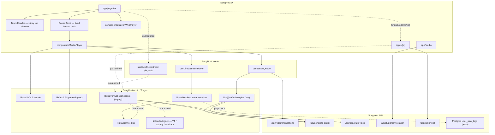

# SongHost Architecture

Technical blueprint of the SongHost codebase. This document reflects the repository after the **SoundExchange statutory-radio pivot**: Phases 1–4 complete; **Phase 5A–5E shipped** (legacy quarantine, `DirectStreamProvider` bus with zero-frame `launchHoldActive` / isolated prefetch buffers, §114 queue, ROU logger, Station Blueprint / Memory Dial); commercial rails live (Clerk, Postgres sync, Free/Pro metering, Stripe webhooks, Clean Mode); Phase 7 extended commentary + weather/daypart + anti-repetition lore live; PWA installability shipped. **Phase 5F** GTM filings / store submission remains. Milestone sequencing lives in [ROADMAP.md](./ROADMAP.md).

> There is no root-level `ARCHITECTURE.md`; this file under `docs/` is the canonical blueprint.

**Strategic engine (current):** SongHost is a **statutory non-interactive radio engine** under SoundExchange **§114** (non-interactive webcasting) and **§112** (ephemeral recordings). The live music bus is **`DirectStreamProvider`** — an un-suppressed native HTML5 `<audio>` element. Mix-bus `musicGain()` ducks the element volume; `captureMediaElement` opens a **single** `MediaElementAudioSourceNode` analyser tap (never a second source node). Spotify Web Playback SDK, Apple MusicKit JS, and the YouTube IFrame API remain in-tree as **quarantined reference adapters** under `src/lib/audio/legacy/`; they are not the production transport. Connection chrome is unmounted from the main radio flow. Historical companion FSM, OAuth, and telemetry contracts are preserved below so that context is not lost.

---

## 1. System Overview & Tech Stack

SongHost is an AI-powered broadcast radio platform: continuous **non-interactive** music playback, dynamic DJ voice overlays, hyper-local / catalog-aware scripting, Station Blueprint authoring, and a primary **direct-stream** transport (`DirectStreamProvider`). Multi-source companion streaming (YouTube IFrame, Spotify Web Playback SDK, Apple MusicKit) is preserved as quarantined legacy — see [§2.1 Quarantined Legacy Transports](#21-quarantined-legacy-transports).

| Layer | Technology |
|-------|------------|
| Framework | **Next.js 15** (App Router), **React 19**, **TypeScript 5.8** |
| Styling | **Tailwind CSS 4** — dark charcoal canvas, brand accent `#2992cf` |
| Auth | **Clerk** (`@clerk/nextjs`) — guest mode still works via local preferences |
| Music transport (primary) | **`DirectStreamProvider`** — un-suppressed HTML5 `<audio>`; mix-bus `musicGain()` on the element; single `captureMediaElement` analyser tap; Track-1 `launchHoldActive` (`hard_pause` / `intro_ramp`). `AudioPlayer` hardcodes `suppressLocalAudio = false`. Binding: `useDirectStreamPlayer`. |
| Catalog & musicology | **Last.fm API** (similarity & tags), **MusicBrainz** (ISRCs & release credits). DirectStream loads `streamUrl` or HTTP `previewUrl` via `resolveDirectStreamUrl` **only after** strict title/artist equality (`itunesTitlesMatch` / `itunesArtistsMatch` in `src/lib/itunes.ts`). A dedicated B2B vendor client (7digital / Songtradr) is not in-tree. Ticketmaster remains for local event mentions. |
| SoundExchange compliance | Postgres **`user_play_logs`**. Gate: **>30s** on-air in `useDirectStreamPlayer.ts` (`PERFORMANCE_COMMIT_SECONDS`). Unique `playSessionId` + `onConflictDoNothing`. Monthly ROU: `scripts/export-rou.ts`. |
| Music (quarantined legacy) | YouTube IFrame API + Data API, iTunes Search (preview + catalog dating), **Spotify Web Playback SDK** + Web API companion, **Apple MusicKit JS** — preserved under `src/lib/audio/legacy/`, not the live bus |
| Speech & AI | **OpenAI GPT-4o-mini** (scripts / curator), **OpenAI `tts-1`** (Free), **ElevenLabs** REST (`eleven_turbo_v2_5`, Pro). **Cartesia** is typed (`VoiceProviderId`) but not wired. Legacy persona aliases resolve short Pro picker ids before TTS — `"devon"` → `"devon-pulse"` — so host lock cannot collapse to Miles. |
| Storage & cache | **PostgreSQL** via Drizzle (`DATABASE_URL`), **Cloudflare R2** (studio assets / manifests / lore audio), browser **localStorage** / **sessionStorage**. Phase 5B hybrid sync mirrors memory presets + saved stations to dedicated tables and Host Studio / `lastStationId` / hostRetention to `users.preferences` JSONB through `/api/user/sync`. Phase 5C meters Free-tier DJ breaks in `user_usage_limits` via `/api/user/usage`. Clerk `unsafeMetadata` is billing `tier` only. |
| Testing | Vitest + `scripts/smoke-test.mjs` / `scripts/check-env.mjs` |

### High-level diagram



### Cockpit layout hierarchy

Home (`src/app/page.tsx`) splits chrome so the audio engine never unmounts when the dashboard scrolls:

```text
<main>
  AmbientCanvas
  BrandHeader          sticky top-0 z-50   (logo, RADIO/STUDIO, v{version} left of DevTierBadge, auth)
  MemoryDialBar        document flow
  dashboard column     pb-32 / md:pb-36 so carousels clear the dock
    SmartSearchBar     single input; multi-type autocomplete (albums / songs / artists); idle placeholder cycles SEARCH_MODE_OPTIONS until focus or typed text
    StationCarousel …
  ControlDeck dock     fixed bottom-0 inset-x-0 z-50 pb-[env(safe-area-inset-bottom)]
    transport + Host Studio + Host Controls (single flex-nowrap row)
    mobile trackActions pinned in compact dock (md:hidden)
    {children}         ALWAYS mounted — AudioPlayer seek bar + DirectStream media element
                       (legacy quarantine: offscreen YouTube host was fixed -left-[9999px])
  ScriptTeleprompter   fixed; open={teleprompterOpen} (no onAir gate)
                       bottom-[calc(env(safe-area-inset-bottom)+7rem)] right-4 z-[60]
                       floats above the z-50 dock; Host Controls toggle is unconditional
  QueueModal           playlist overlay z-50; flex column + overflow-hidden min-h-0
                       track list: h-0 flex-1 min-h-0 + .queue-modal-scroll
                       statutory obfuscation: on-air + past rows show titles;
                       first upcoming = "Up Next: Smart Station Stream";
                       later rows = "Later in the Stream" (no jump-to / drag of unplayed)
  HostSettingsModal    Host Studio settings (manual DJ overrides unrendered)
```

`ControlDeck` `{children}` (the `<AudioPlayer>` instance) MUST remain unconditionally mounted inside the bottom dock wrapper. Do not gate it on idle, sheet-open, or viewport. Remounting the dock player would reset `useStationQueue`. Historical: the YouTube IFrame host was `fixed -left-[9999px]` for the same reason (now quarantined under `src/lib/audio/legacy/`).

**Header version badge:** `src/components/layout/Header.tsx` (`BrandHeader`) imports `version` from `package.json` and renders `v{version}` (`hidden shrink-0 font-mono text-[9px] uppercase tracking-[0.18em] text-zinc-500 sm:inline`) in the sticky chrome actions row, immediately to the left of `DevTierBadge` (passed in via `ControlDeck` `authActions`). Do not place the app version in the Footer or the fixed bottom dock.

**Mobile bottom dock (presentational):** `HostControlsBar` keeps **Host Studio** (left, `min-w-0 flex-1`) and **Host Controls** (right dropdown, `shrink-0`) on one `flex flex-row flex-nowrap` row so the pair does not stack on portrait. Desktop (`md:flex`) icon drawers are unchanged. Like / dislike (`trackActions`) render inside the compact `md:hidden` transport cluster in `ControlDeck` — not in the scrolling dashboard column. `MobilePlayerSheet` still receives `trackActions` for the expanded sheet.

### Architectural principles

Enforced in `.cursor/rules/songhost.mdc`:

1. **Audio engine isolation** — Queue, `DirectStreamProvider`, and DJ voice stay decoupled; UI glues hooks. Quarantined YouTube / SDK adapters keep the same isolation.
2. **Interface-first adapters** — `TrackProvider` / `DirectStreamProvider` / `VoiceNode` in `src/types/audio.ts`; DJ contracts in `src/types/dj.ts`.
3. **Stable React deps** — Stabilize props/callbacks in refs inside audio hooks; never put raw inline objects/arrays in effect deps.
4. **Throttled failure handling** — DirectStream / catalog errors use bounded retry/skip, not infinite loops. Quarantined YouTube / SDK adapters keep the same contract.
5. **First-song & DJ pacing invariants** — See [Key Invariants](#9-key-invariants-do-not-regress).

---

## 2. Project Directory & Key Modules Map

```text
src/
├── app/
│   ├── page.tsx                 # Main radio console / session orchestration
│   ├── layout.tsx               # Clerk → UserPreferences → Tier → (legacy AppleMusic / MusicSource wrappers)
│   ├── globals.css              # Design tokens (brand accent, surfaces) + .queue-modal-scroll
│   ├── studio/page.tsx          # Station Blueprint Builder (seed / vibe / host / voicemail)
│   ├── admin/page.tsx           # Owner ops dashboard (admin-gated; 404 for others)
│   ├── s/[id]/page.tsx          # Shared studio station permalink
│   ├── call/[id]/page.tsx        # Call-in surface
│   ├── actions/
│   │   └── stripe.ts            # createCheckoutSession() Stripe Checkout scaffold
│   └── api/                     # Route handlers (see §5), incl. webhooks/stripe + admin/stats
├── components/
│   ├── player/                  # WebPlayer, HostBar, ProUpgradeModal, MobilePlayerSheet, StationTuner, liner notes…
│   ├── search/                  # SmartSearchBar (multi-type autocomplete + filter chips), SearchModePills
│   ├── studio/                  # Station Blueprint Builder, break cards, share modal (not a fixed sequencer)
│   ├── visualizer/              # Canvas spectrum / ambient / oscilloscope
│   ├── cards/                   # StationCard (discovery / shelf tiles)
│   ├── common/                  # ArtworkImage — canonical artwork renderer
│   ├── AudioPlayer.tsx          # DirectStream + mix-bus integration point
│   ├── ControlDeck.tsx          # Slim sticky BrandHeader + fixed bottom transport dock
│   ├── QueueModal.tsx           # Playlist overlay + statutory title obfuscation (Up Next / Later in the Stream)
│   └── MemoryToolbar.tsx        # 1–6 Live Channel Dial Presets (StationConfig + profile JSON)
├── context/
│   ├── UserPreferencesContext.tsx  # localStorage + `/api/user/sync` hybrid prefs
│   ├── TierContext.tsx             # Free/Pro + break meter (`/api/user/usage`) + upgrade modal
│   ├── MusicSourceContext.tsx      # Quarantined: Spotify / Apple Music auth; HttpOnly PKCE init + spotify_error banner
│   └── AppleMusicContext.tsx    # Quarantined: MusicKit session wrapper
├── data/                        # Preset stations, personas (legacy aliases: devon → devon-pulse), seeds, genres, decades
├── hooks/
│   ├── useStationQueue.ts       # Infinite statutory queue, replenish, recentTrackIds, 30s DJ prefetch clock, §114 admitStatutory
│   ├── useDirectStreamPlayer.ts # React binding for DirectStreamProvider + >30s ROU performanceCommit gate
│   ├── usePreviewPlayer.ts      # HTML5 preview fallback (DirectStream family)
│   ├── useMemoryPresets.ts      # Live Channel Dial Presets 1–6 (StationConfig / profile JSON)
│   ├── useKeyboardShortcuts.ts  # Digits 1–6 → memory presets (input-guarded)
│   └── useDjState.ts / useListenerLocation.ts / useMediaRecorder.ts / useStudioStations.ts
│   # Quarantined (do not import as live bus):
│   #   src/lib/audio/legacy/useYouTubePlayer.ts
│   #   src/lib/audio/legacy/useWebOrchestrator.ts  # returns companionActive: false
├── lib/
│   ├── audio/                   # Dual-track engine (mix-bus, VoiceNode, DirectStreamProvider, prefetch, stingers)
│   │   └── legacy/              # Quarantined adapters: YouTube IFrame, Spotify SDK, MusicKit (reference only — not deleted)
│   ├── player/                  # Direct-stream orchestration; quarantined webOrchestrator / spotifyRemote / appleMusicRemote
│   ├── dj/                      # scheduler, promptBuilder, factEngine, prefetchEngine, teleprompter, broadcast-state
│   ├── location/                # Weather + clock (`weather.ts`): homeCity → IP geo; client timezone headers for daypart
│   ├── queue/                   # builder, shuffle, recent-tracks, statutory-rules, skip-limiter
│   ├── rou/                     # SoundExchange performance-commit helpers
│   ├── catalog/                 # Last.fm similarity/tags + MusicBrainz ISRC / release-year clients
│   ├── itunes.ts                # Strict title/artist equality (`itunesTitlesMatch` / `itunesArtistsMatch`); `lookupITunesTrack` returns null on miss
│   ├── spotify/                 # Quarantined: app-auth client credentials + recommendation pool
│   ├── studio/                  # Station Blueprint schema (seed / vibe / host / voicemail) + R2/local store
│   ├── storage/r2.ts            # Cloudflare R2 uploads
│   ├── db/                      # Drizzle schema (users, memory slots, saved stations, usage limits, play logs, cached lore, fact graph)
│   ├── usage/                   # Free-tier DJ break metering helpers (`dj-breaks.ts`, `constants.ts`)
│   ├── admin.ts                 # Owner gate (`verifyAdminAccess`) + platform metrics aggregation
│   ├── stripe.ts                # Stripe SDK singleton + Pro/Free tier sync helpers
│   ├── user/                    # Preferences helpers, feedback / bans
│   └── visuals/                 # Spectrum math + theme palettes
└── types/
    ├── audio.ts                 # TrackProvider, DirectStreamProvider, VoiceNode, DualTrackMix, ducking
    ├── dj.ts                    # DjSegmentPlan, pacing / knowledge / mood
    ├── station.ts               # ChatterPacing, EraLock, MemoryPreset, StationConfig, Studio Blueprint
    ├── user.ts                  # UserPreferences
    ├── voice.ts / visuals.ts / curator.ts / studio-search.ts
```

### Core entry points

| Entry | Role |
|-------|------|
| `src/lib/audio/DirectStreamProvider.ts` | **Primary music bus.** Native HTML5 `<audio>`. Ducking is `musicGain(master, duck)` on the element; `captureMediaElement` opens a single analyser tap. Resolves `streamUrl` then HTTP `previewUrl` via `resolveDirectStreamUrl`. `load()` MUST call `streamMatchesQueueMetadata` and reject iTunes/mzstatic URL-only rows that lack title/artist identity (`onError("metadata_mismatch")`, no `.src`). Track-1 lock: `launchHoldActive` / `launchHoldMode` (`hard_pause` \| `intro_ramp`) enforced in `beginPlaybackFromStart`, `ensurePlayback`, and `applyUnlock`. `setDuckGain(DUCK_RATIO)` is pinned **once** when arming `intro_ramp` — position ticks / `playing` / `ensurePlayback` / `applyUnlock` MUST NOT re-pin. Playhead `> 3s` while playing auto-`releaseLaunchHold` (flag only). Public methods: `setLaunchHold`, `releaseLaunchHold`, `isLaunchHoldActive`, `getLaunchHoldActive`, `getLaunchHoldMode`. |
| `src/lib/itunes.ts` | Strict catalog identity. `itunesTitlesMatch` / `itunesArtistsMatch` normalize case, whitespace, and feature tags but **keep** version parentheticals (`(Reimagined)`). `lookupITunesTrack` returns `null` on miss — never title-only `includes` or rank-0 `songs[0]`. |
| `src/hooks/useDirectStreamPlayer.ts` | React binding. Exposes the same launch-hold methods on the provider. `onTimeUpdate` commits ROU when `shouldCommitPerformance` (`position > 30`, `playbackState === "playing"`, licensed HTTP URL, new `playSessionId`). `committedSessionIdRef` prevents pause/resume double-POST. |
| `src/app/page.tsx` | Home console: station launch, search, slim `BrandHeader`, bottom `ControlDeck` dock, AudioPlayer / WebPlayer. Historical Spotify connect (Heavy Rotation, onboarding) called `useMusicSource().connectSpotify({ intent: true })` from **click handlers only** — no duplicate PKCE client. That OAuth path is quarantined (see §2.1); DirectStream launches do not start companion SDK auth. **UI hard-lock:** `HeavyRotationShelf` and the guest "Connect Spotify" CTA are unmounted from the home hero. Post-Clerk boot may open `OnboardingModal` Step 1 for signed-out listeners and **MUST NOT** auto-open Step 2 ("Connect Spotify Premium"). |
| `src/context/MusicSourceContext.tsx` | **Quarantined.** Spotify / Apple Music auth + active source. Hydrate captures OAuth tokens but **MUST NOT** promote Spotify / Apple as the live `activeProvider` — DirectStream owns the radio bus. `connectSpotify()` is **click-gated** (`{ intent: true }` or live `navigator.userActivation.isActive`) before `window.location.assign` to `GET /api/auth/spotify`. `isConnecting` is ref-guarded so callback identity stays stable. On return, reads `spotify_error` and shows a dismissible banner **before** `purgeOAuthCallbackParams()`. |
| `src/components/AudioPlayer.tsx` | DirectStream path: queue + scheduler + VoiceNode + prefetch + mix-bus ducking. `suppressLocalAudio` is hardcoded `false` so the licensed HTML5 element is never frozen for a companion SDK. `handleNewTrack` ignores `companionActiveRef` while `isDirectStreamMode` is active. When `sessionOpeningDjRef` is true, it arms `setLaunchHold` **synchronously** before any `await`, calls `shouldPauseForStationLaunchVocals(0, true)`, and skips `resolveLocalEvent` for station-launch liners. VoiceNode `onEnded` / `finishDjSegment`, `releaseOpenerHold`, and the restore watchdog MUST call `provider.releaseLaunchHold()` and swell the duck bus to 1.0 over 1500 ms when still at 0.18. `performanceCommit` stays armed for licensed DirectStream plays **>30s**. Next is disabled when `skip-limiter` is exhausted. Quarantined YouTube / iTunes adapters remain callable for reference playback only. |
| `src/components/common/ArtworkImage.tsx` | Canonical artwork renderer for `StationCard`, `ControlDeck`, and `QueueModal` — catalog artwork URL, then `Disc3` / `Radio` icon. Historical YouTube CDN quality ladder (`hqdefault` → `mqdefault` → `default`) is retained as a fallback for quarantined embed art. |
| `src/components/player/WebPlayer.tsx` | Now-playing chrome bound to DirectStream track state (legacy: companion orchestrator track state). |
| `src/hooks/useWebOrchestrator.ts` | **Quarantined** (`src/lib/audio/legacy/useWebOrchestrator.ts`). Hard-returns `companionActive: false` so deck transport routes to `AudioPlayer` / `useStationQueue`. The Spotify Web Playback SDK MUST NOT `transferPlaybackToLocalDevice()` or seize playback. Host state (`isPro`, persona, Clean Mode, commentary, vibe, DJ mode/tuning) coalesces through a **400ms** `applyHostState` debounce. |
| `src/lib/player/webOrchestrator.ts` | **Quarantined.** Duck–Talk–Swell for Spotify / Apple Music companion streams (duration-based Mode A/B). |
| `src/hooks/useStationQueue.ts` | Statutory queue generation from Station Profile / Blueprint seeds + `StationConfig`, replenish, anti-repeat, `admitStatutory` → `filterStatutoryAdmissions` |
| `src/lib/queue/statutory-rules.ts` | Rolling 3-hour artist/album admission (`MAX_ARTIST_PER_WINDOW = 4`, `MAX_ALBUM_PER_WINDOW = 3`, max 3 consecutive artist / 2 consecutive album), timestamped air-log |
| `src/lib/queue/skip-limiter.ts` | 6 skips per **60-minute sliding window** (`SKIP_WINDOW_MS`); refuse skip; keep on-air track |
| `src/lib/rou/performance-commit.ts` | `PERFORMANCE_COMMIT_SECONDS = 30`, `buildPlaySessionId`, `shouldCommitPerformance`, `postPlayLog` |
| `src/lib/catalog/lastfm.ts` | Last.fm artist similarity + folksonomy tags |
| `src/lib/catalog/musicbrainz.ts` | MusicBrainz ISRC + confirmed release-year lookup |
| `src/lib/audio/mix-bus.ts` | Music / voice / SFX gain staging + master analyser. DirectStream ducks via `musicGain()` on the HTML5 element; `captureMediaElement` is a **single** analyser tap (never a second source node). |
| `src/lib/audio/VoiceNode.ts` | DJ speech node with duck ownership + isolated preload. `preload()` sets `muted = true` / `volume = 0` **before** `.src` and MUST NOT attach to the live session `AudioContext` or `MediaElementAudioSourceNode`. `play()` MUST NOT await `HTMLAudioElement.play()` settling (1s start bound). `play()` `finally` MUST `rampVolume(duckRatio, 1.0, rampOutMs)` and fire `onEnded` (played-through) before resolving. TRACE 4 **single emitter:** `Prefetch buffer ready` **only** in `preload()`; `DJ Voice on-air` **only** in `play()` (skipped when the abort signal has already fired). |
| `src/lib/audio/dj-prefetch.ts` | Unified 30s lookahead (`LOOKAHEAD_SECONDS = PREFETCH_LOOKAHEAD_SECONDS`) for DirectStream / AudioPlayer (legacy YouTube path unchanged) |
| `src/lib/dj/prefetchEngine.ts` | Unified 30s zero-latency warmup (`PREFETCH_LOOKAHEAD_SECONDS = 30`) → `prefetchedBreaksMap` |
| `src/lib/audio/TrackProvider.ts` | `BaseTrackProvider` + **`DirectStreamProvider` / `Html5TrackProvider`**. Quarantined YouTube adapter remains in this file’s legacy surface / `src/lib/audio/legacy/`. |
| `src/app/s/[id]/page.tsx` | Public station permalink — `generateMetadata()` OpenGraph/Twitter cards + `PublicStationPlayer` (catalog/saved Listen + Save to My Radio; historical studio Spotify/Apple gate is quarantined) |
| `src/components/player/ShareModal.tsx` | Control Deck share sheet — copies `${origin}/s/${stationId}` with toast feedback |
| `src/lib/station/public-station.ts` | Resolves public station ids from catalog → Postgres `user_saved_stations` → R2 studio blueprints |
| `src/app/studio/page.tsx` | Station Blueprint Builder → `/api/studio/save-station` (seed criteria, vibe directives, host rules, caller voicemails — not a fixed track sequencer) |
| `src/components/player/ProUpgradeModal.tsx` | Pro paywall modal (`z-[80]`); Checkout CTA + Free Mode dismiss |
| `src/app/actions/stripe.ts` | Server Action: Stripe Checkout Session (`subscription`) or local Pro unlock |
| `src/lib/stripe.ts` | Shared Stripe client + `syncSubscriptionTier` / webhook event appliers |
| `src/app/api/webhooks/stripe/route.ts` | Stripe webhook: signature verify → Clerk + Postgres Pro/Free sync |

---

## 2.1 Quarantined Legacy Transports

Spotify Web Playback SDK, Apple MusicKit JS, and the YouTube IFrame API are **quarantined, not deleted**. They remain in-tree as reference `TrackProvider` / companion adapters so historical FSM, OAuth, telemetry, and ducking contracts stay reviewable. They are **not** the production music bus. New station launches MUST attach to `DirectStreamProvider`.

**Canonical home:** `src/lib/audio/legacy/`

| Adapter | Historical role | Preserved modules (do not delete) |
|---------|-----------------|-----------------------------------|
| **YouTube IFrame API** | Free / embed fallback music bus; offscreen host `fixed -left-[9999px]` | `useYouTubePlayer.ts`, `YouTubeTrackProvider` (`TrackProvider.ts`), offscreen host in `AudioPlayer` |
| **Spotify Web Playback SDK + Web API** | Companion Connect transport + catalog / Heavy Rotation | `useWebOrchestrator.ts`, `webOrchestrator.ts`, `spotifyRemote.ts`, `lib/spotify/*`, `MusicSourceContext.tsx`, `/api/auth/spotify` (+ PKCE callback) |
| **Apple MusicKit JS** | Companion MusicKit transport | `appleMusicRemote.ts`, `AppleMusicContext.tsx` |

Quarantine rules:

1. Do not wire these adapters as the live `TrackProvider` for new station launches or statutory streams.
2. Keep their `TrackProvider`, duck, prefetch, OAuth, and telemetry contracts intact so they can be studied or revived only behind an explicit product decision.
3. Companion duration-based Mode A/B, Spotify OAuth click-gating, REST 429 circuit breakers, launch handshake, and YouTube first-song `seekTo(0)` remain documented in §3 / §9 as **legacy transport invariants** — they still apply to the quarantined code paths.
4. iTunes Search remains a dated-catalog helper (era lock) and the strict title/artist equality source for preview attach (`itunesTitlesMatch` / `itunesArtistsMatch`) until MusicBrainz / B2B release dates fully replace it; it is not a music transport. Rank-0 / title-only `includes` preview attach is forbidden.

---

## 3. Audio Orchestration & Web Audio Pipeline

### Dual-track architecture

Broadcast audio is two (plus SFX) buses, never one fused stream. **Production music** is `DirectStreamProvider` (un-suppressed HTML5) with mix-bus `musicGain()` on the element. Companion Spotify / Apple / YouTube paths remain documented as quarantined adapters (see §2.1).

| Bus | Owner | Duckable? |
|-----|-------|-----------|
| **Music Track Node** | **`DirectStreamProvider`** (native HTML5; duck via `musicGain()` on the element; single `captureMediaElement` analyser tap). Legacy: `TrackProvider` (YouTube / HTML5 iTunes) or companion transport (Spotify SDK / MusicKit via `WebOrchestrator`) | Yes — only duck target |
| **DJ Voice Node** | `BufferedVoiceNode` (`src/lib/audio/VoiceNode.ts`) or orchestrator-owned `HTMLAudioElement` | Never |
| **SFX / Stingers** | `StingerEngine` (`vinyl_scratch`, `frequency_sweep`, `station_chime`) | Never (marks break edges) |

Contracts live in `src/types/audio.ts` (`TrackProvider`, `DirectStreamProvider`, `VoiceNode`, `DualTrackMix`, `DuckingConfig`).

### Sidechain ducking (`mix-bus.ts` + `VoiceNode` / `dj-intro.ts`)

| Parameter | Constant | Value |
|-----------|----------|-------|
| Duck target | `DUCK_RATIO` | **18%** of master |
| Duck ramp in | `DUCK_RAMP_MS` | **300 ms** |
| Restore ramp out | `RESTORE_RAMP_MS` | **1500 ms** |
| Voice headroom | `VOICE_HEADROOM_BOOST` | **1.35×** (Web Audio speech nodes up to 1.35×; media elements clamped ≤ 1.0) |
| Voice floor | `MIN_VOICE_GAIN` | 0.1 |

`musicGain(master, duckGain)` keeps ducked music tracking the fader. `voiceGain(master)` takes **no** duck parameter — structural guarantee that speech is never sidechained.

YouTube / `VoiceNode` (quarantined embed path) still uses `voiceGain(master, djVolume)` (master × dj × boost, **clamped ≤ 1.0** on the media element). DirectStream applies the same mix-bus `voiceGain` / `musicGain` math on the HTML5 element volume (analyser tap is a single `captureMediaElement` source). Companion Web Audio `speechGain` uses `companionVoiceGain(djVolume, master)`: `masterVolume` is a **0-only mute gate** (no linear attenuation). Speech is `djVolume * VOICE_HEADROOM_BOOST`, allowing GainNode headroom up to **1.35×**. `HTMLAudioElement` fallbacks remain clamped at **1.0**.

Spotify / Apple companion path (`webOrchestrator.ts`) is **quarantined**. While preserved, it is **duration-based Mode A/B**, not format-aware Pause–Talk–Resume:

- **Mode A** (decoded TTS ≤ 15s): mood-aware **relative** ducking (`MODE_A_DUCK_RATIO_DEFAULT = 0.18`, Chill `0.12`, Hyped `0.25`) over `MODE_A_DUCK_RAMP_MS` (**600 ms** linear). Logarithmic swell: default `MODE_A_SWELL_MS_DEFAULT = 800 ms` (Chill `1200 ms`, Hyped `400 ms`).
- **Mode B** (decoded TTS > 15s, or duration unknown): fade outgoing to **0** over `MODE_B_FADE_MS` (**1500 ms**), hold station bed at `MODE_B_BED_GAIN = 0.25`, then decay over `MODE_B_BED_DECAY_MS` (**400 ms**) before hard-launch.

`STANDARD_BREAK_DUCK_RATIO` equals mix-bus `DUCK_RATIO` (**0.18**, relative to pre-break volume). The **0.25** figure applies strictly to Mode B station-bed gain (`MODE_B_BED_GAIN`) and Hyped Mode A (`MODE_A_DUCK_RATIO_HYPED`) — it is not the default duck floor.

**SoundExchange play logging:** `useDirectStreamPlayer` commits a `user_play_logs` row via `POST /api/play-logs` when a **licensed** DirectStream track has been on-air **>30s** (`PERFORMANCE_COMMIT_SECONDS` in `src/lib/rou/performance-commit.ts`). Payload: ISRC (MusicBrainz, resolved before insert if missing), track title, artist, album, duration, licensed `streamUrl`, and unique `playSessionId` (`${stationId}:${trackId}:${queueIndex}:${queueGeneration}`). Idempotency: client `committedSessionIdRef` (pause/resume of the same airing is not a new row) plus Postgres unique index `user_play_logs_play_session_uidx` with `onConflictDoNothing`. Sub-30s plays, preview-only fallbacks, and quarantined companion adapters do not satisfy statutory ROU. Monthly files: `npx tsx scripts/export-rou.ts --month YYYY-MM` (`npm run export-rou`).

**DirectStream** (and the quarantined YouTube / HTML5 path) uses mix-bus `DUCK_RATIO = 0.18` (18% floor / **300 ms** duck-in / **1500 ms** restore). Format-aware Pause–Talk–Resume on the quarantined companion adapters is deferred to Phase 6.

### Pre-fetch sequence A — DirectStream / AudioPlayer (30s)

`LOOKAHEAD_SECONDS = PREFETCH_LOOKAHEAD_SECONDS = 30` in `src/lib/audio/dj-prefetch.ts` (re-export of the unified constant).

```text
position clock → shouldStartLookahead(duration - position ≤ 30)
  → DjPrefetchController.start(trackKey, task)
      → planDjSegment() once  (state + randomness travel with the clip)
      → generateDjBreak()     (script + TTS)
      → VoiceNode.preload(blob)  (muted + volume 0 before .src; never session AudioContext)
  → on transition: take(trackKey) → play warmed blob (or live fallback)
```

Prefetch isolation (MUST): `VoiceNode.preload()` MUST NOT call `captureMediaElement`, MUST NOT attach a `MediaElementAudioSourceNode` to the live session graph, MUST NOT `play()`, and MUST NOT ramp `duckBus`. Completion logs `[SongHost TRACE 4] Prefetch buffer ready` **only from `preload()`**. Live `play()` logs `[SongHost TRACE 4] DJ Voice on-air` **only from `play()`**, and skips that line (plus `.play() starting`) when the abort signal has already fired. `dj-intro.ts`, `AudioPlayer.tsx`, and `prefetchEngine.ts` MUST NOT emit either TRACE 4 tag.

### Pre-fetch sequence B — Zero-latency engine (30s)

`PREFETCH_LOOKAHEAD_SECONDS = 30` in `src/lib/dj/prefetchEngine.ts`. Companion near-end uses `COMPANION_PREFETCH_NEAR_END_MS = 30000` (`PREFETCH_LOOKAHEAD_SECONDS * 1000`) in `useWebOrchestrator.ts`.

```text
useStationQueue.notePlaybackProgress / companion onNearEnd
  → shouldPrefetchUpcomingBreak(remaining ≤ 30)
  → DjBreakPrefetchEngine.ensurePrefetch(upcoming, previousTrack=on-air Track N)
      → /api/generate-script  then  /api/generate-voice
      → cache ArrayBuffer + Blob in prefetchedBreaksMap
  → on transition: take(trackKey) → play warmed buffer (or live fallback)
```

Rules:

- At most **one** break in flight; a new target aborts the previous slot.
- Scheduler decision is **not** re-taken at the transition (would double-count pacing and change the break).
- Failures degrade to live generation; they do not stall music.
- Companion path: `WebOrchestrator.prefetchDjBreak` (30s near-end via `PREFETCH_LOOKAHEAD_SECONDS` / `COMPANION_PREFETCH_NEAR_END_MS = 30000`) with duration-based Mode A/B. Format-aware Pause–Talk–Resume is Phase 6.
- **Lookahead `previousTrack`:** Prefetch for Track N+1 explicitly binds the live on-air Track N (`coherent.trackId !== registeredTrackId`). Do not run `resolveLorePreviousTrack(history, upcomingId)` during warmup — that would recap N-1 because N has not finished. `prefetchDjBreak` / `fetchDjAudio` MUST NOT assign `currentTrack` / `currentTrackId` during lookahead; warmup stays in the prefetch buffer.
- **Prefetch vs launch liner:** A matching warmed clip for the live track ID MUST execute on transition (`executePrefetchedDjBreak` / `resolveDjAudio` → `"Executing prefetched DJ break"` / `"Using prefetched DJ break"`). Do not discard it for `getStationLaunchLiner`. Launch liners are Track 1 of an explicit flush only.

### Buffer / completion guards

- Prefetch decode timeout: **8s** (`PRELOAD_DECODE_TIMEOUT_MS` in `VoiceNode`). Prefetch elements stay muted at volume 0 and off-graph until `play()`.
- Abort on skip / station change / queue edit via `AbortController` + `retain(keys)` / `clear()`.
- Voice duck / pause release runs on every exit path (ended, error, abort, superseded) so music cannot stick ducked or paused.
- Fresh TTS `HTMLAudioElement` per break on the orchestrator path (browser buffer reuse after Track 1 can hard-lock).
- Stinger buffers cache per id; truncated decays fade at buffer edge to avoid clicks.
- Master analyser `captureMediaElement()` **refuses a suspended** `AudioContext` — visualization must never silence a break. Prefetch MUST NOT call `captureMediaElement`.
- TRACE 4 single-emitter split: `[SongHost TRACE 4] Prefetch buffer ready` **only** in `VoiceNode.preload()` (warmup complete, not on-air) vs `[SongHost TRACE 4] DJ Voice on-air` **only** in `VoiceNode.play()` after `onStarted` (skipped if abort already fired). Legacy `DJ Voice buffer ready` and duplicate lookahead TRACE 4 emissions are removed from `dj-intro.ts` / `AudioPlayer.tsx` / `prefetchEngine.ts`.

### Transition flow (duration-based Mode A / Mode B)

**Companion duration-based Mode A / Mode B** (quarantined Spotify / Apple path)

Routing uses `decodedAudioBuffer.duration` from `audioContext.decodeAudioData`. Un-probed or invalid durations **fail closed to Mode B**. Quarantined companion code does **not** route on `commentaryFormat`; format-aware Pause–Talk–Resume is deferred to Phase 6.

**Zero-leak companion transition:** When a DJ break is pending, the orchestrator ducks the incoming Spotify transport in-band to the Mode A floor **without** `pause()` + `seek(0)` during `PREFETCHING_BREAK` if no speech buffer is ready. That avoids the ~0.3s Spotify freeze on Track 2+. Mode B freeze (mute + pause + seek `0:00`) starts only after `decodeAudioData` proves the clip is > 15s (or duration unknown). Live track transitions while `PREFETCHING_BREAK` MUST call `registerTrack` and exit any stale hold for the previous `currentTrackId` before evaluating a new one.

- **Mode A** (clip ≤ 15s): duck in-band at the mood-aware relative floor (`0.18` default, Chill `0.12`, Hyped `0.25`) over **600 ms** linear → speak in-band → logarithmic swell (`800 ms` default, Chill `1200 ms`, Hyped `400 ms`). Never bounce the playhead with pause/seek/resume.
- **Mode B** (clip > 15s, or duration unknown): fade outgoing to **0** over **1500 ms**, hold station bed at **0.25**, **keep Track B frozen at 0:00** for the entire host break, decay the bed over **400 ms**, then hard-launch Track B from position **0:00** at full volume. Single-URI `playTrack` and SDK auto-advance must not run Track B audio in parallel with Mode B speech.

**DirectStream — mix-bus Duck–Talk–Swell (primary)**

Mid-session (Track 2+):

1. Music keeps playing at full gain through prefetch / live TTS (`PREFETCHING_BREAK`).
2. `VoiceNode.play()` after `onStarted` ducks music to **0.18** of master over **300 ms** (`DUCK_RATIO` / `DUCK_RAMP_MS`). `handleNewTrack` MUST NOT pre-duck before `playDjIntro`.
3. Prefetched (or live) DJ clip plays at `voiceGain` (DirectStream / media element; quarantined YouTube path identical).
4. On speech end (+ small tail), a dropped `ended`, or the VoiceNode restore watchdog (`speechDuration + RESTORE_RAMP_MS + 1500 ms`), music restores over **1500 ms** (`RESTORE_RAMP_MS`). `waitForAudioEnd` also resolves immediately when the element has already ended, and times out at remaining duration + **2000 ms**. Restore is in `VoiceNode.play()` `finally` and MUST run even when `ended` is dropped. Do not await `HTMLAudioElement.play()` settling (1s start bound); a hung `play()` must not strand the duck.

Track 1 session opener (MUST — zero-frame hold, not an un-held start):

1. `stationId` / `queueGeneration` arms `launchHoldActive` as `hard_pause` before play/load effects.
2. `handleNewTrack` (while `sessionOpeningDjRef`) re-arms the hold **before any `await`**. `shouldPauseForStationLaunchVocals(0, true)` treats the playhead as true `0:00`. Confirmed intro ≥ 3s may promote to `intro_ramp`.
3. `hard_pause`: element stays paused at `0:00`. `intro_ramp`: element may play from `0:00` already at `DUCK_RATIO = 0.18`.
4. Station-launch liners skip `resolveLocalEvent` so location fetch cannot delay TTS.
5. `releaseOpenerHold`: MUST call `provider.releaseLaunchHold()` and clear `sessionOpeningDjRef` / `launchHoldActiveRef`. `hard_pause` seeks `0`, plays at 18%, swells over `RESTORE_RAMP_MS` (1500 ms); `intro_ramp` stays playing. If the duck bus is still at `DUCK_RATIO` on opener completion / VoiceNode `onEnded` / restore watchdog, swell to `UNDUCKED_GAIN` over `RESTORE_RAMP_MS`. If `introRunningRef` remains true past `speechDuration + RESTORE_RAMP_MS + 1500 ms`, force that restore and release the hold so Track 2 is not blocked. Never toggles React `isPlaying`.
6. `sessionOpeningDjRef` stays true until opener synthesis completes and `play()` is called or fails. 30s lookahead also gates on `!introRunningRef.current`.

**Companion Mode A — relative duck (not the legacy 25% / 400 ms DTS path)**

1. Music keeps playing.
2. Transport ducks over **600 ms** linear to the mood-aware relative floor (`0.18` default; Chill `0.12`; Hyped `0.25`). `0.25` here is Hyped Mode A only — not Mode B bed gain.
3. Prefetched (or live) DJ clip plays at `companionVoiceGain`.
4. On speech end (+ small tail), music log-swells (`800 ms` default; Chill `1200 ms`; Hyped `400 ms`).

**Companion Mode B — fade-to-zero + station bed**

1. Outgoing track ramps to **0** over **1500 ms**.
2. Station bed holds at **0.25** (`MODE_B_BED_GAIN`) while the host speaks. Track B stays at `0:00`.
3. Bed decays over **400 ms**, then Track B hard-launches from `0:00` at full volume.

**Extended formats** (`roots_branches`, `time_capsule`, `directors_cut`) — Pause–Talk–Resume is **Phase 6** on the quarantined companion adapters. DirectStream / HTML5 may still pause (or hold a **5%** ambient floor) via `resolveBreakTransitionPolicy`. Do not document companion Pause–Talk–Resume as live.

**Planned (Phase 6 — not implemented):** Dual-phase orchestration + companion format-aware Pause–Talk–Resume

1. **Phase 1 — Speech Spotlight:** music yields hard for host focus.
2. **Phase 2 — Ducked Track Lead-In:** next track enters under a ducked bed while speech finishes.

Do not document Phase 6 dual-phase lead-in or companion Pause–Talk–Resume as live behavior; duration-based Mode A (≤ 15s) / Mode B (> 15s) is what production companion code runs today.

### DirectStream first-song invariant

Pause until audio unlock → arm `launchHoldActive` (default `hard_pause`) → play from position **0** under the hold (`hard_pause` stays paused at `0:00`; `intro_ramp` may play only at `DUCK_RATIO = 0.18`) → emit on-playing **once per track load** (no `onPaused` bounce). Element volume is re-applied from the **current** duck gain on ready / load-settle / playing (`applyVolume`). Position ticks MUST NOT re-pin `setDuckGain(DUCK_RATIO)`. Playhead `> 3s` while playing auto-releases the hold flag. Track 1 MUST NOT start un-held at full gain. `beginPlaybackFromStart`, `ensurePlayback`, and `applyUnlock` all honor the hold without re-pinning duck. Binding: `useDirectStreamPlayer` exposes `setLaunchHold`, `releaseLaunchHold`, `isLaunchHoldActive`, `getLaunchHoldActive`, `getLaunchHoldMode`.

### YouTube first-song invariant (`useYouTubePlayer.ts`) — quarantined

Pause until audio unlock → single `seekTo(0)` → play → `tryEmitOnPlaying()` **once per track load**. Duck gain is re-asserted on ready / load-settle / PLAYING because embeds reset to 100% volume on module load.

### Spotify Companion single-driver telemetry (quarantined)

Companion progress has **two** clocks that MUST stay separated:

1. **Transport samples** — Spotify Web Playback SDK `player_state_changed` (and REST `/me/player` only when no SDK device is ready). These stamps are authoritative for track identity, pause/play, duration, and FSM timing (`resolvePlaybackPositionMs`).
2. **Local playhead interpolation** — a 250 ms UI clock (`PLAYHEAD_INTERPOLATION_MS`) that fills the gaps between sparse SDK events: `progressMs = min(durationMs, positionMs + (now - receivedAt))`. It updates `companionPlayback` / shared `ActiveTrackState.positionMs` **only**. It MUST NOT drive ducking, Mode A/B holds, or `freezeIncomingCompanionTransport`.

When the SDK listener is registered (`useWebOrchestrator` + `attachSpotifyPlayerStateListener`), the 2000 ms REST poll (`subscribeSpotifyPlaybackState`) MUST stay stopped — including while local interpolation is running. If no SDK sample arrives for 2000 ms, issue one `player.getCurrentState()` re-anchor (or one REST fetch if state is null), then resume interpolation. REST remains a disconnected fallback only (no SDK device / `ready` not yet fired).

| Driver | Tag | `trackId` | When |
|--------|-----|-----------|------|
| SDK listener | `[TELEMETRY: DJ Timing Check]` `driver: "spotify-sdk"` | On-air Spotify URI | `player_state_changed` |
| REST poll | `[TELEMETRY: DJ Timing Check]` `driver: "spotify"` | On-air `/me/player` item | 2000 ms, SDK absent |
| Prefetch lookahead | `[TELEMETRY: DJ Prefetch Check]` | **Upcoming** queue key | `DjBreakPrefetchEngine.observeProgress` |

Do **not** log upcoming lookahead ids as `[TELEMETRY: DJ Timing Check]` — that paints a dual-track ghost (on-air + up-next) at the same playhead. `AudioPlayer` companion scrub (`notePlaybackProgress`) feeds the prefetch engine only; it is not a second timing driver.

### Station launch handshake (`isLaunchingStation`)

`beginStationLaunchLock(uris)` arms a UI lock so stale `player_state_changed` events cannot flash the previous station's title/art. Rules:

- **Arm only on explicit launches** (`flushSession === true` — `launchStation` / `playTrack({ flushSession: true })`). Steer corrections and mid-session companion advances (`flushSession: false`) MUST NOT re-lock the deck.
- **Do not arm** when `uris` is `undefined` or empty. An untargetable lock swallows every SDK event (including Heavy Rotation relinks) and never confirms.
- **Confirm on any launched URI**, not only `uris[0]`. After `normalizeSpotifyTrackId`, the live track matches if its id (or `linked_from.id`) is in the launch array.
- **3s safety timeout:** if the lock is still armed and the SDK reports actively playing audio, release `isLaunchingStation` so events flow through to `onTrackStarted` / `registerTrack`.

**`sessionLaunchPending` (Track 1 one-shot):** Armed **only** by `flushForStationLaunch()`, `resetBreakSession()`, `launchStation()`, and hook `playTrack({ flushSession: true })`. Cleared when `registeredTrackId` advances past launch, on every `runDjBreakInternal` early return, and on the first Track 1 break attempt in `resolveDjAudio` (success, skip, or failure). MUST NOT be re-armed when `executedBreakTrackIds.size === 0` or on track advances — a first voiced break mid-session uses the standard prefetch / LLM path. If a matching prefetched break exists for the live track ID, it **takes precedence** over a stale launch flag and executes via Mode A ducking (Mode B only when decoded TTS > 15s). `getStationLaunchLiner` runs strictly on that explicit Track 1 open when no matching prefetch exists.

`findQueueIndexForPlayingTrack` uses the same catalog-id normalization plus `linkedFromId` / `linked_from` matching, then lowercase title + artist equality as a fallback, so `syncIndexToPlayingTrack` can advance `currentIndex` on relinked Heavy Rotation hops.

### Two-tier listener state (settings vs playhead)

Listener identity and Host Studio settings are **account-scoped**. Live playhead is **transport-scoped**. Do not fuse them:

| Tier | What lives here | Store | Sync |
|------|-----------------|-------|------|
| **User settings** | `activePersonaId`, commentary format (including Director's Cut), mood / personality, `stationConfigs` (incl. `vibePrompt`), Host Retention (`activeHostId` / `isHostLocked`), `lastStationId` | Postgres `users.preferences` JSONB via `/api/user/sync` (localStorage first) | Cross-device. Clerk `unsafeMetadata` stays billing-only (`tier`) — never a prefs blob |
| **Playhead** | Current stream URL, position, pause/resume | **DirectStream** HTML5 `currentTime` / `paused` on the live `<audio>` element. Historical companion: Spotify Connect (SDK `player_state_changed` + REST fallback) | Reconciled on handshake (`syncIndexToPlayingTrack` / `onTrackStarted`). Tab `sessionStorage` (`songhost_active_station_id` / `songhost_active_queue`) is the same-tab cache; `localStorage` `songhost:last_session` is the cross-tab / restart snapshot |

A new device hydrates Host Studio + `lastStationId` from JSONB, then Path A/B/C of the mobile gesture CTA attaches to DirectStream or launches the station. Ducking ratios, Mode A/B hold timing, and volume ramps are unchanged.

**Active-station snapshot (two-tier):** `persistActiveStation` / `writePersistedSessionQueue` dual-write `{ stationId, station, queue, currentIndex }` to tab `sessionStorage` **and** `localStorage` `songhost:last_session`. This blob is strictly an **offline cache** during session boot and station transitions — **DirectStream** (HTML5 playhead) is the playback authority. Historical: Spotify Connect or the live YouTube playhead filled that role. Search launches (Full Album, Artist Radio, Song Radio, AI Curator, Studio Mixes / Blueprints) remain the primary active station across tabs and browser restarts. Boot restore is quiet — it rehydrates React queue state from the cache and does **not** issue an unprompted playhead command. Explicit station selection MUST call `persistActiveStation(station, { resetPlayhead: true })` so a new `queueGeneration` cannot inherit a stale `currentIndex`.

**Boot precedence:** `sessionStorage` → `localStorage` `songhost:last_session` → prefs `lastStationId` lookup → Heavy Rotation fallback. Heavy Rotation auto-stage is blocked while last-session rehydration is pending, and whenever `lastStationId` is populated and is not a `heavy-rotation-*` station.

### Spotify OAuth click-gating (MUST) — quarantined legacy

`MusicSourceContext.connectSpotify()` is strictly click-gated. `window.location.assign` to `GET /api/auth/spotify` MUST NOT run unless the caller passed `{ intent: true }` or `navigator.userActivation.isActive` is true at the **start** of the call (captured synchronously before any `await`). Browsers without the User Activation API still allow the click-handler path. Mount hydrate (`completeSpotifyPkceFromUrl` / `captureSpotifyTokensFromUrl` / token restore) restores an existing session and MUST NOT call `beginSpotifyAuth()`.

**Callback identity:** `isConnecting` is stored on `isConnectingRef` and is **not** in the `connectSpotify` `useCallback` dependency array, so connecting flips cannot change callback identity or accidentally re-trigger a `useEffect(..., [connectSpotify])`.

**Post-Clerk boot gate (`page.tsx`):** After Clerk `authLoaded`, the home boot effect evaluates `!isSignedIn` immediately — it MUST NOT wait for Spotify token probing. Signed-out listeners get `OnboardingModal` **Step 1** (`setOnboardingTargetStep(1)`), unless `hasDismissedOnboarding` / `onboardingAutoOpenedRef` already suppressed the prompt. Signed-in sessions MUST NOT auto-open **Step 2: Connect Spotify**. `ControlDeck` unmounts `<MusicSourceHeader />` (Spotify / Apple connection pills) and keeps `DevTierBadge`. That effect MUST only set `onboardingOpen` — it MUST NEVER call `connectSpotify()` or navigate to `/api/auth/spotify`. OAuth starts only from an explicit Connect click (`handleConnectSpotify` → `connectSpotify({ intent: true })`, Music Source modal, or public-station Connect).

---

## 4. State Management & Data Flow

### Session / queue

| State | Location | Lifetime |
|-------|----------|----------|
| Active station, playhead, volume, `queueGeneration` | `page.tsx` + `AudioPlayer` / orchestrator | Session |
| Queue + current index | `useStationQueue` | Session (reset on `stationId:queueGeneration`) |
| Active `stationId` + queue | `sessionStorage` (`songhost_active_station_id`, `songhost_active_queue`) | Tab session (survives refresh; cleared when the tab closes) |
| Last-session snapshot | `localStorage` `songhost:last_session` (`{ stationId, station, queue, currentIndex }`) | Cross-tab / browser restart. Dual-written with the tab keys. Boot reads this when `sessionStorage` is empty |
| `recentTrackIds` (last **100**) | `src/lib/queue/recent-tracks.ts` (+ mirrored in queue hook) | In-memory page session; fed to `/api/recommendations` `exclude` |
| `actualPlaybackHistory` (last **5**, newest last) | `WebOrchestrator` | Session; zero-lag append via `recordActualPlayback()` on every companion track transition, including while `running` or Mode A/B holds are active (`noteActualPlayback` keep-alive). Each tuple MUST be identity-coherent (`source.id === targetTrackId`); skip the append rather than mixing title/artist from another URI / `nextPrefetchKey`. Lore `previousTrack` is always the immediate N-1 predecessor after filtering the current id. Distinct from `recentTrackIds` (recommendation exclude list). |
| DJ scheduler state | `AudioPlayer` / broadcast-state refs | Session |
| Companion track / DJ status | `WebOrchestrator` + `useSyncExternalStore` in WebPlayer | Session |
| Failed YouTube IDs (quarantined) | `failed-youtube-ids.ts` | Session |
| Starter first-track history | `starter-history.ts` | `localStorage` (rotation window 20) |

Queue launch rules (`useStationQueue`):

| Path | ID prefix | Behavior |
|------|-----------|----------|
| Preset genre/decade | (none) | Random starter + catalog replenish |
| Artist Radio | `artist-radio-` | Mixed statutory stream (seed + Last.fm similar artists); admit + catalog replenish |
| AI Curator | `ai-curator-` | Shuffle full playlist |
| Song / Album radio | mode-specific | Built via song-radio / album-radio helpers |

`sessionOpeningDjRef` is set **only** on `stationId` or `queueGeneration` change — never on `videoId` / track advance.

**Companion playback history (quarantined):** `WebOrchestrator.actualPlaybackHistory` is the lore-recap source of truth on the legacy companion path (newest last, cap 5). `recordActualPlayback()` / `noteActualPlayback()` append on every companion track transition with zero lag — including while a Duck–Talk–Swell is `running` or a Mode A/B hold is active — so the buffer never stalls or misses a played track. Metadata is resolved in order: SDK `getCurrentTrackState()` → queue row (`findQueueIndexForPlayingTrack`) → REST currently-playing **only if the URI matches** → `djPrefetchByTrackId.get(trackId)` exact key. Never fall back to `nextPrefetchKey` or to a hydrated `queue.slice(index - 2, index)`. If no coherent match exists, skip the append. Live breaks send `previousTrack` as the immediate N-1 predecessor (last history entry after filtering the current id). When the active epoch has not aired a track, omit `previousTrack` (opener / song intro). Lookahead prefetch for N+1 binds the live on-air Track N instead, because N has not finished. `recentTrackIds` in `src/lib/queue/recent-tracks.ts` remains a separate recommendation-exclude list and is not this buffer.

**Cross-break script history:** `_broadcastHistory` (aired DJ scripts, newest last) is forwarded on every `fetchDjAudio` as `recentBreakHistory: this._broadcastHistory.slice(-6).map(e => e.script)` plus `styleRotationIndex: this._broadcastHistory.length`. `/api/generate-script` folds those scripts into `buildAntiRepetitionDirective()` so consecutive breaks do not repeat origin cities, album facts, or chart peaks. Companion lore also calls `pickMusicologyPillar(styleRotationIndex)` so `roots_branches` rotates pillars instead of defaulting to origin stories. `roots_branches` is budgeted at **25–32 words (~12–14s)** (`loreWordCeiling` / `truncateToWordLimit` cap 32) so clips reliably qualify for Mode A (≤ 15.0s). Do not change `MODE_A_DURATION_THRESHOLD_SEC`.

Session Persistence: Active `stationId` and `queue` persist in a **two-tier** model that acts strictly as an **offline cache**. Tab state lives in `sessionStorage` (`songhost_active_station_id`, `songhost_active_queue`) so a refresh can rehydrate React until **DirectStream** confirms the live playhead. A durable snapshot is dual-written to `localStorage` `songhost:last_session` (`{ stationId, station, queue, currentIndex }`) so a new tab or browser restart can rehydrate the last search launch as the primary active station. Neither store is the recap or playhead source of truth — `actualPlaybackHistory` / `sessionPlayedRef` own DJ recaps, and DirectStream owns the needle. **Boot precedence:** `sessionStorage` → `localStorage` snapshot → `lastStationId` lookup (saved / preset / studio catalog) → Heavy Rotation fallback. Hydrate the persisted station queue on mount before DirectStream `play` / `onTrackStarted` so `syncIndexToPlayingTrack` cannot miss against a fallback preset. Silent tab rehydration MUST NOT auto-trigger playhead commands. Explicit station switches reset `currentIndex` to `0` and flush speech; they MUST NOT resume a cached offset. Historical companion: unrecognized Spotify Autoplay tracks must **not** be prepended into the live queue; `onTrackStarted` steers playback back onto `queue[currentIndex + 1]` / `queue[currentIndex]` via `playTrack` / `steerToStationUri`.

**UI mount hydration vs. ControlDeck paint:** Memory queue hydration is instant (`bootQueueFromSession` / `runReset` restore `queue` + `currentIndex` for index lookup). Visual ControlDeck metadata is handshake-gated: `isSpotifySyncPending` defaults `true` on Spotify companion session restore (restored rows carry `spotifyId`) and `false` for YouTube. While pending, `stampQueueOpener` is suppressed and `ControlDeck` renders "Tuning in…" with no artwork even if restored `sessionStorage` props exist. `page.tsx` `onTrackStarted` MUST call `clearSpotifySyncPending()` / `setIsSpotifySyncPending(false)` **immediately** on invoke — even when `findQueueIndexForPlayingTrack` returns `-1` on a relink edge case — so the mask cannot stick. `runReset` clears the pending flag at the start of **non-hydrate** relaunches so a leftover restore mask cannot leak into Heavy Rotation / preset sessions.

`findQueueIndexForPlayingTrack` normalizes both the playing URI/id and each queue `spotifyId` via `normalizeSpotifyTrackId`, matches `linkedFromId` / `linked_from.id` when present, and falls back to lowercase title + artist equality. That lookup is what advances `currentIndex` on Spotify auto-advance (including Heavy Rotation).

**Station Handoff Invariant (quarantined companion):** Station switches MUST call `AudioPlayer.armStationHandoff()` from `selectStation` / `handoffToWebOrchestrator` **before** queue updates so `handleNewTrack` cannot race `launchStation` with Spotify Search. `disarmStationHandoff()` runs after the official launch. Native `spotifyId` / `spotifyUri` on the queue row MUST be preferred over Search; resolved URIs are persisted via `updateTrackAt` (never in-place mutation). DirectStream launches skip companion Search; they load the queue row's `streamUrl` / HTTP `previewUrl` via `resolveDirectStreamUrl`.

**Spotify REST 429 circuit breaker (quarantined):** `src/lib/spotify/fetchWithRetry.ts` (`spotifyApiFetch`, `fetchSpotifyGetWithRetry`) owns a process-wide breaker (`spotifyRateLimitResetTime` / `isSpotifyCircuitOpen()`). A live HTTP 429 honors `Retry-After` (default 30 s) and fail-fasts later GETs with a synthetic 429. `searchSpotifyTrackUri` bounds concurrency to **2**, negatively caches 429s for **60 s**, and LRU-caps the URI cache at **256**. Canonical rules: [AUDIO_ORCHESTRATION_SPEC_2.md](./AUDIO_ORCHESTRATION_SPEC_2.md) §1.6.

**Spotify Search query fallback (quarantined):** `searchSpotifyTrackUri` sanitizes YouTube junk via `sanitizeSpotifySearchTitle` / `sanitizeSpotifySearchArtist` (quotes, resolution tags, standalone years, 8-digit `YYYYMMDD` date stamps, featuring / `ft.` / `feat.` credits and trailing featured-artist strings, exclusive/official/lyric parens and remaining generic parens such as `(With Intro)` while keeping structural tags `pt. 1` / `part 2` / `radio edit` / `single version`; aggregator channels such as Audacy → empty artist; `&` / `,` / `and` lists isolate the **primary** artist). Search is **3-tier**: Tier 1 quoted fields (`track:"…" artist:"…"`), then Tier 2 un-fielded `q` (`title artist`), then Tier 3 title-only (`title`) when that would not duplicate Tier 2. Each later tier runs only when the previous produced no URI and was not HTTP 429 / circuit-open. Empty catalog misses (`null` URI) use a **15 s** TTL (`SEARCH_EMPTY_TTL_MS`) rather than a permanent negative cache so sanitizer updates can retry. 429s remain **60 s**. Each attempt logs 502s and empty result sets.

### Provider tree (`src/app/layout.tsx`)

```text
ClerkProvider
  └─ UserPreferencesProvider     # prefs, memory dial, saved stations, Clean Mode, commentary
       └─ TierProvider           # subscription tier, break quota, ProUpgradeModal state
            ├─ AppleMusicProvider      # quarantined MusicKit wrapper (see §2.1)
            │    └─ MusicSourceProvider → {children}   # quarantined Spotify / Apple auth
            └─ DevTierToggle     # dev-only; single mount in layout (not page.tsx)
```

No circular imports between context modules. Billing tier is owned by `TierContext` (`"free" | "pro"`). Legacy `UserPreferences.userTier` (`"Free" | "Pro"`) remains for storage compatibility but is not the live gate.

### User preferences

`UserPreferences` (`src/types/user.ts`) in `UserPreferencesContext`:

- Tier, preferred TTS voice, active persona, chatter pacing, visualizer mode
- **`allowExplicit`** — Clean Mode gate (Phase 5C). Guests / missing flag default to `false`; logged-in accounts without a stored value default to `true`. Persisted via `setAllowExplicit()` → localStorage. Host Settings Drawer exposes the "Allow Explicit Content" toggle (`AllowExplicitContentToggle` in `HostBar.tsx`).
  - When `false`: `/api/recommendations` and `/api/station-tracks` drop candidates with `track.explicit === true`; `promptBuilder.buildExplicitContentDirective()` appends the FCC-safe BROADCAST DIRECTIVE to DJ system prompts.
  - When `true`: catalog keeps explicit tracks; DJ prompts allow natural late-night commentary without strict censorship.
- **`commentaryFormat`** — lore / commentary depth (Phase 7). Defaults to `"standard"`. Persisted via `setCommentaryFormat()`; Host Settings Drawer exposes "Lore & Commentary Depth" (`CommentaryFormatSelector` in `HostBar.tsx`). UI display labels are standardized across the HostBar summary pill (`formatCommentaryFormatLabel` / `formatHostSettingsSummary` in `HostBar.tsx`) and the Host Settings Drawer: **`"Standard"`**, **`"Roots & Branches"`**, **`"Sonic Time Capsule"`**, and **`"Director's Cut"`**. The Host Studio pill subscribes to live `UserPreferences.commentaryFormat` so a drawer change updates immediately (e.g. `Natural Pace • Director's Cut`). Extended values `roots_branches`, `time_capsule`, and `directors_cut` are Pro-gated and append format + SSML pacing directives in `promptBuilder.buildCommentaryFormatDirective()`. DirectStream (and the quarantined Spotify companion `useWebOrchestrator` path) folds this through `resolveStationSettings()` (station override > global) rather than reading the raw global preference. Host Settings snaps Free-tier selections back to `"standard"`.
- **`mood`** / **`personality`** — Host Studio vocal energy and personality colour. Optional on older prefs blobs; hydrate to Even Keel / Normal. Persisted via `setDjMood()` / `setDjPersonality()` to both global preferences and `stationConfigs[stationId]` so Tuning Console picks are fully retained across page reloads. Host Settings Drawer exposes the selectors (`HostMoodSelector` / `HostPersonalitySelector` in `HostBar.tsx`).
- Play history, liked tracks, saved stations (saved stations store **Station Profile JSON**, not frozen playlists)
- **`memoryPresets`** — always exactly **6** slots; each slot is a **Live Channel Dial Preset** (Station Profile JSON that regenerates a fresh statutory stream on tune)
- **`stationConfigs`** — per-station overrides (host, pacing, era, vibe / `vibePrompt`, `commentaryFormat`, `mood`, `personality`); never mutate a preset `Station` in place
- **`lastStationId`** — durable resume target for the mobile gesture CTA (Path B) and boot restore when no session snapshot exists; synced in JSONB. A local id set during the active session is **not** overwritten by a stale cloud GET (`mergeCloudPreferencesOverLocal`); `schedulePreferencesSync` pushes the local id so JSONB catches up. Distinct from the tab `sessionStorage` playhead and from `songhost:last_session` (queue snapshot)

Persistence: `localStorage` keyed by Clerk `userId` or guest. Signed-in accounts hybrid-sync **memory presets**, **saved stations**, and the **Host Studio / resume slice** through `/api/user/sync` (local first, debounced ~400ms background Postgres upsert into `users.preferences` JSONB). Cloud wins on conflict after login hydrate **except** `lastStationId`, which keeps the in-session local value. `resolveStationSettings()` is the single precedence fold (station override > global > station default). Do **not** store this blob in Clerk `unsafeMetadata`.

**Two-tier reminder:** JSONB holds *what the listener wants* (host, lore depth, custom directives, last station id). **DirectStream** holds *where the needle is* (HTML5 `currentTime` / `paused` on the live element). Historical: Spotify Connect held the companion needle. `sessionStorage` is the same-tab queue cache; `songhost:last_session` is the cross-tab snapshot so `syncIndexToPlayingTrack` can resolve the live track after a new tab or restart — neither is the cross-device playhead source of truth.

**Spotify Companion lore breaks** (quarantined: `useWebOrchestrator` → `WebOrchestrator` → `/api/generate-script` lore pipeline) enforce the folded Host Settings together: `commentaryFormat`, mood, personality, and `vibePrompt` custom directives. `promptBuilder.buildLoreSystemPrompt()` injects `buildVibeDirective()` so listener-authored station notes colour the host. DirectStream uses the same prompt pipeline without the companion SDK.

Pinned home presets: `songhost:pinned-presets` via `src/lib/user/preferences.ts` (migrate-on-read from `songghost:pinned-presets`).

### 1–6 Live Channel Dial Presets

Memory buttons 1–6 are **Live Channel Dial Presets**, not static playlists. Parking a slot stores a **Station Profile JSON** (`MemoryPreset` seeds) plus a parked **`StationConfig`** snapshot (`user_memory_slots.stationConfig` JSONB and `UserPreferences.stationConfigs[stationId]` — host, pacing, era, vibe, commentary, mood, personality). Tuning a slot dynamically generates a **fresh statutory non-interactive stream** through `useStationQueue` + `DirectStreamProvider`. Recalling a dial MUST NOT restore a frozen, listener-ordered track list as on-demand playback.

| Slot | Index | Contract |
|------|-------|----------|
| Buttons 1–6 | `memoryPresets[0..5]` | `MemoryPreset \| null` (seeds + dial chrome — not a playlist snapshot) |
| Host overlay | `stationConfigs[stationId]` | `StationConfig` folded by `resolveStationSettings()` |
| Shape lock | `MEMORY_PRESET_COUNT = 6` | `normalizeMemoryPresets()` before any index |
| UI | `MemoryToolbar.tsx` | Tap = tune (regenerate statutory stream); long-press / right-click = park profile |
| Hotkeys | `useKeyboardShortcuts.ts` | Digits `1`–`6` call `playMemorySlot(slotIndex)` |
| Cloud sync | `user_memory_slots` + `user_saved_stations` + `users.preferences` JSONB (Drizzle) | `/api/user/sync` |

**Input guard:** the global `keydown` listener ignores hotkeys when `e.target` is an `INPUT`, `TEXTAREA`, or `contentEditable` element so Smart Search / Host Settings typing never steals the dial.

Only preset / saved **station profiles** may be parked; ephemeral artist-radio / curator launches cannot be recalled from the dial.

### Station Blueprint Builder (`/studio`)

Ghost Studio (`src/app/studio/page.tsx`) is a **Station Blueprint Builder**, not a fixed track sequencer. A published blueprint stores the rules that generate a live statutory channel:

| Blueprint field | Role |
|-----------------|------|
| Seed criteria | Artist / genre / era / energy / catalog-depth seeds (`TuneStationPanel` `seedsOnly`; Last.fm similarity, MusicBrainz dating). DirectStream resolves `streamUrl` / HTTP `previewUrl`. |
| Vibe directives | Listener-authored `vibePrompt` / custom host notes folded by `resolveStationSettings()` |
| Host rules | Persona, chatter pacing, commentary format, mood / personality, Clean Mode |
| Caller voicemails | R2-hosted call-in stems (`/api/studio/upload-voicemail`) cued as `kind: "call_in"` breaks |

`/api/studio/save-station` serializes this blueprint (plus optional cover and `djConfig`) to R2. Playback never treats the blueprint as an on-demand playlist: `useStationQueue` generates a fresh non-interactive queue from the stored profile each session. Historical `StudioStationManifest.tracks[]` / `djBreaks[]` cue lists remain valid payload fields for authored liners and voicemails, but they do not reintroduce interactive sequencing.

### Decade / Genre Matrix tuner

| Piece | Role |
|-------|------|
| `StationTuner.tsx` | Inline expandable deck under the primary Station Finder search bar |
| Era chips | Multi-select `60s` · `70s` · `80s` · `90s` · `2000s` · `2010s` · `Modern` |
| Genre matrix | Sub-genres filtered by selected decades (e.g. `90s` → Grunge, Alternative, East Coast Hip-Hop, Eurodance, Britpop) |
| Sliders | Energy Level (Mellow → High Energy) · Catalog Depth (Mainstream Hits → Deep Cuts) |
| Generate | **Tune & Generate Station** builds a weighted `/api/station-tracks` seed query from the matrix, then launches a synthetic `tuner-*` session |
| Toggle | **Advanced Tuning** icon (`SlidersHorizontal`) adjacent to `SmartSearchBar` expands / collapses the drawer |

Listener location (`useListenerLocation`) uses `sessionStorage` for hyper-local DJ mentions.

### Smart Search autocomplete

`SmartSearchBar` (`src/components/search/SmartSearchBar.tsx`) is the Station Finder input. Parent launch callbacks (`onLaunch`, `onLaunchSongRadio`, `onLoadCurated`) stay owned by `SearchSection` / `page.tsx` — the bar only binds dropdown rows to those existing handlers. Album deep-dives are not launched from Search.

| Piece | Behavior |
|-------|----------|
| Multi-type fetch | Typing a query always calls `GET /api/search?q=…&type=track,artist` by default. The idle launch-mode rotator must **not** narrow the request to tracks-only or artists-only. |
| Idle rotator freeze | `SEARCH_MODE_OPTIONS` placeholder cycling stops when the input is focused **or** contains user text. |
| Filter chips | Sticky header inside the `z-[100]` dropdown: **ALL** · **SONGS** · **ARTISTS** · **AI**. Chip clicks refetch `type=track,artist` / `track` / `artist` (or switch to AI Curator) and **must not** clear the query string. There is no **ALBUMS** chip. |
| Section order | Dropdown lists **Songs** first, then **Artists**. Album rows are not rendered. |
| Action badges | Song rows keep a non-interactive intent chip: `[SONG RADIO]`. Artist rows keep `[ARTIST RADIO]`. Row click and keyboard Enter launch `selectArtist(artist)` → mixed Artist Radio. There is no Artist Mix (`artist-only`) badge. |
| Click → launch | `selectTrack` → `launchSongRadio` → `onLaunchSongRadio`; `selectArtist(artist)` → `launchArtistRadio(name)` → `onLaunch`. `launchArtistRadio` always sends `mode=mixed`. Parent `onLaunch` signature is unchanged. |
| Typed launch / Enter | `runStationLaunch` fetches `GET /api/search?q=…&type=track,artist&limit=8`. Exact track hit (`itunesTrackMatchesQuery`) → Song Radio. Exact artist hit (`itunesArtistsMatch`) → mixed Artist Radio. No entity hit → `launchCurator(query)` (AI Curator). Never fail with `"No matching track found"`. |

The 3-item `SearchModePills` row remains hidden; launch-button copy still follows the cycled `MusicSearchMode` (Song Radio · Artist Radio · AI Curator).

### Strict catalog metadata matching (MUST)

Preview URLs and DirectStream `.src` assignments are identity-gated. Helpers live in `src/lib/itunes.ts`.

| Rule | Live contract |
|------|----------------|
| Normalization | Case-insensitive, collapsed whitespace. Feature tags `(feat. …)` / trailing `ft.` are stripped. **All other parentheticals stay** — `(Reimagined)` is required for version isolation. Artist match uses the primary name only. |
| `itunesTitlesMatch` / `itunesArtistsMatch` | Strict `===` after `normalizeItunesTitle` / `normalizeItunesArtist`. Empty sides never match. |
| `lookupITunesTrack` | First row where **both** title and artist match; otherwise **`null`**. No title-only `includes`, no rank-0 `songs[0]`. |
| `/api/search` | `previewUrl` attached only when `itunesTrackMatchesQuery(track, q)`. `gateTrackSeeds`: rank-0 is never a seed; `limit=1` returns only an equality hit. |
| `/api/song-radio` | `catalogPreviewUrl` / `attachSeedCatalog` require title **and** artist equality against the requested seed before binding a preview. |
| `DirectStreamProvider.load()` | `streamMatchesQueueMetadata` rejects `extras.resolvedTitle` / `resolvedArtist` stamp mismatches. iTunes / `mzstatic.com` URLs without title+artist identity are rejected (`metadata_mismatch`); `.src` is never assigned. |

---

## 5. API Routes & Backend Services Index

### Catalog & search

| Route | Method | Purpose |
|-------|--------|---------|
| `/api/recommendations` | GET | Anti-repetition catalog pool: seeds → exclude `recentTrackIds` → popularity / energy window → **Fisher–Yates** shuffle. Resolves via Last.fm similarity and MusicBrainz credits. Historical Spotify pool (`lib/spotify/recommendations.ts`) is quarantined. When `allowExplicit=false`, drops `explicit === true` candidates. Used by Song Radio / Artist Radio oversampling. |
| `/api/song-radio` | GET | Song Radio catalog build. Seed identity MUST pass `itunesTitlesMatch` + `itunesArtistsMatch` before preview bind (`catalogPreviewUrl` / `attachSeedCatalog`). Catalog pin is `lookupITunesSongById` then `lookupITunesTrack` — never rank-0. MusicBrainz / Last.fm remain the similarity pool; historical Spotify recommendations are optional when app token is present. |
| `/api/artist-radio` | GET | Artist Radio defaults to **statutory mixed** (`mode=mixed`): seed artist + Last.fm `fetchSimilarArtists` (then curated co-anchors). Spotify `/v1/recommendations` is not the live similarity source. An empty similar pool returns **404** rather than a single-artist payload. `artist-only` remains an explicit query opt-in only. |
| `/api/album-radio` | GET | Full Album deep-dive queue (MusicBrainz release credits) |
| `/api/album-suggest` | GET | Album autocomplete |
| `/api/artist-suggest` | GET | Artist autocomplete |
| `/api/station-tracks` | GET | Preset station replenishment (era-locked → MusicBrainz dated catalog; iTunes dating remains a fallback). Honors `allowExplicit` Clean Mode filter on `track.explicit`. Also seeded by the Decade/Genre Matrix tuner (`StationTuner`) with optional `target_popularity` / `target_energy` / `weight` hints on the query string. |
| `/api/song-search` | GET | On-demand queue insertion search |
| `/api/search` | GET | Unified multi-entity helper (`type=track,artist` by default from Smart Search; `type=album` remains opt-in). Track `previewUrl` is attached only on `itunesTrackMatchesQuery`. `gateTrackSeeds` never treats rank-0 as a seed; `limit=1` returns only an equality hit. |
| `/api/curate-playlist` | POST | AI Curator (GPT-4o-mini → resolved tracks) |
| `/api/user/top-tracks` | GET | Listener top tracks (auth-aware) |
| `/api/user/sync` | GET/POST | Phase 5B cloud persistence: Clerk-authenticated fetch / upsert of `user_memory_slots` (dial 1–6 → `slotIndex` 0–5), `user_saved_stations`, and `users.preferences` JSONB (`activePersonaId`, `commentaryFormat`, `mood`, `personality`, `stationConfigs` incl. `vibePrompt`, `hostRetention`, `lastStationId`). A POST body with `preferences` alone is valid. Client hydrates localStorage first, then merges cloud over local; Host Studio writes debounce ~400ms. Clerk `unsafeMetadata` is not used for this blob. |
| `/api/user/usage` | GET | Phase 5C Free-tier DJ break meter: returns `breakCount`, `limit` (30 Free / `null` Pro unlimited), `daysUntilReset`, `periodStart`, `tier`. Resets `breakCount` when `periodStart` is older than 30 days. |
| `/api/webhooks/stripe` | POST | Phase 5C Stripe billing webhook. Verifies `Stripe-Signature` via `STRIPE_WEBHOOK_SECRET`. Handles `checkout.session.completed`, `customer.subscription.created|updated|deleted`. Resolves Clerk user from `client_reference_id` / `metadata.userId`, then syncs `unsafeMetadata.tier` + Postgres `users.tier` (`pro` when `active`/`trialing`, `free` on `canceled` / subscription deleted). Returns `400` on bad signatures. |

**Search modes** (idle placeholder on `SmartSearchBar` cycles `SEARCH_MODE_OPTIONS` until the input is focused or has text; the 3-item `SearchModePills` row is hidden): Song Radio · Artist Radio · AI Curator. Autocomplete is independent of that idle mode: default fetch is `type=track,artist`, with sticky **ALL / SONGS / ARTISTS / AI** chips to refine the overlay. **Advanced Tuning** is an icon-only `SlidersHorizontal` control beside the search input that opens the Decade/Genre Matrix drawer.

### Speech & AI

| Route | Method | Purpose |
|-------|--------|---------|
| `/api/generate-script` | POST | LLM DJ script (+ optional lore cache / embedded TTS audio URL). Free-tier quota: `403 QUOTA_EXCEEDED` when `breakCount >= 30`; increments meter after successful new generation. Free-tier pace guard forces `djMode: "balanced"` / `talkLevel: "standard"` (`breakPace: "short"`). Lore breaks send folded `commentaryFormat`, mood, personality, `vibePrompt` custom directives, and `recentBreakHistory` (last 6 aired scripts); `buildLoreSystemPrompt` injects `buildVibeDirective()` so Host Studio notes apply on DirectStream (and on the quarantined Spotify companion path). `buildAntiRepetitionDirective(excludedFacts, recentBreakHistory)` blocks repeated origin-city / album facts. Extended deep-dive formats (`directors_cut`, `time_capsule`) use `gpt-4o`; `standard` and `roots_branches` stay on `gpt-4o-mini`. Completions set `frequency_penalty: 0.4` and `presence_penalty: 0.3`. |
| `/api/generate-voice` | POST | TTS dispatch (OpenAI `tts-1` or ElevenLabs). **There is no `/api/tts` route** — clients use these two. |
| `/api/liner-notes` | POST | Album / track liner notes copy |
| `/api/artist-events` | GET | Ticketmaster local events for DJ mentions |

Script formatting / soft pauses: `src/lib/tts.ts` / `dj-script.ts`. Extended commentary formats instruct the LLM to inject `<break time="300ms"/>` / `<break time="500ms"/>` tags. `prepareTtsSynthesisText()` **preserves** those tags for ElevenLabs and **strips / softens** them to ellipsis cues for OpenAI `tts-1` (which cannot accept raw SSML).

**Text sanitization pipeline (MUST):** `sanitizeDjScript()` runs before TTS on both lore and legacy generate-script paths. It strips markdown heading prefixes (`#`), underscores (`_`), paired and unpaired asterisks (`*`), stage directions (`[…]` / `(…)` / `*…*`), emojis, and orphan trailing punctuation. `formatScriptForTts({ compactPauses: true })` is applied to Mode A formats (`standard`, `roots_branches`) so pauses land only at sentence boundaries — per-clause `" ... "` insertion is reserved for longer Mode B formats. `truncateToWordLimit` then enforces the lore ceiling (`roots_branches` max **32** words).

**ElevenLabs Turbo voice bounds:** `stability >= 0.55`, `style <= 0.15`, `use_speaker_boost: false` (`clampTurboVoiceSettings` / `STANDARD_VOICE_SETTINGS`).

### Studio & auth

| Route | Method | Purpose |
|-------|--------|---------|
| `/api/station/[id]` | GET | Public station fetch for shared permalinks. Resolves built-in catalog → Postgres `user_saved_stations` → R2 studio blueprints via `resolvePublicStation()`. Returns `{ station, error }` (`404` when missing). Powers `/s/[id]` player hydration and OpenGraph metadata. |
| `/api/studio/save-station` | GET/POST | Serialize a **Station Blueprint** (`StudioStationManifest`: seed criteria, vibe directives, host rules / `djConfig`, caller voicemail URLs, optional authored liner cues) → R2 `studio-stations/{id}.json` (+ user index). Returns id used by **`/s/[id]`**. Playback regenerates a statutory stream from the profile; it does not treat the blueprint as an on-demand sequencer. |
| `/api/studio/upload-cover` | POST | Cover art → R2 |
| `/api/studio/upload-voice` | POST | Custom voice stem → R2 |
| `/api/studio/upload-voicemail` | POST | Call-in / voicemail clip → R2 |
| `/api/auth/spotify` | GET | **Quarantined.** Server-side Spotify OAuth initiation. Generates PKCE `state` + `code_verifier`, sets HttpOnly cookies (`sg_spotify_oauth_state`, `sg_spotify_pkce_verifier`; `Secure` on HTTPS, `SameSite=Lax`, `Path=/`, `Max-Age=900`), then **302** to Spotify authorize. Client connect flows (`MusicSourceContext.connectSpotify()`, Heavy Rotation, onboarding) navigate here **only after an explicit click** (`{ intent: true }` or live user activation) and `clearSpotifyTokens()`. Mount / post-Clerk effects MUST NOT hit this route. DirectStream launches do not use this route. |
| `/api/auth/spotify/callback` | GET | **Quarantined.** Spotify OAuth + PKCE token exchange using the HttpOnly cookies from `/api/auth/spotify`. Raw failures (`access_denied`, `missing_code`, `missing_cookies`, `invalid_state`, token errors) redirect to `/` with `spotify_error=<reason>`. **Redirect URI invariant:** local MUST be `http://127.0.0.1:3000/api/auth/spotify/callback` (Spotify forbids `localhost`); production MUST be `https://song-ghost.vercel.app/api/auth/spotify/callback`. |

`MusicSourceContext.connectSpotify()` refuses `window.location.assign` without explicit intent (`{ intent: true }` or `navigator.userActivation.isActive`). Connecting is tracked on `isConnectingRef` so the callback identity does not churn with `isConnecting` state. Hydrate on the OAuth return URL **before** stripping query keys: `spotify_error` is mapped to a dismissible amber alert banner (`access_denied`, `missing_code`, `missing_cookies`, …). Success still lands `spotify_access_token` / `spotify_refresh_token` for `captureSpotifyTokensFromUrl()` but MUST NOT set `activeProvider`. `page.tsx` boot-gate auto-opens `OnboardingModal` as **presentation only** — Step 1 immediately when Clerk `authLoaded` and signed out (no Spotify wait); it MUST NOT auto-open Step 2 — never an automatic authorize redirect.

### Ops & monitoring

| Route | Method | Purpose |
|-------|--------|---------|
| `/api/health` | GET | Production readiness probe. Checks Postgres via a short-lived Drizzle `select 1` when `DATABASE_URL` is set (`connected` / `not_configured` / `error`), plus presence of `OPENAI_API_KEY` and `NEXT_PUBLIC_CLERK_PUBLISHABLE_KEY` (`configured` / `missing`). Returns `{ status, timestamp, services }` with HTTP `200` when healthy or `503` when a critical dependency fails. Global client crashes are caught by `ErrorBoundary` (`Station Recovering` soft reset) in the root layout. |
| `/api/admin/stats` | GET | Phase 5D owner metrics. Requires `verifyAdminAccess()` (`src/lib/admin.ts`): Clerk `userId` in `ADMIN_USER_IDS` (comma-separated) **or** `sessionClaims.metadata.role === "admin"`. Returns `403` when unauthorized. Aggregates Postgres via Drizzle: `users` count, Pro subscribers (`tier === 'pro'`), sum of `user_usage_limits.breakCount`, estimated API spend (`totalBreaks × $0.0039`), and `user_saved_stations` count. Payload: `{ users, proSubscribers, totalBreaks, estimatedSpend, savedStations }`. Powers the `/admin` dashboard (unauthorized visitors see a clean **404 Not Found** so the route stays invisible). |
| `/api/play-logs` | POST | SoundExchange ROU writer. Body: `{ playSessionId, trackTitle, artistName, albumTitle?, isrc?, durationSec?, streamUrl? }`. Clerk `userId` is stored when signed in (guests write `null`). Missing ISRC is resolved via MusicBrainz before insert. Unique `playSessionId` uses `onConflictDoNothing`. Returns `{ success: true, isrc }` — HTTP 200 no-op when `DATABASE_URL` is unset. |

### Persistence services

- **R2** — `src/lib/storage/r2.ts`, blueprint / cover / voicemail store under CDN URL.
- **Postgres** — `src/lib/db/schema.ts` (see Database Schema below), including **`user_play_logs`** for SoundExchange ROU.
- **User sync** — `src/app/api/user/sync/route.ts` + `src/lib/user/cloud-sync.ts`, wired from `UserPreferencesContext` for signed-in Clerk users.

### Database Schema

Drizzle tables in `src/lib/db/schema.ts` (all active, plus statutory `user_play_logs`):

| Table | Purpose |
|-------|---------|
| `users` | Clerk-backed account row (`id` = Clerk user id), Stripe customer + `subscriptionStatus` + product `tier` (`free` \| `pro`, synced by `/api/webhooks/stripe`) + `preferences` JSONB (Host Studio / hostRetention / lastStationId; not Clerk metadata) |
| `user_memory_slots` | Live Channel Dial Presets 1–6 (`slotIndex` 0–5). JSONB `stationConfig` holds MemoryPreset extras **plus** a parked `StationConfig` snapshot. Unique on `(userId, slotIndex)`. Tuning regenerates a statutory stream. |
| `user_saved_stations` | Listener-saved **station profiles** (seeds + `StationConfig` — not a static playlist); unique on `(userId, stationId)` |
| `user_usage_limits` | Rolling 30-day Free-tier DJ break meter (`userId` PK, `breakCount`, `periodStart`, `updatedAt`). Auto-resets when `periodStart` is older than 30 days. |
| `user_play_logs` | SoundExchange **§114 / §112** Reports of Use. Columns: `id` UUID PK, `userId` (nullable, `onDelete: set null`), `isrc`, `trackTitle`, `artistName`, `albumTitle`, `durationSec`, `playedAt`, unique `playSessionId` (`user_play_logs_play_session_uidx`). Indexes on `playedAt` and `isrc`. Gate: licensed DirectStream **>30s** in `useDirectStreamPlayer`. Writer: `POST /api/play-logs` (`onConflictDoNothing`). Monthly export: `scripts/export-rou.ts`. |
| `cached_lore_breaks` | Cached lore TTS clips keyed by `trackId` + ElevenLabs `voiceId` (unique on pair) |
| `lore_facts` | Canonical music-lore fact graph (`id`, optional `artistId` / `albumId` / `trackId`, `factText`, `category`, `createdAt`) |
| `user_lore_history` | Per-listener served-fact ledger (`userId` → `users.id`, `factId` → `lore_facts.id`, `servedAt`); indexed on `userId` and `(userId, factId)` |

**Free-tier DJ break metering** (`src/lib/usage/dj-breaks.ts`): Free listeners get **30** voiced breaks per rolling 30-day window; Pro is unlimited. `GET /api/user/usage` returns `{ breakCount, limit, daysUntilReset, periodStart, tier }` (and resets expired windows). `/api/generate-script` enforces the Free quota with `403 { error: "QUOTA_EXCEEDED" }` and increments `breakCount` after a successful new generation (cache hits do not increment). `TierContext` hydrates from `/api/user/usage`; `HostBar` shows `BREAKS n/30 THIS MONTH · FREE` / `BREAKS UNLIMITED · PRO` and locks Break Now at 30/30.

**Stripe Pro state sync** (`src/lib/stripe.ts` + `/api/webhooks/stripe`): Production upgrades/downgrades write Clerk `unsafeMetadata.tier` and Postgres `users.tier` together. Checkout Session creation stamps `client_reference_id` + `metadata.userId` / `subscription_data.metadata.userId` so webhook events can resolve the Clerk account.

### Free vs. Pro Feature Matrix

| Feature | Free | Pro |
|---------|------|-----|
| DJ break quota | 30 / rolling 30 days | Unlimited |
| TTS voices | OpenAI STANDARD (`onyx` / `echo` / `alloy`) | Named ElevenLabs / Cartesia hosts + HD engine |
| Lore & commentary depth | `standard` only | `roots_branches`, `time_capsule`, `directors_cut` |
| **DJ break pace** | **SHORT BREAKS only** (`short_breaks` → `balanced` / chatter `standard`) | SILENT · EVERY SONG · SHORT BREAKS · LONG BREAKS |
| Custom host directives | Locked | Editable |
| Sarcastic Critic personality | Locked | Unlocked |

**DJ Pace Restriction (Phase 5C):** Free listeners are locked to SHORT BREAKS. `BreakPaceSelector` in `HostBar.tsx` badges SILENT / EVERY SONG / LONG BREAKS as PRO and calls `openUpgradeModal()` on click without changing selection. When tier switches to `"free"` (or guest init), `HostControlsBar` + `setUserTier("Free")` reset global `chatterPacing` to `"standard"`, and the home session clamps `activeChatterPacing` to `"standard"`. `/api/generate-script` applies `applyFreeTierPaceGuard()` so Free requests always run `djMode: "balanced"` / `talkLevel: "standard"` (`breakPace: "short"`) regardless of the client payload.

**Anti-Repetition Fact Engine** (`src/lib/dj/factEngine.ts`): `getServedFactIds(userId)` / `logServedFact(userId, factId)` read/write `user_lore_history`. `/api/generate-script` resolves excluded topics and injects an `ANTI-REPETITION DIRECTIVE` via `buildDjScriptPrompt()` / `buildAntiRepetitionDirective(excludedFacts, recentBreakHistory)` in `promptBuilder.ts`. Companion `recentBreakHistory` (last 6 `_broadcastHistory` scripts) is the session-local half of that gate.

**PWA Manifest & Mobile Installability** (`src/app/manifest.json` + `src/app/layout.tsx`):

- Web App Manifest name `"SongHost Radio Studio"` / short_name `"SongHost"`, `display: "standalone"`, theme/background `#09090b` (zinc-950), icons `/icon-192.png` + `/icon-512.png`.
- Root layout metadata: `appleWebApp: { capable, statusBarStyle: "black-translucent", title: "SongHost" }` and dark/light `themeColor` meta tags so iOS/Android install chrome matches the charcoal UI.
- A mirrored copy also lives at `public/manifest.json` for the explicit `metadata.manifest` link.

**Weather & Time-of-Day Contextual DJ Intros** (`src/lib/location/weather.ts` → `/api/generate-script` → `promptBuilder.ts`):

```text
Place (VPN-safe):
  body.homeCity (UserPreferences.homeCity / Host Settings "Broadcast City")
    → Open-Meteo geocoding + forecast
  else Request headers (x-forwarded-for / x-real-ip / cf-connecting-ip)
    → extractClientIp()
    → ipapi.co / ip-api.com geolocation
  → getBriefWeatherWithin({ homeCity, ipAddress }, 800ms)  # hard deadline
       → Open-Meteo current temp (°F) + WMO condition
       → in-memory cache keyed by city (30 min TTL)

Clock (always client timezone — never IP locale):
  x-client-timezone / x-timezone headers
    → resolveClientClock() → timeOfDay + dayOfWeek

  → resolveAtmosphericBroadcastContext({ timeZone, timeOfDay, location, weather })
  → buildDjScriptPrompt(..., { broadcastContext })
       → appends BROADCAST TIMING & ATMOSPHERE system directive
  → also mirrors into context.hyperLocal for user-brief daypart colour
```

Failures (private IP, timeout, provider error) degrade to `null` weather; script generation continues with clock-only atmosphere. Location fallback order: weather city → `homeCity` / `listenerCity`.

---

## 6. Design System & Theme Tokens

Defined in `src/app/globals.css`:

```css
:root {
  --background: #09090b;
  --surface: #121215;
  --surface-elevated: #18181b;
  --surface-border: rgba(255, 255, 255, 0.08);
  --foreground: #f4f4f5;
  --muted-foreground: #a1a1aa;
  --brand-accent: #2992cf;
  --brand-accent-hover: #227cb1;
  --brand-accent-glow: rgba(41, 146, 207, 0.25);
  --station-accent: var(--brand-accent);
}
```

Tailwind `@theme inline` maps:

| CSS variable | Tailwind token |
|--------------|----------------|
| `--brand-accent` | `accent` / `bg-accent` / `text-accent` / `border-accent` |
| `--brand-accent-hover` | `accent-hover` |
| `--brand-accent-glow` | `accent-glow` (shadows) |

Fonts: **Plus Jakarta Sans** (`--font-sans`), **Space Mono** (`--font-mono`). Logo duality animation crossfades SongHost ↔ SonGhost with accent glow on `g`.

**Playlist scrollport (`.queue-modal-scroll`):** Scoped to `QueueModal`’s track list. Firefox uses `scrollbar-width: thin` + `scrollbar-color: #C4A574 #ECE8DF`. WebKit uses an 8px thumb (`#C4A574`, hover `#A88858`) on a rounded `#ECE8DF` track. `scrollbar-gutter: stable` reserves the gutter so the thumb never overlaps row buttons. The list wrapper itself is `h-0 flex-1 min-h-0` inside the `max-h-[85vh]` dialog — `h-0` is the shrink-to-available-space contract that makes `overflow-y-auto` fire reliably.

### Z-index stacking guidelines

Keep overlays ordered so search never loses to the player, and modals never lose to drawers:

| Layer | Typical `z-*` | Examples |
|-------|---------------|----------|
| Deck / sticky chrome | `z-50` / `z-[60]` | Slim sticky `BrandHeader` (`z-50`), fixed bottom `ControlDeck` dock (`z-50`), history / liner drawers, mobile player sheet |
| Teleprompter panel | `z-[60]` | `ScriptTeleprompter` — `bottom-[calc(env(safe-area-inset-bottom)+7rem)] right-4` so the panel clears the fixed dock. Mounted on `open={teleprompterOpen}` with no `onAir` gate; Host Controls `onTeleprompter` toggles unconditionally. |
| Playlist overlay | `z-50` | `QueueModal` — same layer as the dock; dialog is a `max-h-[85vh] flex flex-col overflow-hidden min-h-0` column. Header + save/search footer are `shrink-0`. The track list is `h-0 flex-1 min-h-0 overflow-y-auto overscroll-region touch-pan-y queue-modal-scroll` (no `max-h-[45vh]` / `max-h-[22vh]` caps). `h-0` forces the flex child to shrink to leftover column space so `overflow-y-auto` activates on all browsers. `.queue-modal-scroll` (`src/app/globals.css`) paints a warm cream/gold thumb (`#C4A574` on `#ECE8DF`, hover `#A88858`) with `scrollbar-gutter: stable` so the track never overlaps row buttons. |
| Standard modals | `z-[70]` / panel `z-[71]` | Host settings, share station |
| Billing / upgrade | `z-[80]` / `z-[81]` | `ProUpgradeModal` |
| Top-level blocking UI | `z-[100]` | `SmartSearchBar` results dropdown, `MusicSourceModal` |

Search dropdowns must sit **above** the player bar (`z-[100]`). Player sheets sit at `z-[60]` so they do not cover search. `ScriptTeleprompter` also sits at `z-[60]` and must stay above the `z-50` dock. Avoid inventing one-off layers without updating this table.

### Visualizer palettes

Genre-adaptive colors are keyed by **host** (`lib/visuals/theme-palette.ts`), not station id — every launch path already resolves a `PersonaId`.

---

## 7. Environment Variables & External Keys Checklist

Copy `.env.example` → `.env.local`. Phase 5 infra keys are validated by `npm run check-env` / `src/lib/env.ts` (Clerk required when that schema is parsed; DB/R2 optional when blank).

### Core broadcast

| Variable | Required for |
|----------|--------------|
| `OPENAI_API_KEY` | DJ scripts, AI Curator, Free-tier TTS, liner notes |
| `ELEVENLABS_API_KEY` | Pro-tier TTS |
| `ELEVENLABS_VOICE_SLOANE` / `_JOHNNY` / `_DEVON` / `_KIRA` / `_JASPER` | Optional persona voice overrides |
| `LASTFM_API_KEY` | Similarity & tags (Artist Radio mix, Station Blueprint seeds) |
| `TICKETMASTER_API_KEY` | Local concert mentions |

### Catalog & statutory radio

| Variable | Required for |
|----------|--------------|
| `MUSICBRAINZ_USER_AGENT` (or equivalent MusicBrainz client id) | ISRCs, release credits, era-lock dating |
| DirectStream HTTP URLs | Queue-row `streamUrl` or HTTP `previewUrl` (`resolveDirectStreamUrl`). Dedicated B2B vendor credentials are not required by the current runtime. |

### Spotify (quarantined legacy)

| Variable | Required for |
|----------|--------------|
| `NEXT_PUBLIC_SPOTIFY_CLIENT_ID` | PKCE authorize + Web Playback SDK |
| `SPOTIFY_CLIENT_SECRET` | Token exchange / app-auth recommendations |
| `NEXT_PUBLIC_SPOTIFY_REDIRECT_URI` / `SPOTIFY_REDIRECT_URI` | Canonical callback. Local: `http://127.0.0.1:3000/api/auth/spotify/callback` (**never** `localhost`). Production: `https://song-ghost.vercel.app/api/auth/spotify/callback`. |
| `NEXT_PUBLIC_SPOTIFY_SCOPES` | Optional; defaults are `streaming`, `user-read-currently-playing`, `user-read-playback-state`, `user-top-read`, `user-modify-playback-state`, `user-read-private`, `user-read-email`. `streaming`, `user-modify-playback-state`, `user-read-private`, and `user-read-email` are always appended (Web Playback SDK `check_scope` 403 without private/email). |

**Spotify Redirect URI Invariant (quarantined):** Spotify OAuth strictly disallows `localhost` URIs. Local development MUST strictly use `127.0.0.1:3000` (`http://127.0.0.1:3000/api/auth/spotify/callback`), while production MUST use `https://song-ghost.vercel.app/api/auth/spotify/callback`. `canonicalizeSpotifyRedirectUri()` in `src/lib/player/spotifyRemote.ts` rewrites loopback hosts (`localhost`, `::1`, `127.0.0.1`) to the registered local callback and never emits `localhost` in `redirect_uri`. Client connect starts at **`GET /api/auth/spotify` only after an explicit click** (`connectSpotify({ intent: true })` or live user activation), which sets HttpOnly PKCE cookies (`sg_spotify_oauth_state`, `sg_spotify_pkce_verifier`) before the Spotify authorize 302 — never via `document.cookie`, and never from a mount / post-Clerk `useEffect`.

### Apple Music (quarantined legacy)

| Variable | Required for |
|----------|--------------|
| `NEXT_PUBLIC_APPLE_MUSIC_DEVELOPER_TOKEN` | MusicKit JS (alias: `NEXT_PUBLIC_APPLE_DEVELOPER_TOKEN`) |

### YouTube (quarantined legacy)

| Variable | Required for |
|----------|--------------|
| `YOUTUBE_API_KEY` | YouTube search / embed validation (legacy IFrame path) |

### Auth & Phase 5 infra

| Variable | Required for |
|----------|--------------|
| `NEXT_PUBLIC_CLERK_PUBLISHABLE_KEY` | Clerk client |
| `CLERK_SECRET_KEY` | Clerk server |
| `DATABASE_URL` | Postgres (`postgres://` / `postgresql://`) — optional locally; required in production for `users`, memory slots, saved stations, usage limits, **`user_play_logs`** (SoundExchange ROU) |
| `R2_ACCOUNT_ID` (or `R2_ENDPOINT`) | Cloudflare R2 |
| `R2_ACCESS_KEY_ID` / `R2_SECRET_ACCESS_KEY` | R2 credentials |
| `R2_BUCKET_NAME` | Bucket |
| `NEXT_PUBLIC_R2_CDN_URL` | Public CDN base for manifests & uploads |

| `STRIPE_SECRET_KEY` | Stripe Checkout + webhook handlers (optional locally — falls back to Dev Pro unlock) |
| `STRIPE_PRICE_ID` (or `STRIPE_PRO_PRICE_ID`) | Pro subscription price for Checkout |
| `STRIPE_WEBHOOK_SECRET` | `/api/webhooks/stripe` signature verification (`stripe.webhooks.constructEvent`) |

Cartesia / Deepgram keys are not required by the current runtime (typed or roadmap only).

---

## 8. DJ System (quick reference)

`planDjSegment()` in `src/lib/dj/scheduler.ts` is a pure state machine.

**Chatter pacing** (wins when set):

| Level | Behavior |
|-------|----------|
| `talkative` | Alternate `full_break` ↔ `stinger` every track |
| `standard` | Voiced break every 2–4 tracks |
| `music_focused` | Every 5–7 tracks |
| `music_only` | Host muted — **only** case that may skip opening `song_intro` |

Legacy `djPacingFrequency`: `minGap = pacing`, `maxGap = pacing + 1`, stinger alternation at pacing 1.

Track 1 of a session (non–`music_only`): always `full_break` / `kind: "song_intro"` with `isSessionOpening: true`.

**Commentary format** (`UserPreferences.commentaryFormat` / `StationConfig.commentaryFormat`):

| Format | Tier | Script behavior | Transition (DirectStream primary / companion quarantined) |
|--------|------|-----------------|----------------------------------------------------------|
| `standard` | Free | Quick broadcast breaks and track intros (default) | DirectStream: mix-bus Duck–Talk–Swell (`0.18` / 300 ms / 1500 ms). Quarantined companion: duration-based Mode A (≤ 15s, relative duck `0.18` / Chill `0.12` / Hyped `0.25`) or Mode B (> 15s, bed `0.25`) |
| `roots_branches` | Pro | 25–32 words (~12–14s), rotating musicology pillar — Mode A targeted | Same DirectStream mix-bus DTS; quarantined companion Mode A/B (format-aware Pause–Talk–Resume is Phase 6) |
| `time_capsule` | Pro | ~15s historical worldbuilding (city / scene / culture) | Same DirectStream mix-bus DTS; quarantined companion Mode A/B (format-aware Pause–Talk–Resume is Phase 6) |
| `directors_cut` | Pro | Liner notes, chord colour, studio session lore | Same DirectStream mix-bus DTS; quarantined companion Mode A/B (format-aware Pause–Talk–Resume is Phase 6) |

Station override wins over the global preference via `resolveStationSettings()`. `resolveBreakTransitionPolicy` still exists for DirectStream / HTML5 (standard duck `0.18` vs extended pause-or-5% ambient) but does **not** drive the quarantined companion FSM.

---

## 9. Key Invariants (Do Not Regress)

1. **DirectStream first song:** pause until audio unlock → arm `launchHoldActive` (default `hard_pause`) → play from position **0** under the hold (`hard_pause` stays paused at `0:00`; `intro_ramp` may play only at `DUCK_RATIO = 0.18`) → emit on-playing once per track load (no `onPaused` bounce). Track 1 MUST NOT start un-held at full gain. Element volume is re-applied from the **current** duck gain on ready / load-settle / playing. Position ticks MUST NOT re-pin `setDuckGain(DUCK_RATIO)`. Quarantined YouTube: pause → unlock → `seekTo(0)` → play → single `tryEmitOnPlaying()` per load.
2. `sessionOpeningDjRef` only on `stationId` / `queueGeneration` change.
3. Opening DJ is `song_intro` unless `chatterPacing === "music_only"`.
4. `silent` / `plan: null` → AudioPlayer must not force a DJ intro.
5. Stabilize audio-hook callbacks in refs; no unstable effect deps.
6. Duck: DirectStream / HTML5 **0.18** floor / **300 ms** duck-in / **1500 ms** restore. **`VoiceNode.play()` is the sole mid-session sidechain trigger** — `handleNewTrack` MUST NOT `rampVolume` to `DUCK_RATIO` before `playDjIntro`. Quarantined companion **Mode A**: mood-aware relative ducking (`0.18` default, Chill `0.12`, Hyped `0.25`) over **600 ms** linear, log swell **800 ms** default (Chill `1200 ms`, Hyped `400 ms`). Quarantined companion **Mode B**: ramp to **0** over **1500 ms**, hold station bed at **0.25**, decay **400 ms** before hard-launch. Never duck the voice bus. Format-aware Pause–Talk–Resume is Phase 6 on companion.
7. Prefetch plans the break **once**; consumer commits `nextState` at take time. Zero-latency engine warms at **≤30s** remaining into `prefetchedBreaksMap`. Prefetch buffers stay isolated (`muted` / `volume = 0` before `.src`; never session `AudioContext` / `MediaElementAudioSourceNode`). TRACE 4 **single emitter:** `Prefetch buffer ready` **only** in `VoiceNode.preload()`; `DJ Voice on-air` **only** in `VoiceNode.play()` (skip on abort). Do not re-emit from `dj-intro.ts`, `AudioPlayer.tsx`, or `prefetchEngine.ts`.
8. Era lock rejects undated candidates; under lock, source dated catalogs (MusicBrainz / B2B, historically iTunes), not bare YouTube search.
9. `memoryPresets` is always length 6 after `normalizeMemoryPresets()`. Each slot stores a **Station Profile JSON** plus a parked **`StationConfig`** that regenerates a statutory stream — never a frozen on-demand playlist.
10. Analyser capture never routes into a suspended graph.
11. **Background Visibility Guard:** Tab visibility changes or SDK WebSocket reconnects MUST NOT trigger audio playback when the UI state is paused.
12. **Station Queue Isolation:** Observer telemetry handlers must never mutate state arrays when lookups fail. Rogue driver tracks must be force-corrected back to the canonical station queue.
13. **Spotify Redirect URI Invariant (quarantined):** Spotify OAuth strictly disallows `localhost` URIs. Local development MUST strictly use `127.0.0.1:3000` (`http://127.0.0.1:3000/api/auth/spotify/callback`); production MUST use `https://song-ghost.vercel.app/api/auth/spotify/callback`.
14. **Station Handoff Invariant (quarantined companion):** Station switches MUST arm `AudioPlayer.armStationHandoff()` before queue updates so `handleNewTrack` cannot burn Search ahead of `launchStation`. Disarm after the official companion launch.
15. **Preservation of Native Track Identifiers (quarantined companion):** `onCompanionPlayTrack` / `launchCompanionTrack` MUST pass `spotifyId` / `spotifyUri`. `launchCompanionTrack` checks `spotifyUriForQueueTrack()` before Search. Resolved URIs persist via `updateTrackAt`. DirectStream rows persist `streamUrl` + ISRC the same way (`updateTrackAt`, never in-place mutation).
16. **In-Memory Search Deduplication & Negative Caching (quarantined):** `searchSpotifyTrackUri` MUST check the LRU `artist:title` cache first (cap **256**), fail-fast when `isSpotifyCircuitOpen()`, negatively cache 429s for **60 s**, and bound parallel Search GETs to **2**. After title/artist sanitization, Search is **3-tier**: quoted `track:"…"` / `artist:"…"` → un-fielded `title artist` → title-only (skipped when it would duplicate Tier 2). Later tiers run only when the previous is non-OK, empty, or a network error — not on 429.
17. **Spotify REST 429 Circuit Breaker (quarantined):** `fetchSpotifyGetWithRetry` / `spotifyApiFetch` MUST trip on HTTP 429, honor `Retry-After` (default **30 s**), never retry 429, and fail-fast remaining GETs while the circuit is open.
18. **Launch handshake (quarantined companion):** `beginStationLaunchLock` MUST NOT arm on empty/`undefined` URIs, and MUST NOT arm unless `flushSession === true`. Confirm when the live id matches **any** launched URI (normalized) or `linked_from.id`. If the lock is still armed after **3s** of active playback, release it so `onTrackStarted` / `registerTrack` can run.
19. **Station launch liner vs Autopilot prefetch:** `sessionLaunchPending` is a Track 1 one-shot — armed only on explicit flushes/launches and cleared on any track advance or `runDjBreakInternal` / `resolveDjAudio` early return. Prefetched breaks for the live track ID take precedence over a stale launch flag and execute via Mode A in-band ducking (no `pause()` + `seek(0)`). Do not re-arm the flag when `executedBreakTrackIds` is empty. `registerTrack` must run during `PREFETCHING_BREAK`; skip only `MODE_B_BED_FADE` / `MODE_B_SPEAKING`.
20. **Spotify OAuth click-gating (quarantined):** `connectSpotify()` MUST require `{ intent: true }` or a live user activation before `window.location.assign` to `/api/auth/spotify`. Post-Clerk boot evaluates `!isSignedIn` immediately on `authLoaded` (Step 1, no Spotify wait) and MUST NOT auto-open Step 2. It MUST NOT auto-start OAuth. `connectSpotify` identity is ref-stabilized (`isConnectingRef`).
21. **DirectStream is the production bus:** New station launches MUST attach to `DirectStreamProvider` (HTML5 `<audio>`, `musicGain()` on the element, single `captureMediaElement` tap). `suppressLocalAudio` stays `false`. Do not re-enable Spotify / Apple / YouTube as the live bus without an explicit product decision. Quarantined adapters stay under `src/lib/audio/legacy/` and MUST NOT be deleted. Connection chrome stays unmounted.
22. **SoundExchange ROU:** Licensed DirectStream plays **>30s** MUST write Postgres `user_play_logs` via `POST /api/play-logs` with unique `playSessionId` (`buildPlaySessionId`). Sub-30s plays are not logged. Pause/resume of the same airing MUST NOT double-commit (`committedSessionIdRef` + unique index).
23. **Non-interactive programming:** Station Blueprints and Live Channel Dial Presets (`StationConfig` + seeds) generate streams from profile JSON. They MUST NOT restore a listener-ordered on-demand playlist as the live queue. `useStationQueue` / `statutory-rules.ts` enforce §114 artist cap (4 / 3h, max 3 consecutive), album cap (3 / 3h, max 2 consecutive). `skip-limiter.ts` enforces **6 skips per 60-minute sliding window**. `QueueModal` obfuscates forward titles. No reverse scrub / instant replay. Catalog exhaustion holds the on-air row — it MUST NOT clear the air-log or wrap to index 0.
24. **Launch hold:** `DirectStreamProvider.launchHoldActive` (`setLaunchHold` / `releaseLaunchHold` / `isLaunchHoldActive` / `getLaunchHoldActive` / `getLaunchHoldMode`) MUST keep Track 1 at `hard_pause` (paused `0:00`) or `intro_ramp` (pre-ducked `DUCK_RATIO` from `0:00`). `handleNewTrack` arms the hold synchronously while `sessionOpeningDjRef` is true, before any `await`. `shouldPauseForStationLaunchVocals(0, true)` treats a held playhead as true `0:00`. Station-launch liners skip `resolveLocalEvent`. `releaseLaunchHold` is synchronized across speech-end (`AudioPlayer` VoiceNode `onEnded` / `finishDjSegment`, `releaseOpenerHold`, restore watchdog — swell if still at 0.18 over 1500 ms) and position-safety (`currentTime > 3` while playing clears the flag only). Position ticks MUST NOT re-pin duck gain.
25. **Prefetch graph isolation:** `VoiceNode.preload()` MUST NOT attach to the live session graph. `play()` is the sole `captureMediaElement` / duck-in entry. TRACE 4 `Prefetch buffer ready` is emitted **only** from `preload()`; `DJ Voice on-air` **only** from `play()` after abort-signal check.
26. **Strict catalog identity:** Seed launches (`SmartSearchBar.runStationLaunch`, `/api/search` `gateTrackSeeds`, `/api/song-radio` preview attach) MUST pass `itunesTitlesMatch` / `itunesArtistsMatch` (or `itunesTrackMatchesQuery`). `lookupITunesTrack` returns `null` on miss — never title-only `includes` or rank-0 `songs[0]`. `DirectStreamProvider.load()` rejects stamp mismatches and URL-only iTunes/mzstatic provider IDs that lack title/artist identity.

---

## 10. Phase Alignment

| Phase | Status | Architectural note |
|-------|--------|--------------------|
| 1 — Core foundation & UI polish | ✅ | Shuffle, presets, charcoal + `#2992cf` tokens |
| 2 — Zero-gap dual-track engine | ✅ | VoiceNode, mix-bus ducking, unified 30s prefetch, stingers. **Live music bus is `DirectStreamProvider` (HTML5 + `musicGain()`).** |
| 3 — Visualizer, personalization, mobile, search modes | ✅ | Steps 3A–3E |
| 4 — Native streams / `/s/[id]` / Studio | ✅ | Historical: `webOrchestrator`, MusicKit, save-station. **Post-pivot:** those transports are quarantined under `src/lib/audio/legacy/`; Studio is the Station Blueprint Builder |
| 5 — Statutory engine + DirectStream + commercial rails | ✅ / 🔜 | **5A–5E shipped** (quarantine, DirectStream with zero-frame `launchHoldActive` + isolated prefetch buffers, VoiceNode-only TRACE 4, strict catalog equality, §114 queue, ROU, Blueprint / Memory Dial). Commercial rails (Clerk, quotas, Stripe, Clean Mode) live. **5F remaining:** CRB Notice of Use, SoundExchange fee, PRO licenses, App Store / Play submission, landing/Sentry/PostHog/Legal. Dedicated B2B catalog vendor client not in-tree. |
| 6 — Dual-phase spotlight → ducked lead-in | 📋 | Sharing/OG live; format-aware Pause–Talk–Resume on quarantined companion, dual-phase audio, Bandsintown/News, R2 city cache not implemented (weather shipped via Phase 7) |
| 7 — Extended commentary + fact engine + weather | ✅ / 🔜 | Formats live; DirectStream uses mix-bus Duck–Talk–Swell; quarantined companion transitions are duration-based Mode A/B (≤ 15s vs > 15s), not format-aware Pause–Talk–Resume; `lore_facts` / `user_lore_history`, weather/daypart live; Deepgram Aura remaining |
| 8 — Live Ghost & CarPlay | 📋 | PWA manifest live; WebRTC Live Ghost + CarPlay/Android Auto roadmap only |
| 9 — Media Casting (Google Cast & AirPlay) | 📋 | Feature backlog only — Cast SDK, AirPlay picker, quarantined YouTube receiver handoff, `ControlDeck` Cast icon |

**SoundExchange pivot:** Production architecture is a **statutory non-interactive radio engine** (§114 / §112). Catalog metadata comes from Last.fm and MusicBrainz, with iTunes as a dated-catalog helper under **strict title/artist equality**. DirectStream plays `streamUrl` or HTTP `previewUrl` only after identity gates (`lookupITunesTrack` returns `null` on miss; `load()` rejects stamp mismatches). TRACE 4 on the live bus is a VoiceNode-only split (`Prefetch buffer ready` vs `DJ Voice on-air`). Companion Spotify / Apple / YouTube code is preserved, not deleted.

Historical "Phase 5B/5C" labels on Clerk sync, Stripe, and Clean Mode in §4–§5 refer to the original SaaS rails (shipped ahead of the statutory pivot). ROADMAP Phase 5A–5F is the statutory-engine numbering used for remaining GTM work.

**Pre-launch verdict:** Broadcast engine (including zero-frame DirectStream launch holds and isolated prefetch buffers), statutory queue, ROU logger, personalization, billing rails, and lore/weather context are production-shaped. Remaining Phase 5 work is **5F GTM / store**. Do not treat Phase 6 dual-phase lead-in, companion format-aware Pause–Talk–Resume, Deepgram, or Media Casting as live. Prefer adapters under `src/lib/audio/` (especially `DirectStreamProvider` + `mix-bus.ts`) over growing UI components. Quarantined legacy adapters live under `src/lib/audio/legacy/`.

---

## 11. Future Technical Roadmap / Feature Backlog

Queued post-launch work that is **not** implemented. See [ROADMAP.md](./ROADMAP.md) for phase sequencing. Phase 9 Media Casting is recorded here so living-room TV handoff stays out of the Phase 1–5A implementation surface.

### Phase 9 — Media Casting (Google Cast & AirPlay)

SongHost remains the transport remote. The TV (or AirPlay target) owns native playback; the dock does not become a second audio engine.

| Target | Scope |
|--------|--------|
| **Google Cast Web SDK Integration** | Load the Google Cast Framework SDK (`cast_sender.js?loadCastFramework=1`). Establish session management via `cast.framework.CastContext` to discover and connect to Google TV and Chromecast devices. |
| **AirPlay Target Picker (Apple TV / iOS / macOS)** | Bind `HTMLMediaElement.webkitShowPlaybackTargetPicker()` for native AirPlay target selection on Safari and iOS devices. |
| **YouTube Direct Receiver Handoff (quarantined)** | Historical backlog: dispatch active YouTube Video IDs to the TV's native YouTube receiver. Not part of the statutory DirectStream bus. |
| **Dock Transport UI (`ControlDeck.tsx`)** | Position a compact `<Cast />` icon (using `lucide-react`) inside the right-hand transport deck in `ControlDeck.tsx` alongside the volume slider and mode controls. |
