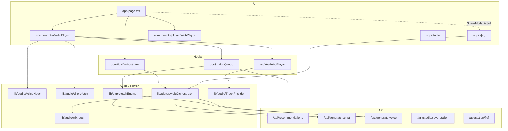

# SongGhost / SongHost Architecture

Technical blueprint of the SongGhost codebase (product brand: **SongHost**). This document reflects the repository at **pre-launch readiness**: Phases 1–4 complete; Phase 5B/5C commercial rails live (Clerk, Postgres sync, Free/Pro metering, Stripe webhooks, Clean Mode); Phase 7 extended commentary + weather/daypart + anti-repetition lore live; PWA installability shipped. Phase 5A dogfooding and 5D public launch ops remain. Milestone sequencing lives in [ROADMAP.md](./ROADMAP.md).

> There is no root-level `ARCHITECTURE.md`; this file under `docs/` is the canonical blueprint.

---

## 1. System Overview & Tech Stack

SongGhost is an AI-powered broadcast radio platform: continuous music playback, dynamic DJ voice overlays, hyper-local / catalog-aware scripting, custom station authoring, and multi-source streaming (YouTube embed fallback, Spotify Web Playback SDK, Apple MusicKit).

| Layer | Technology |
|-------|------------|
| Framework | **Next.js 15** (App Router), **React 19**, **TypeScript 5.8** |
| Styling | **Tailwind CSS 4** — dark charcoal canvas, brand accent `#2992cf` |
| Auth | **Clerk** (`@clerk/nextjs`) — guest mode still works via local preferences |
| Music (legacy / free) | YouTube IFrame API, iTunes Search (preview + catalog dating) |
| Streaming transports | **Spotify Web Playback SDK** + Web API companion; **Apple MusicKit JS** |
| Speech & AI | **OpenAI GPT-4o-mini** (scripts / curator), **OpenAI `tts-1`** (Free), **ElevenLabs** REST (`eleven_turbo_v2_5`, Pro). **Cartesia** is typed (`VoiceProviderId`) but not wired. Legacy persona aliases resolve short Pro picker ids before TTS — `"devon"` → `"devon-pulse"` — so host lock cannot collapse to Miles. |
| Storage & cache | **PostgreSQL** via Drizzle (`DATABASE_URL`), **Cloudflare R2** (studio assets / manifests / lore audio), browser **localStorage** / **sessionStorage**. Phase 5B hybrid sync mirrors memory presets + saved stations to dedicated tables and Host Studio / `lastStationId` / hostRetention to `users.preferences` JSONB through `/api/user/sync`. Phase 5C meters Free-tier DJ breaks in `user_usage_limits` via `/api/user/usage`. Clerk `unsafeMetadata` is billing `tier` only. |
| Optional catalog / events | Last.fm (similar artists), Ticketmaster (local events), YouTube Data API |
| Testing | Vitest + `scripts/smoke-test.mjs` / `scripts/check-env.mjs` |

### High-level diagram



### Architectural principles

Enforced in `.cursor/rules/songghost.mdc`:

1. **Audio engine isolation** — Queue, music providers, and DJ voice stay decoupled; UI glues hooks.
2. **Interface-first adapters** — `TrackProvider` / `VoiceNode` in `src/types/audio.ts`; DJ contracts in `src/types/dj.ts`.
3. **Stable React deps** — Stabilize props/callbacks in refs inside audio hooks; never put raw inline objects/arrays in effect deps.
4. **Throttled failure handling** — YouTube / SDK errors use bounded retry/skip, not infinite loops.
5. **First-song & DJ pacing invariants** — See [Key Invariants](#9-key-invariants-do-not-regress).

---

## 2. Project Directory & Key Modules Map

```text
src/
├── app/
│   ├── page.tsx                 # Main radio console / session orchestration
│   ├── layout.tsx               # Clerk → UserPreferences → Tier → AppleMusic → MusicSource
│   ├── globals.css              # Design tokens (brand accent, surfaces, z-index helpers)
│   ├── studio/page.tsx          # Ghost Studio authoring console
│   ├── admin/page.tsx           # Owner ops dashboard (admin-gated; 404 for others)
│   ├── s/[id]/page.tsx          # Shared studio station permalink
│   ├── call/[id]/page.tsx        # Call-in surface
│   ├── actions/
│   │   └── stripe.ts            # createCheckoutSession() Stripe Checkout scaffold
│   └── api/                     # Route handlers (see §5), incl. webhooks/stripe + admin/stats
├── components/
│   ├── player/                  # WebPlayer, HostBar, ProUpgradeModal, MobilePlayerSheet, StationTuner, liner notes…
│   ├── search/                  # SmartSearchBar, SearchModePills (Station Finder tabs)
│   ├── studio/                  # Track sequence, break cards, share modal
│   ├── visualizer/              # Canvas spectrum / ambient / oscilloscope
│   ├── cards/                   # StationCard (discovery / shelf tiles)
│   ├── common/                  # ArtworkImage — canonical artwork renderer
│   ├── AudioPlayer.tsx          # YouTube/iTunes dual-track integration point
│   ├── ControlDeck.tsx          # On-air deck chrome + Tune Station toggle
│   ├── QueueModal.tsx           # Playlist / station queue + artwork mosaic
│   └── MemoryToolbar.tsx        # 1–6 physical dial presets
├── context/
│   ├── UserPreferencesContext.tsx  # localStorage + `/api/user/sync` hybrid prefs
│   ├── TierContext.tsx             # Free/Pro + break meter (`/api/user/usage`) + upgrade modal
│   ├── MusicSourceContext.tsx      # Spotify / Apple Music auth + active source
│   └── AppleMusicContext.tsx
├── data/                        # Preset stations, personas (legacy aliases: devon → devon-pulse), seeds, genres, decades
├── hooks/
│   ├── useStationQueue.ts       # Infinite queue, replenish, recentTrackIds, 30s DJ prefetch clock
│   ├── useYouTubePlayer.ts      # YouTube IFrame lifecycle + duck fold-in
│   ├── useWebOrchestrator.ts    # Spotify/Apple companion + SDK wiring + duck/pause policy
│   ├── usePreviewPlayer.ts      # iTunes 30s preview fallback
│   ├── useMemoryPresets.ts
│   ├── useKeyboardShortcuts.ts  # Digits 1–6 → memory presets (input-guarded)
│   └── useDjState.ts / useListenerLocation.ts / useMediaRecorder.ts / useStudioStations.ts
├── lib/
│   ├── audio/                   # Dual-track engine (mix-bus, VoiceNode, TrackProvider, prefetch, stingers)
│   ├── player/                  # webOrchestrator, spotifyRemote, appleMusicRemote
│   ├── dj/                      # scheduler, promptBuilder, factEngine, prefetchEngine, teleprompter, broadcast-state
│   ├── location/                # Weather + clock (`weather.ts`): homeCity → IP geo; client timezone headers for daypart
│   ├── queue/                   # builder, shuffle, recent-tracks
│   ├── spotify/                 # App-auth client credentials + recommendation pool
│   ├── studio/                  # Manifest schema + R2/local store
│   ├── storage/r2.ts            # Cloudflare R2 uploads
│   ├── db/                      # Drizzle schema (users, memory slots, saved stations, usage limits, cached lore, fact graph)
│   ├── usage/                   # Free-tier DJ break metering helpers (`dj-breaks.ts`, `constants.ts`)
│   ├── admin.ts                 # Owner gate (`verifyAdminAccess`) + platform metrics aggregation
│   ├── stripe.ts                # Stripe SDK singleton + Pro/Free tier sync helpers
│   ├── user/                    # Preferences helpers, feedback / bans
│   └── visuals/                 # Spectrum math + theme palettes
└── types/
    ├── audio.ts                 # TrackProvider, VoiceNode, DualTrackMix, ducking
    ├── dj.ts                    # DjSegmentPlan, pacing / knowledge / mood
    ├── station.ts               # ChatterPacing, EraLock, MemoryPreset, Studio voice overrides
    ├── user.ts                  # UserPreferences
    ├── voice.ts / visuals.ts / curator.ts / studio-search.ts
```

### Core entry points

| Entry | Role |
|-------|------|
| `src/app/page.tsx` | Home console: station launch, search modes, ControlDeck, AudioPlayer / WebPlayer |
| `src/components/AudioPlayer.tsx` | YouTube + iTunes path: queue + scheduler + VoiceNode + prefetch |
| `src/components/common/ArtworkImage.tsx` | Canonical artwork renderer for `StationCard`, `ControlDeck`, and `QueueModal` — YouTube CDN quality ladder (`hqdefault` → `mqdefault` → `default`) then `Disc3` / `Radio` icon |
| `src/components/player/WebPlayer.tsx` | Companion now-playing chrome bound to orchestrator track state |
| `src/hooks/useWebOrchestrator.ts` | Loads Spotify SDK, owns `WebOrchestrator` lifecycle |
| `src/lib/player/webOrchestrator.ts` | Duck–Talk–Swell for Spotify / Apple Music companion streams |
| `src/hooks/useStationQueue.ts` | Queue generation, replenish, anti-repeat |
| `src/lib/audio/mix-bus.ts` | Music / voice / SFX gain staging + master analyser |
| `src/lib/audio/VoiceNode.ts` | DJ speech node with duck ownership + preload |
| `src/lib/audio/dj-prefetch.ts` | 20s lookahead DJ break warming (YouTube / AudioPlayer path) |
| `src/lib/dj/prefetchEngine.ts` | 30s zero-latency warmup → `prefetchedBreaksMap` + duck/pause policy |
| `src/lib/audio/TrackProvider.ts` | `BaseTrackProvider` + YouTube / HTML5 adapters |
| `src/app/s/[id]/page.tsx` | Public station permalink — `generateMetadata()` OpenGraph/Twitter cards + `PublicStationPlayer` (studio Spotify/Apple gate or catalog/saved Listen + Save to My Radio) |
| `src/components/player/ShareModal.tsx` | Control Deck share sheet — copies `${origin}/s/${stationId}` with toast feedback |
| `src/lib/station/public-station.ts` | Resolves public station ids from catalog → Postgres `user_saved_stations` → R2 studio manifests |
| `src/app/studio/page.tsx` | Authoring UI → `/api/studio/save-station` |
| `src/components/player/ProUpgradeModal.tsx` | Pro paywall modal (`z-[80]`); Checkout CTA + Free Mode dismiss |
| `src/app/actions/stripe.ts` | Server Action: Stripe Checkout Session (`subscription`) or local Pro unlock |
| `src/lib/stripe.ts` | Shared Stripe client + `syncSubscriptionTier` / webhook event appliers |
| `src/app/api/webhooks/stripe/route.ts` | Stripe webhook: signature verify → Clerk + Postgres Pro/Free sync |

---

## 3. Audio Orchestration & Web Audio Pipeline

### Dual-track architecture

Broadcast audio is two (plus SFX) buses, never one fused stream:

| Bus | Owner | Duckable? |
|-----|-------|-----------|
| **Music Track Node** | `TrackProvider` (YouTube / HTML5) or companion transport (Spotify SDK / MusicKit via `WebOrchestrator`) | Yes — only duck target |
| **DJ Voice Node** | `BufferedVoiceNode` (`src/lib/audio/VoiceNode.ts`) or orchestrator-owned `HTMLAudioElement` | Never |
| **SFX / Stingers** | `StingerEngine` (`vinyl_scratch`, `frequency_sweep`, `station_chime`) | Never (marks break edges) |

Contracts live in `src/types/audio.ts` (`TrackProvider`, `VoiceNode`, `DualTrackMix`, `DuckingConfig`).

### Sidechain ducking (`mix-bus.ts` + `VoiceNode` / `dj-intro.ts`)

| Parameter | Constant | Value |
|-----------|----------|-------|
| Duck target | `DUCK_RATIO` | **18%** of master |
| Duck ramp in | `DUCK_RAMP_MS` | **300 ms** |
| Restore ramp out | `RESTORE_RAMP_MS` | **1500 ms** |
| Voice headroom | `VOICE_HEADROOM_BOOST` | **1.35×** (Web Audio speech nodes up to 1.35×; media elements clamped ≤ 1.0) |
| Voice floor | `MIN_VOICE_GAIN` | 0.1 |

`musicGain(master, duckGain)` keeps ducked music tracking the fader. `voiceGain(master)` takes **no** duck parameter — structural guarantee that speech is never sidechained.

YouTube / `VoiceNode` still uses `voiceGain(master, djVolume)` (master × dj × boost, **clamped ≤ 1.0** on the media element). Companion Web Audio `speechGain` uses `companionVoiceGain(djVolume, master)`: `masterVolume` is a **0-only mute gate** (no linear attenuation). Speech is `djVolume * VOICE_HEADROOM_BOOST`, allowing GainNode headroom up to **1.35×**. `HTMLAudioElement` fallbacks remain clamped at **1.0**.

Spotify / Apple companion path uses format-aware constants from `prefetchEngine.ts` via `webOrchestrator.ts`:
- **Standard short breaks:** `SPOTIFY_DUCK_RATIO = STANDARD_BREAK_DUCK_RATIO` (**0.25** / 25%), duck/restore ramps via REST volume (~400 ms duck / ~600 ms restore).
- **Extended formats:** Pause–Talk–Resume, or `EXTENDED_BREAK_AMBIENT_FLOOR` (**0.05**) when pause is unavailable.

YouTube / HTML5 path still uses mix-bus `DUCK_RATIO = 0.18` (18% / 300 ms in / 1500 ms out).

### Pre-fetch sequence A — YouTube / AudioPlayer (20s)

`LOOKAHEAD_SECONDS = 20` in `src/lib/audio/dj-prefetch.ts`.

```text
position clock → shouldStartLookahead(duration - position ≤ 20)
  → DjPrefetchController.start(trackKey, task)
      → planDjSegment() once  (state + randomness travel with the clip)
      → generateDjBreak()     (script + TTS)
      → VoiceNode.preload(blob)
  → on transition: take(trackKey) → play warmed blob (or live fallback)
```

### Pre-fetch sequence B — Zero-latency engine (30s)

`PREFETCH_LOOKAHEAD_SECONDS = 30` in `src/lib/dj/prefetchEngine.ts`.

```text
useStationQueue.notePlaybackProgress / companion onNearEnd
  → shouldPrefetchUpcomingBreak(remaining ≤ 30)
  → DjBreakPrefetchEngine.ensurePrefetch(upcoming, previousTrack=on-air Track N)
      → /api/generate-script  then  /api/generate-voice
      → cache ArrayBuffer + Blob in prefetchedBreaksMap
  → on transition: take(trackKey) → play warmed buffer (or live fallback)
```

Rules:

- At most **one** break in flight; a new target aborts the previous slot.
- Scheduler decision is **not** re-taken at the transition (would double-count pacing and change the break).
- Failures degrade to live generation; they do not stall music.
- Companion path: `WebOrchestrator.prefetchDjBreak` (30s near-end via `PREFETCH_LOOKAHEAD_SECONDS`) with format-aware Duck–Talk–Swell or Pause–Talk–Resume.
- **Lookahead `previousTrack`:** Prefetch for Track N+1 explicitly binds the live on-air Track N (`coherent.trackId !== registeredTrackId`). Do not run `resolveLorePreviousTrack(history, upcomingId)` during warmup — that would recap N-1 because N has not finished. `prefetchDjBreak` / `fetchDjAudio` MUST NOT assign `currentTrack` / `currentTrackId` during lookahead; warmup stays in the prefetch buffer.

### Buffer / completion guards

- Prefetch decode timeout: **8s** (`PRELOAD_DECODE_TIMEOUT_MS` in `VoiceNode`).
- Abort on skip / station change / queue edit via `AbortController` + `retain(keys)` / `clear()`.
- Voice duck / pause release runs on every exit path (ended, error, abort, superseded) so music cannot stick ducked or paused.
- Fresh TTS `HTMLAudioElement` per break on the orchestrator path (browser buffer reuse after Track 1 can hard-lock).
- Stinger buffers cache per id; truncated decays fade at buffer edge to avoid clicks.
- Master analyser `captureMediaElement()` **refuses a suspended** `AudioContext` — visualization must never silence a break.

### Transition flow (format-aware)

**Companion duration-based Mode A / Mode B** (live Spotify / Apple path)

Routing uses `decodedAudioBuffer.duration` from `audioContext.decodeAudioData`. Un-probed or invalid durations **fail closed to Mode B**.

**Zero-leak companion transition:** When a DJ break is pending, the orchestrator freezes the incoming Spotify transport at **0:00** (mute + pause + seek) **before** history, script prefetch, or TTS decode. That hold stays in force for the entire `PREFETCHING_BREAK` window so the SDK cannot leak an unmuted Track B pre-roll. Speech (Mode B) or Mode A ducking begins only after `decodeAudioData` proves the clip; until then Track B remains held at 0:00.

- **Mode A** (clip ≤ 15s): after decode proves the short clip, resume Track B at the duck floor → speak in-band → logarithmic swell.
- **Mode B** (clip > 15s, or duration unknown): fade outgoing to a station bed, **keep Track B frozen at 0:00** for the entire host break, then hard-launch Track B from position **0:00** at full volume when speech completes. Single-URI `playTrack` and SDK auto-advance must not run Track B audio in parallel with Mode B speech.

**Standard / short breaks — Duck–Talk–Swell** (YouTube / HTML5; companion Mode A)

1. Music keeps playing.
2. Companion music ducks to **25%** (~400 ms); YouTube/HTML5 path ducks to **18%** (~300 ms).
3. Prefetched (or live) DJ clip plays at `voiceGain` (YouTube / media element) or `companionVoiceGain` (companion Web Audio).
4. On speech end (+ small tail), music restores (companion ~600 ms / HTML5 ~1500 ms).

**Extended formats** (`roots_branches`, `time_capsule`, `directors_cut`) — Pause–Talk–Resume

1. Pause main music (preferred) **or** duck to a **5%** ambient floor if pause fails.
2. Host clip plays.
3. Resume music (or swell ambient → pre-break volume) when speech completes.

**Planned (Phase 6 — not implemented):** Dual-phase orchestration

1. **Phase 1 — Speech Spotlight:** music yields hard for host focus.
2. **Phase 2 — Ducked Track Lead-In:** next track enters under a ducked bed while speech finishes.

Do not document Phase 6 dual-phase lead-in as live behavior; format-aware Duck vs Pause above is what production code runs today.

### YouTube first-song invariant (`useYouTubePlayer.ts`)

Pause until audio unlock → single `seekTo(0)` → play → `tryEmitOnPlaying()` **once per track load**. Duck gain is re-asserted on ready / load-settle / PLAYING because embeds reset to 100% volume on module load.

### Spotify Companion single-driver telemetry

Companion progress has **two** clocks that MUST stay separated:

1. **Transport samples** — Spotify Web Playback SDK `player_state_changed` (and REST `/me/player` only when no SDK device is ready). These stamps are authoritative for track identity, pause/play, duration, and FSM timing (`resolvePlaybackPositionMs`).
2. **Local playhead interpolation** — a 250 ms UI clock (`PLAYHEAD_INTERPOLATION_MS`) that fills the gaps between sparse SDK events: `progressMs = min(durationMs, positionMs + (now - receivedAt))`. It updates `companionPlayback` / shared `ActiveTrackState.positionMs` **only**. It MUST NOT drive ducking, Mode A/B holds, or `freezeIncomingCompanionTransport`.

When the SDK listener is registered (`useWebOrchestrator` + `attachSpotifyPlayerStateListener`), the 2000 ms REST poll (`subscribeSpotifyPlaybackState`) MUST stay stopped — including while local interpolation is running. If no SDK sample arrives for 2000 ms, issue one `player.getCurrentState()` re-anchor (or one REST fetch if state is null), then resume interpolation. REST remains a disconnected fallback only (no SDK device / `ready` not yet fired).

| Driver | Tag | `trackId` | When |
|--------|-----|-----------|------|
| SDK listener | `[TELEMETRY: DJ Timing Check]` `driver: "spotify-sdk"` | On-air Spotify URI | `player_state_changed` |
| REST poll | `[TELEMETRY: DJ Timing Check]` `driver: "spotify"` | On-air `/me/player` item | 2000 ms, SDK absent |
| Prefetch lookahead | `[TELEMETRY: DJ Prefetch Check]` | **Upcoming** queue key | `DjBreakPrefetchEngine.observeProgress` |

Do **not** log upcoming lookahead ids as `[TELEMETRY: DJ Timing Check]` — that paints a dual-track ghost (on-air + up-next) at the same playhead. `AudioPlayer` companion scrub (`notePlaybackProgress`) feeds the prefetch engine only; it is not a second timing driver.

### Two-tier listener state (settings vs playhead)

Listener identity and Host Studio settings are **account-scoped**. Live playhead is **transport-scoped**. Do not fuse them:

| Tier | What lives here | Store | Sync |
|------|-----------------|-------|------|
| **User settings** | `activePersonaId`, commentary format (including Director's Cut), mood / personality, `stationConfigs` (incl. `vibePrompt`), Host Retention (`activeHostId` / `isHostLocked`), `lastStationId` | Postgres `users.preferences` JSONB via `/api/user/sync` (localStorage first) | Cross-device. Clerk `unsafeMetadata` stays billing-only (`tier`) — never a prefs blob |
| **Playhead** | Current URI, position, pause/resume, SDK device | Spotify Connect (SDK `player_state_changed` + REST fallback) | Reconciled on handshake (`syncIndexToPlayingTrack` / `onTrackStarted`). Tab `sessionStorage` (`songhost_active_station_id` / `songhost_active_queue`) is a same-tab cache only |

A new device hydrates Host Studio + `lastStationId` from JSONB, then Path A/B/C of the mobile gesture CTA attaches to Connect or launches the station. Ducking ratios, Mode A/B hold timing, and volume ramps are unchanged.

---

## 4. State Management & Data Flow

### Session / queue

| State | Location | Lifetime |
|-------|----------|----------|
| Active station, playhead, volume, `queueGeneration` | `page.tsx` + `AudioPlayer` / orchestrator | Session |
| Queue + current index | `useStationQueue` | Session (reset on `stationId:queueGeneration`) |
| Active `stationId` + queue | `sessionStorage` (`songhost_active_station_id`, `songhost_active_queue`) | Tab session (survives refresh; cleared when the tab closes) |
| `recentTrackIds` (last **100**) | `src/lib/queue/recent-tracks.ts` (+ mirrored in queue hook) | In-memory page session; fed to `/api/recommendations` `exclude` |
| `actualPlaybackHistory` (last **5**, newest last) | `WebOrchestrator` | Session; zero-lag append via `recordActualPlayback()` on every companion track transition, including while `running` or Mode A/B holds are active (`noteActualPlayback` keep-alive). Each tuple MUST be identity-coherent (`source.id === targetTrackId`); skip the append rather than mixing title/artist from another URI / `nextPrefetchKey`. Lore `previousTrack` is always the immediate N-1 predecessor after filtering the current id. Distinct from `recentTrackIds` (recommendation exclude list). |
| DJ scheduler state | `AudioPlayer` / broadcast-state refs | Session |
| Companion track / DJ status | `WebOrchestrator` + `useSyncExternalStore` in WebPlayer | Session |
| Failed YouTube IDs | `failed-youtube-ids.ts` | Session |
| Starter first-track history | `starter-history.ts` | `localStorage` (rotation window 20) |

Queue launch rules (`useStationQueue`):

| Path | ID prefix | Behavior |
|------|-----------|----------|
| Preset genre/decade | (none) | Random starter + catalog replenish |
| Artist Radio | `artist-radio-` | Preserve API order |
| AI Curator | `ai-curator-` | Shuffle full playlist |
| Song / Album radio | mode-specific | Built via song-radio / album-radio helpers |

`sessionOpeningDjRef` is set **only** on `stationId` or `queueGeneration` change — never on `videoId` / track advance.

**Companion playback history:** `WebOrchestrator.actualPlaybackHistory` is the lore-recap source of truth (newest last, cap 5). `recordActualPlayback()` / `noteActualPlayback()` append on every companion track transition with zero lag — including while a Duck–Talk–Swell is `running` or a Mode A/B hold is active — so the buffer never stalls or misses a played track. Metadata is resolved in order: SDK `getCurrentTrackState()` → queue row (`findQueueIndexForPlayingTrack`) → REST currently-playing **only if the URI matches** → `djPrefetchByTrackId.get(trackId)` exact key. Never fall back to `nextPrefetchKey`. If no coherent match exists, skip the append. Live breaks send `previousTrack` as the immediate N-1 predecessor (last history entry after filtering the current id). Lookahead prefetch for N+1 binds the live on-air Track N instead, because N has not finished. `recentTrackIds` in `src/lib/queue/recent-tracks.ts` remains a separate recommendation-exclude list and is not this buffer.

Session Persistence: Active `stationId` and `queue` persist in `sessionStorage` across browser reloads to keep React UI queue state aligned with server-side Spotify Connect playback. Hydrate the persisted station queue on mount before Spotify SDK `resume` / `onTrackStarted` so `syncIndexToPlayingTrack` cannot miss against a fallback preset. Unrecognized Spotify Autoplay tracks must **not** be prepended into the live queue; `onTrackStarted` steers playback back onto `queue[currentIndex + 1]` / `queue[currentIndex]` via `playTrack` / `steerToStationUri`.

**UI mount hydration vs. ControlDeck paint:** Memory queue hydration is instant (`bootQueueFromSession` / `runReset` restore `queue` + `currentIndex` for index lookup). Visual ControlDeck metadata is handshake-gated: `isSpotifySyncPending` defaults `true` on Spotify companion session restore (restored rows carry `spotifyId`) and `false` for YouTube. While pending, `stampQueueOpener` is suppressed and `ControlDeck` renders "Tuning in…" with no artwork even if restored `sessionStorage` props exist. `page.tsx` clears the flag only after `syncIndexToPlayingTrack` completes or `onTrackStarted` fires with live cloud state — so a refresh cannot flash the last persisted title (e.g. "Creep") before the SDK reports the actual on-air track.

**Station Handoff Invariant:** Station switches MUST call `AudioPlayer.armStationHandoff()` from `selectStation` / `handoffToWebOrchestrator` **before** queue updates so `handleNewTrack` cannot race `launchStation` with Spotify Search. `disarmStationHandoff()` runs after the official launch. Native `spotifyId` / `spotifyUri` on the queue row MUST be preferred over Search; resolved URIs are persisted via `updateTrackAt` (never in-place mutation).

**Spotify REST 429 circuit breaker:** `src/lib/spotify/fetchWithRetry.ts` (`spotifyApiFetch`, `fetchSpotifyGetWithRetry`) owns a process-wide breaker (`spotifyRateLimitResetTime` / `isSpotifyCircuitOpen()`). A live HTTP 429 honors `Retry-After` (default 30 s) and fail-fasts later GETs with a synthetic 429. `searchSpotifyTrackUri` bounds concurrency to **2**, negatively caches 429s for **60 s**, and LRU-caps the URI cache at **256**. Canonical rules: [AUDIO_ORCHESTRATION_SPEC_2.md](./AUDIO_ORCHESTRATION_SPEC_2.md) §1.6.

**Spotify Search query fallback:** `searchSpotifyTrackUri` sanitizes YouTube junk via `sanitizeSpotifySearchTitle` / `sanitizeSpotifySearchArtist` (quotes, resolution tags, standalone years, 8-digit `YYYYMMDD` date stamps, featuring / `ft.` / `feat.` credits and trailing featured-artist strings, exclusive/official/lyric parens; aggregator channels such as Audacy → empty artist; `&` / `,` lists isolate the **primary** artist). Search is **3-tier**: Tier 1 quoted fields (`track:"…" artist:"…"`), then Tier 2 un-fielded `q` (`title artist`), then Tier 3 title-only (`title`) when that would not duplicate Tier 2. Each later tier runs only when the previous produced no URI and was not HTTP 429 / circuit-open. Each attempt logs 502s and empty result sets.

### Provider tree (`src/app/layout.tsx`)

```text
ClerkProvider
  └─ UserPreferencesProvider     # prefs, memory dial, saved stations, Clean Mode, commentary
       └─ TierProvider           # subscription tier, break quota, ProUpgradeModal state
            ├─ AppleMusicProvider
            │    └─ MusicSourceProvider → {children}
            └─ DevTierToggle     # dev-only; single mount in layout (not page.tsx)
```

No circular imports between context modules. Billing tier is owned by `TierContext` (`"free" | "pro"`). Legacy `UserPreferences.userTier` (`"Free" | "Pro"`) remains for storage compatibility but is not the live gate.

### User preferences

`UserPreferences` (`src/types/user.ts`) in `UserPreferencesContext`:

- Tier, preferred TTS voice, active persona, chatter pacing, visualizer mode
- **`allowExplicit`** — Clean Mode gate (Phase 5C). Guests / missing flag default to `false`; logged-in accounts without a stored value default to `true`. Persisted via `setAllowExplicit()` → localStorage. Host Settings Drawer exposes the "Allow Explicit Content" toggle (`AllowExplicitContentToggle` in `HostBar.tsx`).
  - When `false`: `/api/recommendations` and `/api/station-tracks` drop candidates with `track.explicit === true`; `promptBuilder.buildExplicitContentDirective()` appends the FCC-safe BROADCAST DIRECTIVE to DJ system prompts.
  - When `true`: catalog keeps explicit tracks; DJ prompts allow natural late-night commentary without strict censorship.
- **`commentaryFormat`** — lore / commentary depth (Phase 7). Defaults to `"standard"`. Persisted via `setCommentaryFormat()`; Host Settings Drawer exposes "Lore & Commentary Depth" (`CommentaryFormatSelector` in `HostBar.tsx`). UI display labels are standardized across the HostBar summary pill (`formatCommentaryFormatLabel` / `formatHostSettingsSummary` in `HostBar.tsx`) and the Host Settings Drawer: **`"Standard"`**, **`"Roots & Branches"`**, **`"Sonic Time Capsule"`**, and **`"Director's Cut"`**. The Host Studio pill subscribes to live `UserPreferences.commentaryFormat` so a drawer change updates immediately (e.g. `Natural Pace • Director's Cut`). Extended values `roots_branches`, `time_capsule`, and `directors_cut` are Pro-gated and append format + SSML pacing directives in `promptBuilder.buildCommentaryFormatDirective()`. Spotify Companion (`useWebOrchestrator`) folds this through `resolveStationSettings()` (station override > global) rather than reading the raw global preference. Host Settings snaps Free-tier selections back to `"standard"`.
- **`mood`** / **`personality`** — Host Studio vocal energy and personality colour. Optional on older prefs blobs; hydrate to Even Keel / Normal. Persisted via `setDjMood()` / `setDjPersonality()` to both global preferences and `stationConfigs[stationId]` so Tuning Console picks are fully retained across page reloads. Host Settings Drawer exposes the selectors (`HostMoodSelector` / `HostPersonalitySelector` in `HostBar.tsx`).
- Play history, liked tracks, saved stations
- **`memoryPresets`** — always exactly **6** slots
- **`stationConfigs`** — per-station overrides (host, pacing, era, vibe / `vibePrompt`, `commentaryFormat`, `mood`, `personality`); never mutate a preset `Station` in place
- **`lastStationId`** — durable resume target for the mobile gesture CTA (Path B); synced in JSONB, distinct from tab `sessionStorage` playhead

Persistence: `localStorage` keyed by Clerk `userId` or guest. Signed-in accounts hybrid-sync **memory presets**, **saved stations**, and the **Host Studio / resume slice** through `/api/user/sync` (local first, debounced ~400ms background Postgres upsert into `users.preferences` JSONB). Cloud wins on conflict after login hydrate. `resolveStationSettings()` is the single precedence fold (station override > global > station default). Do **not** store this blob in Clerk `unsafeMetadata`.

**Two-tier reminder:** JSONB holds *what the listener wants* (host, lore depth, custom directives, last station id). Spotify Connect holds *where the needle is*. `sessionStorage` queue hydrate exists so `syncIndexToPlayingTrack` can resolve the live URI on refresh — it is not the cross-device source of truth.

**Spotify Companion lore breaks** (`useWebOrchestrator` → `WebOrchestrator` → `/api/generate-script` lore pipeline) enforce the folded Host Settings together: `commentaryFormat`, mood, personality, and `vibePrompt` custom directives. `promptBuilder.buildLoreSystemPrompt()` injects `buildVibeDirective()` so listener-authored station notes colour the host on Spotify streams.

Pinned home presets: `songghost:pinned-presets` via `src/lib/user/preferences.ts`.

### 1–6 radio physical presets

| Slot | Index | Contract |
|------|-------|----------|
| Buttons 1–6 | `memoryPresets[0..5]` | `MemoryPreset \| null` |
| Shape lock | `MEMORY_PRESET_COUNT = 6` | `normalizeMemoryPresets()` before any index |
| UI | `MemoryToolbar.tsx` | Tap = tune; long-press / right-click = park |
| Hotkeys | `useKeyboardShortcuts.ts` | Digits `1`–`6` call `playMemorySlot(slotIndex)` |
| Cloud sync | `user_memory_slots` + `user_saved_stations` + `users.preferences` JSONB (Drizzle) | `/api/user/sync` (Phase 5B) |

**Input guard:** the global `keydown` listener ignores hotkeys when `e.target` is an `INPUT`, `TEXTAREA`, or `contentEditable` element so Smart Search / Host Settings typing never steals the dial.

Only preset / saved stations may be parked; ephemeral artist-radio / curator launches cannot be recalled from the dial.

### Decade / Genre Matrix tuner

| Piece | Role |
|-------|------|
| `StationTuner.tsx` | Inline expandable deck under the primary Station Finder search bar |
| Era chips | Multi-select `60s` · `70s` · `80s` · `90s` · `2000s` · `2010s` · `Modern` |
| Genre matrix | Sub-genres filtered by selected decades (e.g. `90s` → Grunge, Alternative, East Coast Hip-Hop, Eurodance, Britpop) |
| Sliders | Energy Level (Mellow → High Energy) · Catalog Depth (Mainstream Hits → Deep Cuts) |
| Generate | **Tune & Generate Station** builds a weighted `/api/station-tracks` seed query from the matrix, then launches a synthetic `tuner-*` session |
| Toggle | **Tune Station** on `ControlDeck` and adjacent to `SearchModePills` expands / collapses the drawer |

Listener location (`useListenerLocation`) uses `sessionStorage` for hyper-local DJ mentions.

---

## 5. API Routes & Backend Services Index

### Catalog & search

| Route | Method | Purpose |
|-------|--------|---------|
| `/api/recommendations` | GET | Anti-repetition Spotify pool: seeds → exclude `recentTrackIds` → random `target_popularity` ∈ [45,85] → **Fisher–Yates** shuffle (`lib/spotify/recommendations.ts`). When `allowExplicit=false`, drops `explicit === true` candidates. Used by Song Radio / Artist Radio oversampling. |
| `/api/song-radio` | GET | Song Radio catalog build (Spotify + iTunes resolve) |
| `/api/artist-radio` | GET | Artist Mix (`artist-only`) / Artist Radio (`mixed` + Last.fm) |
| `/api/album-radio` | GET | Full Album deep-dive queue |
| `/api/album-suggest` | GET | Album autocomplete |
| `/api/artist-suggest` | GET | Artist autocomplete |
| `/api/station-tracks` | GET | Preset station replenishment (era-locked → iTunes-dated catalog). Honors `allowExplicit` Clean Mode filter on `track.explicit`. Also seeded by the Decade/Genre Matrix tuner (`StationTuner`) with optional `target_popularity` / `target_energy` / `weight` hints on the query string. |
| `/api/song-search` | GET | On-demand queue insertion search |
| `/api/search` | GET | Unified search helper |
| `/api/curate-playlist` | POST | AI Curator (GPT-4o-mini → resolved tracks) |
| `/api/user/top-tracks` | GET | Listener top tracks (auth-aware) |
| `/api/user/sync` | GET/POST | Phase 5B cloud persistence: Clerk-authenticated fetch / upsert of `user_memory_slots` (dial 1–6 → `slotIndex` 0–5), `user_saved_stations`, and `users.preferences` JSONB (`activePersonaId`, `commentaryFormat`, `mood`, `personality`, `stationConfigs` incl. `vibePrompt`, `hostRetention`, `lastStationId`). A POST body with `preferences` alone is valid. Client hydrates localStorage first, then merges cloud over local; Host Studio writes debounce ~400ms. Clerk `unsafeMetadata` is not used for this blob. |
| `/api/user/usage` | GET | Phase 5C Free-tier DJ break meter: returns `breakCount`, `limit` (30 Free / `null` Pro unlimited), `daysUntilReset`, `periodStart`, `tier`. Resets `breakCount` when `periodStart` is older than 30 days. |
| `/api/webhooks/stripe` | POST | Phase 5C Stripe billing webhook. Verifies `Stripe-Signature` via `STRIPE_WEBHOOK_SECRET`. Handles `checkout.session.completed`, `customer.subscription.created|updated|deleted`. Resolves Clerk user from `client_reference_id` / `metadata.userId`, then syncs `unsafeMetadata.tier` + Postgres `users.tier` (`pro` when `active`/`trialing`, `free` on `canceled` / subscription deleted). Returns `400` on bad signatures. |

**Search modes** (UI: `SearchModePills` Station Finder tabs): Song Radio · Artist Mix · Artist Radio · Full Album · AI Curator. **Tune Station** sits adjacent to these pills (and on `ControlDeck`) to open the Decade/Genre Matrix drawer.

### Speech & AI

| Route | Method | Purpose |
|-------|--------|---------|
| `/api/generate-script` | POST | LLM DJ script (+ optional lore cache / embedded TTS audio URL). Free-tier quota: `403 QUOTA_EXCEEDED` when `breakCount >= 30`; increments meter after successful new generation. Free-tier pace guard forces `djMode: "balanced"` / `talkLevel: "standard"` (`breakPace: "short"`). Spotify Companion lore breaks send folded `commentaryFormat`, mood, personality, and `vibePrompt` custom directives; `buildLoreSystemPrompt` injects `buildVibeDirective()` so Host Studio notes apply on Spotify streams. |
| `/api/generate-voice` | POST | TTS dispatch (OpenAI `tts-1` or ElevenLabs). **There is no `/api/tts` route** — clients use these two. |
| `/api/liner-notes` | POST | Album / track liner notes copy |
| `/api/artist-events` | GET | Ticketmaster local events for DJ mentions |

Script formatting / soft pauses: `src/lib/tts.ts` / `dj-script.ts`. Extended commentary formats instruct the LLM to inject `<break time="300ms"/>` / `<break time="500ms"/>` tags. `prepareTtsSynthesisText()` **preserves** those tags for ElevenLabs and **strips / softens** them to ellipsis cues for OpenAI `tts-1` (which cannot accept raw SSML).

### Studio & auth

| Route | Method | Purpose |
|-------|--------|---------|
| `/api/station/[id]` | GET | Public station fetch for shared permalinks. Resolves built-in catalog → Postgres `user_saved_stations` → R2 studio manifests via `resolvePublicStation()`. Returns `{ station, error }` (`404` when missing). Powers `/s/[id]` player hydration and OpenGraph metadata. |
| `/api/studio/save-station` | GET/POST | Serialize `StudioStationManifest` (tracks, `djBreaks` cues, caller URLs, `djConfig`) → R2 `studio-stations/{id}.json` (+ user index). Returns id used by **`/s/[id]`**. |
| `/api/studio/upload-cover` | POST | Cover art → R2 |
| `/api/studio/upload-voice` | POST | Custom voice stem → R2 |
| `/api/studio/upload-voicemail` | POST | Call-in / voicemail clip → R2 |
| `/api/auth/spotify/callback` | GET | Spotify OAuth + PKCE token exchange. **Redirect URI invariant:** local MUST be `http://127.0.0.1:3000/api/auth/spotify/callback` (Spotify forbids `localhost`); production MUST be `https://song-ghost.vercel.app/api/auth/spotify/callback`. |

### Ops & monitoring

| Route | Method | Purpose |
|-------|--------|---------|
| `/api/health` | GET | Production readiness probe. Checks Postgres via a short-lived Drizzle `select 1` when `DATABASE_URL` is set (`connected` / `not_configured` / `error`), plus presence of `OPENAI_API_KEY` and `NEXT_PUBLIC_CLERK_PUBLISHABLE_KEY` (`configured` / `missing`). Returns `{ status, timestamp, services }` with HTTP `200` when healthy or `503` when a critical dependency fails. Global client crashes are caught by `ErrorBoundary` (`Station Recovering` soft reset) in the root layout. |
| `/api/admin/stats` | GET | Phase 5D owner metrics. Requires `verifyAdminAccess()` (`src/lib/admin.ts`): Clerk `userId` in `ADMIN_USER_IDS` (comma-separated) **or** `sessionClaims.metadata.role === "admin"`. Returns `403` when unauthorized. Aggregates Postgres via Drizzle: `users` count, Pro subscribers (`tier === 'pro'`), sum of `user_usage_limits.breakCount`, estimated API spend (`totalBreaks × $0.0039`), and `user_saved_stations` count. Payload: `{ users, proSubscribers, totalBreaks, estimatedSpend, savedStations }`. Powers the `/admin` dashboard (unauthorized visitors see a clean **404 Not Found** so the route stays invisible). |

### Persistence services

- **R2** — `src/lib/storage/r2.ts`, manifest store under CDN URL.
- **Postgres** — `src/lib/db/schema.ts` (see Database Schema below).
- **User sync** — `src/app/api/user/sync/route.ts` + `src/lib/user/cloud-sync.ts`, wired from `UserPreferencesContext` for signed-in Clerk users.

### Database Schema

Drizzle tables in `src/lib/db/schema.ts` (all active):

| Table | Purpose |
|-------|---------|
| `users` | Clerk-backed account row (`id` = Clerk user id), Stripe customer + `subscriptionStatus` + product `tier` (`free` \| `pro`, synced by `/api/webhooks/stripe`) + `preferences` JSONB (Host Studio / hostRetention / lastStationId; not Clerk metadata) |
| `user_memory_slots` | Dial presets 1–6 (`slotIndex` 0–5) + station JSON per Clerk user; unique on `(userId, slotIndex)` |
| `user_saved_stations` | Listener-saved stations / playlists (full `Station` payload JSON); unique on `(userId, stationId)` |
| `user_usage_limits` | Rolling 30-day Free-tier DJ break meter (`userId` PK, `breakCount`, `periodStart`, `updatedAt`). Auto-resets when `periodStart` is older than 30 days. |
| `cached_lore_breaks` | Cached lore TTS clips keyed by `trackId` + ElevenLabs `voiceId` (unique on pair) |
| `lore_facts` | Canonical music-lore fact graph (`id`, optional `artistId` / `albumId` / `trackId`, `factText`, `category`, `createdAt`) |
| `user_lore_history` | Per-listener served-fact ledger (`userId` → `users.id`, `factId` → `lore_facts.id`, `servedAt`); indexed on `userId` and `(userId, factId)` |

**Free-tier DJ break metering** (`src/lib/usage/dj-breaks.ts`): Free listeners get **30** voiced breaks per rolling 30-day window; Pro is unlimited. `GET /api/user/usage` returns `{ breakCount, limit, daysUntilReset, periodStart, tier }` (and resets expired windows). `/api/generate-script` enforces the Free quota with `403 { error: "QUOTA_EXCEEDED" }` and increments `breakCount` after a successful new generation (cache hits do not increment). `TierContext` hydrates from `/api/user/usage`; `HostBar` shows `BREAKS n/30 THIS MONTH · FREE` / `BREAKS UNLIMITED · PRO` and locks Break Now at 30/30.

**Stripe Pro state sync** (`src/lib/stripe.ts` + `/api/webhooks/stripe`): Production upgrades/downgrades write Clerk `unsafeMetadata.tier` and Postgres `users.tier` together. Checkout Session creation stamps `client_reference_id` + `metadata.userId` / `subscription_data.metadata.userId` so webhook events can resolve the Clerk account.

### Free vs. Pro Feature Matrix

| Feature | Free | Pro |
|---------|------|-----|
| DJ break quota | 30 / rolling 30 days | Unlimited |
| TTS voices | OpenAI STANDARD (`onyx` / `echo` / `alloy`) | Named ElevenLabs / Cartesia hosts + HD engine |
| Lore & commentary depth | `standard` only | `roots_branches`, `time_capsule`, `directors_cut` |
| **DJ break pace** | **SHORT BREAKS only** (`short_breaks` → `balanced` / chatter `standard`) | SILENT · EVERY SONG · SHORT BREAKS · LONG BREAKS |
| Custom host directives | Locked | Editable |
| Sarcastic Critic personality | Locked | Unlocked |

**DJ Pace Restriction (Phase 5C):** Free listeners are locked to SHORT BREAKS. `BreakPaceSelector` in `HostBar.tsx` badges SILENT / EVERY SONG / LONG BREAKS as PRO and calls `openUpgradeModal()` on click without changing selection. When tier switches to `"free"` (or guest init), `HostControlsBar` + `setUserTier("Free")` reset global `chatterPacing` to `"standard"`, and the home session clamps `activeChatterPacing` to `"standard"`. `/api/generate-script` applies `applyFreeTierPaceGuard()` so Free requests always run `djMode: "balanced"` / `talkLevel: "standard"` (`breakPace: "short"`) regardless of the client payload.

**Anti-Repetition Fact Engine** (`src/lib/dj/factEngine.ts`): `getServedFactIds(userId)` / `logServedFact(userId, factId)` read/write `user_lore_history`. `/api/generate-script` resolves excluded topics and injects an `ANTI-REPETITION DIRECTIVE` via `buildDjScriptPrompt()` / `buildAntiRepetitionDirective()` in `promptBuilder.ts`.

**PWA Manifest & Mobile Installability** (`src/app/manifest.json` + `src/app/layout.tsx`):

- Web App Manifest name `"SongHost Radio Studio"` / short_name `"SongHost"`, `display: "standalone"`, theme/background `#09090b` (zinc-950), icons `/icon-192.png` + `/icon-512.png`.
- Root layout metadata: `appleWebApp: { capable, statusBarStyle: "black-translucent", title: "SongHost" }` and dark/light `themeColor` meta tags so iOS/Android install chrome matches the charcoal UI.
- A mirrored copy also lives at `public/manifest.json` for the explicit `metadata.manifest` link.

**Weather & Time-of-Day Contextual DJ Intros** (`src/lib/location/weather.ts` → `/api/generate-script` → `promptBuilder.ts`):

```text
Place (VPN-safe):
  body.homeCity (UserPreferences.homeCity / Host Settings "Broadcast City")
    → Open-Meteo geocoding + forecast
  else Request headers (x-forwarded-for / x-real-ip / cf-connecting-ip)
    → extractClientIp()
    → ipapi.co / ip-api.com geolocation
  → getBriefWeatherWithin({ homeCity, ipAddress }, 800ms)  # hard deadline
       → Open-Meteo current temp (°F) + WMO condition
       → in-memory cache keyed by city (30 min TTL)

Clock (always client timezone — never IP locale):
  x-client-timezone / x-timezone headers
    → resolveClientClock() → timeOfDay + dayOfWeek

  → resolveAtmosphericBroadcastContext({ timeZone, timeOfDay, location, weather })
  → buildDjScriptPrompt(..., { broadcastContext })
       → appends BROADCAST TIMING & ATMOSPHERE system directive
  → also mirrors into context.hyperLocal for user-brief daypart colour
```

Failures (private IP, timeout, provider error) degrade to `null` weather; script generation continues with clock-only atmosphere. Location fallback order: weather city → `homeCity` / `listenerCity`.

---

## 6. Design System & Theme Tokens

Defined in `src/app/globals.css`:

```css
:root {
  --background: #09090b;
  --surface: #121215;
  --surface-elevated: #18181b;
  --surface-border: rgba(255, 255, 255, 0.08);
  --foreground: #f4f4f5;
  --muted-foreground: #a1a1aa;
  --brand-accent: #2992cf;
  --brand-accent-hover: #227cb1;
  --brand-accent-glow: rgba(41, 146, 207, 0.25);
  --station-accent: var(--brand-accent);
}
```

Tailwind `@theme inline` maps:

| CSS variable | Tailwind token |
|--------------|----------------|
| `--brand-accent` | `accent` / `bg-accent` / `text-accent` / `border-accent` |
| `--brand-accent-hover` | `accent-hover` |
| `--brand-accent-glow` | `accent-glow` (shadows) |

Fonts: **Plus Jakarta Sans** (`--font-sans`), **Space Mono** (`--font-mono`). Logo duality animation crossfades SongHost ↔ SonGhost with accent glow on `g`.

### Z-index stacking guidelines

Keep overlays ordered so search never loses to the player, and modals never lose to drawers:

| Layer | Typical `z-*` | Examples |
|-------|---------------|----------|
| Deck / sticky chrome | `z-[60]` | Control deck sticky bars, history / liner drawers, mobile player sheet |
| Standard modals | `z-[70]` / panel `z-[71]` | Host settings, share station |
| Billing / upgrade | `z-[80]` / `z-[81]` | `ProUpgradeModal` |
| Top-level blocking UI | `z-[100]` | `SmartSearchBar` results dropdown, `MusicSourceModal` |

Search dropdowns must sit **above** the player bar (`z-[100]`). Player sheets sit at `z-[60]` so they do not cover search. Avoid inventing one-off layers without updating this table.

### Visualizer palettes

Genre-adaptive colors are keyed by **host** (`lib/visuals/theme-palette.ts`), not station id — every launch path already resolves a `PersonaId`.

---

## 7. Environment Variables & External Keys Checklist

Copy `.env.example` → `.env.local`. Phase 5 infra keys are validated by `npm run check-env` / `src/lib/env.ts` (Clerk required when that schema is parsed; DB/R2 optional when blank).

### Core broadcast

| Variable | Required for |
|----------|--------------|
| `OPENAI_API_KEY` | DJ scripts, AI Curator, Free-tier TTS, liner notes |
| `ELEVENLABS_API_KEY` | Pro-tier TTS |
| `ELEVENLABS_VOICE_SLOANE` / `_JOHNNY` / `_DEVON` / `_KIRA` / `_JASPER` | Optional persona voice overrides |
| `YOUTUBE_API_KEY` | YouTube search / embed validation |
| `LASTFM_API_KEY` | Artist Radio similar-artist mix |
| `TICKETMASTER_API_KEY` | Local concert mentions |

### Spotify

| Variable | Required for |
|----------|--------------|
| `NEXT_PUBLIC_SPOTIFY_CLIENT_ID` | PKCE authorize + Web Playback SDK |
| `SPOTIFY_CLIENT_SECRET` | Token exchange / app-auth recommendations |
| `NEXT_PUBLIC_SPOTIFY_REDIRECT_URI` / `SPOTIFY_REDIRECT_URI` | Canonical callback. Local: `http://127.0.0.1:3000/api/auth/spotify/callback` (**never** `localhost`). Production: `https://song-ghost.vercel.app/api/auth/spotify/callback`. |
| `NEXT_PUBLIC_SPOTIFY_SCOPES` | Optional; defaults are `streaming`, `user-read-currently-playing`, `user-read-playback-state`, `user-top-read`, `user-modify-playback-state`, `user-read-private`, `user-read-email`. `streaming`, `user-modify-playback-state`, `user-read-private`, and `user-read-email` are always appended (Web Playback SDK `check_scope` 403 without private/email). |

**Spotify Redirect URI Invariant:** Spotify OAuth strictly disallows `localhost` URIs. Local development MUST strictly use `127.0.0.1:3000` (`http://127.0.0.1:3000/api/auth/spotify/callback`), while production MUST use `https://song-ghost.vercel.app/api/auth/spotify/callback`. `canonicalizeSpotifyRedirectUri()` in `src/lib/player/spotifyRemote.ts` rewrites loopback hosts (`localhost`, `::1`, `127.0.0.1`) to the registered local callback and never emits `localhost` in `redirect_uri`.

### Apple Music

| Variable | Required for |
|----------|--------------|
| `NEXT_PUBLIC_APPLE_MUSIC_DEVELOPER_TOKEN` | MusicKit JS (alias: `NEXT_PUBLIC_APPLE_DEVELOPER_TOKEN`) |

### Auth & Phase 5 infra

| Variable | Required for |
|----------|--------------|
| `NEXT_PUBLIC_CLERK_PUBLISHABLE_KEY` | Clerk client |
| `CLERK_SECRET_KEY` | Clerk server |
| `DATABASE_URL` | Postgres (`postgres://` / `postgresql://`) — optional locally |
| `R2_ACCOUNT_ID` (or `R2_ENDPOINT`) | Cloudflare R2 |
| `R2_ACCESS_KEY_ID` / `R2_SECRET_ACCESS_KEY` | R2 credentials |
| `R2_BUCKET_NAME` | Bucket |
| `NEXT_PUBLIC_R2_CDN_URL` | Public CDN base for manifests & uploads |

| `STRIPE_SECRET_KEY` | Stripe Checkout + webhook handlers (optional locally — falls back to Dev Pro unlock) |
| `STRIPE_PRICE_ID` (or `STRIPE_PRO_PRICE_ID`) | Pro subscription price for Checkout |
| `STRIPE_WEBHOOK_SECRET` | `/api/webhooks/stripe` signature verification (`stripe.webhooks.constructEvent`) |

Cartesia / Deepgram keys are not required by the current runtime (typed or roadmap only).

---

## 8. DJ System (quick reference)

`planDjSegment()` in `src/lib/dj/scheduler.ts` is a pure state machine.

**Chatter pacing** (wins when set):

| Level | Behavior |
|-------|----------|
| `talkative` | Alternate `full_break` ↔ `stinger` every track |
| `standard` | Voiced break every 2–4 tracks |
| `music_focused` | Every 5–7 tracks |
| `music_only` | Host muted — **only** case that may skip opening `song_intro` |

Legacy `djPacingFrequency`: `minGap = pacing`, `maxGap = pacing + 1`, stinger alternation at pacing 1.

Track 1 of a session (non–`music_only`): always `full_break` / `kind: "song_intro"` with `isSessionOpening: true`.

**Commentary format** (`UserPreferences.commentaryFormat` / `StationConfig.commentaryFormat`):

| Format | Tier | Script behavior | Companion transition (`resolveBreakTransitionPolicy`) |
|--------|------|-----------------|--------------------------------------------------------|
| `standard` | Free | Quick broadcast breaks and track intros (default) | Duck–Talk–Swell @ **25%** |
| `roots_branches` | Pro | Sample origins, production lineages, drum breaks | Pause–Talk–Resume (or **5%** ambient) |
| `time_capsule` | Pro | ~15s historical worldbuilding (city / scene / culture) | Pause–Talk–Resume (or **5%** ambient) |
| `directors_cut` | Pro | Liner notes, chord colour, studio session lore | Pause–Talk–Resume (or **5%** ambient) |

Station override wins over the global preference via `resolveStationSettings()`.

---

## 9. Key Invariants (Do Not Regress)

1. YouTube first song: pause → unlock → `seekTo(0)` → play → single `tryEmitOnPlaying()` per load.
2. `sessionOpeningDjRef` only on `stationId` / `queueGeneration` change.
3. Opening DJ is `song_intro` unless `chatterPacing === "music_only"`.
4. `silent` / `plan: null` → AudioPlayer must not force a DJ intro.
5. Stabilize audio-hook callbacks in refs; no unstable effect deps.
6. Duck: **18% / 300 ms in**, **100% / 1500 ms out** (YouTube/HTML5 path); companion **standard** ducks to **25%**; extended formats pause (or 5% ambient); never duck the voice bus.
7. Prefetch plans the break **once**; consumer commits `nextState` at take time. Zero-latency engine warms at **≤30s** remaining into `prefetchedBreaksMap`.
8. Era lock rejects undated candidates; under lock, source dated catalogs (iTunes), not bare YouTube search.
9. `memoryPresets` is always length 6 after `normalizeMemoryPresets()`.
10. Analyser capture never routes into a suspended graph.
11. **Background Visibility Guard:** Tab visibility changes or SDK WebSocket reconnects MUST NOT trigger audio playback when the UI state is paused.
12. **Station Queue Isolation:** Observer telemetry handlers must never mutate state arrays when lookups fail. Rogue driver tracks must be force-corrected back to the canonical station queue.
13. **Spotify Redirect URI Invariant:** Spotify OAuth strictly disallows `localhost` URIs. Local development MUST strictly use `127.0.0.1:3000` (`http://127.0.0.1:3000/api/auth/spotify/callback`); production MUST use `https://song-ghost.vercel.app/api/auth/spotify/callback`.
14. **Station Handoff Invariant:** Station switches MUST arm `AudioPlayer.armStationHandoff()` before queue updates so `handleNewTrack` cannot burn Search ahead of `launchStation`. Disarm after the official companion launch.
15. **Preservation of Native Track Identifiers:** `onCompanionPlayTrack` / `launchCompanionTrack` MUST pass `spotifyId` / `spotifyUri`. `launchCompanionTrack` checks `spotifyUriForQueueTrack()` before Search. Resolved URIs persist via `updateTrackAt`.
16. **In-Memory Search Deduplication & Negative Caching:** `searchSpotifyTrackUri` MUST check the LRU `artist:title` cache first (cap **256**), fail-fast when `isSpotifyCircuitOpen()`, negatively cache 429s for **60 s**, and bound parallel Search GETs to **2**. After title/artist sanitization, Search is **3-tier**: quoted `track:"…"` / `artist:"…"` → un-fielded `title artist` → title-only (skipped when it would duplicate Tier 2). Later tiers run only when the previous is non-OK, empty, or a network error — not on 429.
17. **Spotify REST 429 Circuit Breaker:** `fetchSpotifyGetWithRetry` / `spotifyApiFetch` MUST trip on HTTP 429, honor `Retry-After` (default **30 s**), never retry 429, and fail-fast remaining GETs while the circuit is open.

---

## 10. Phase Alignment

| Phase | Status | Architectural note |
|-------|--------|--------------------|
| 1 — Core foundation & UI polish | ✅ | Shuffle, presets, charcoal + `#2992cf` tokens |
| 2 — Zero-gap dual-track engine | ✅ | VoiceNode, mix-bus ducking, 20s + 30s prefetch, stingers |
| 3 — Visualizer, personalization, mobile, search modes | ✅ | Steps 3A–3E |
| 4 — Spotify / Apple / `/s/[id]` / Studio | ✅ | `webOrchestrator`, MusicKit, save-station |
| 5 — SaaS / Clerk cloud / billing / launch | 🔜 | **5B/5C live** (sync, quotas, Stripe webhooks, Clean Mode, Free/Pro gates). **5A dogfooding + 5D launch ops** (landing, Sentry, PostHog, Legal) remaining |
| 6 — Dual-phase spotlight → ducked lead-in | 📋 | Sharing/OG live; dual-phase audio, Bandsintown/News, R2 city cache not implemented (weather shipped via Phase 7) |
| 7 — Extended commentary + fact engine + weather | ✅ / 🔜 | Formats, duck/pause, `lore_facts` / `user_lore_history`, weather/daypart live; Deepgram Aura remaining |
| 8 — Live Ghost & CarPlay | 📋 | PWA manifest live; WebRTC Live Ghost + CarPlay/Android Auto roadmap only |

**Pre-launch verdict:** Broadcast engine, personalization, billing rails, and lore/weather context are production-shaped. Do not treat Phase 6 dual-phase lead-in or Deepgram as live. Prefer adapters under `src/lib/audio/` and `src/lib/player/` over growing UI components.
