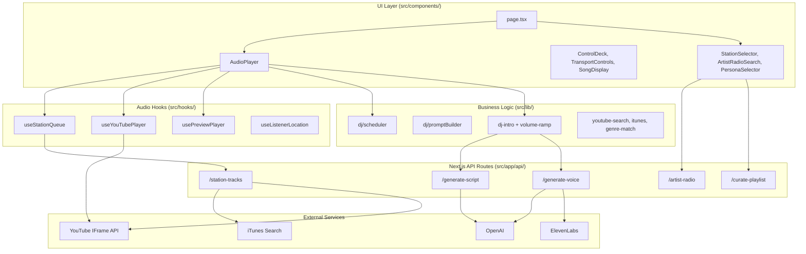
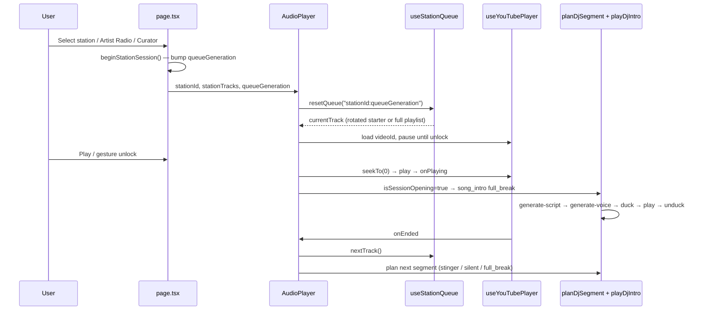
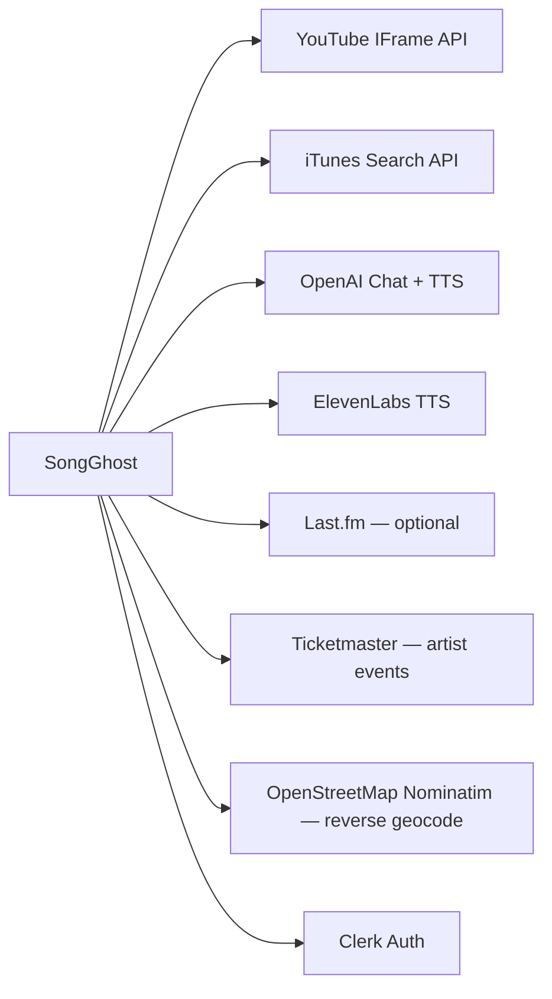

# SongGhost Architecture

SongGhost is an AI-powered broadcast radio platform built on Next.js 15. It delivers zero-gap-style continuous playback, dynamic DJ voice overlays, and multiple station launch paths (preset genres, Artist Radio, and AI Curator). This document describes how the system is structured now that **Phase 1 (Core Foundation & UI Polish) is complete**, and how interfaces are laid out for future milestones.

For milestone sequencing, see [ROADMAP.md](./ROADMAP.md).

---

## Tech Stack

| Layer | Technology |
|-------|------------|
| Framework | Next.js 15 (App Router), React 19 |
| Language | TypeScript 5.8 |
| Styling | Tailwind CSS 4 — "CA Dreamin'" warm vintage radio aesthetic |
| Auth | Clerk (`@clerk/nextjs`) |
| LLM | OpenAI GPT-4o-mini (DJ scripts, AI Curator) |
| TTS | OpenAI `tts-1` (Free tier), ElevenLabs REST (Pro tier) |
| Music sources | YouTube IFrame API, iTunes Search API (preview fallback) |
| Similar artists | Last.fm (optional) |
| Local events | Ticketmaster / artist-events API |
| Testing | Vitest (DJ scheduler unit tests) |

---

## High-Level System Diagram



---

## Architectural Principles

These guardrails are enforced across the codebase and documented in `.cursor/rules/songghost.mdc`.

1. **Audio engine isolation** — Queue logic, YouTube/preview playback, and DJ voice nodes stay decoupled. UI components glue hooks together; they do not embed playback logic.

2. **Interface-first design** — Track providers and voice providers are defined in `src/types/audio.ts` and `src/types/dj.ts`. Adapters (YouTube, Spotify, ElevenLabs, Cartesia) must remain interchangeable.

3. **Stable React dependencies** — Custom audio hooks stabilize props and callbacks in refs at the top of the hook. Raw inline arrays, objects, or unstable callbacks never appear in `useEffect` dependency arrays.

4. **Throttled failure handling** — YouTube embed failures trigger bounded retry/skip logic, not infinite loops.

5. **Phase discipline** — Phase 2+ features (sidechain engine abstraction, WebSocket streaming, Spotify SDK) are typed but not implemented until their milestone.

---

## Directory Structure

```text
src/
├── app/
│   ├── page.tsx              # Main radio console (session orchestration)
│   ├── layout.tsx            # Clerk + UserPreferences providers
│   ├── globals.css           # CA Dreamin' theme tokens
│   └── api/                  # Server-side integrations (see API Routes)
├── components/               # Presentational UI — no business logic
├── context/
│   └── UserPreferencesContext.tsx
├── data/
│   ├── stations.ts           # Preset stations + StationTrack type
│   ├── personas.ts           # The 5 standard DJ hosts (character + voice calibration)
│   ├── presets.ts
│   ├── extra-genres.ts       # Paginated genre expansion (50+)
│   └── extra-decades.ts      # Paginated decades expansion (15+)
├── hooks/
│   ├── useStationQueue.ts    # Infinite queue + replenishment
│   ├── useYouTubePlayer.ts   # YouTube IFrame API lifecycle
│   ├── usePreviewPlayer.ts   # iTunes 30s preview fallback
│   ├── usePreviewPlayer.ts
│   └── useListenerLocation.ts
├── lib/
│   ├── dj/
│   │   ├── scheduler.ts      # DJ pacing state machine (chatter levels + legacy numeric)
│   │   ├── promptBuilder.ts  # LLM prompt variety engine + era/vibe directives
│   │   └── __tests__/
│   ├── queue/
│   │   ├── builder.ts        # Era-locked candidate validation + queue assembly
│   │   └── __tests__/
│   ├── audio/
│   │   ├── mix-bus.ts        # Music/voice gain staging + master analyser tap
│   │   ├── queue-reorder.ts  # Drag-and-drop queue reordering (index-anchored)
│   │   └── __tests__/
│   ├── visuals/
│   │   ├── spectrum.ts       # Visualizer signal math + synthetic fallback drive
│   │   ├── theme-palette.ts  # Genre-adaptive palettes keyed by host
│   │   └── __tests__/
│   ├── dj-resolver.ts        # Decade/genre → host mapping for search & custom stations
│   ├── dj-intro.ts           # Script → voice → duck/unduck orchestration
│   ├── dj-script.ts          # Sanitization + TTS formatting
│   ├── volume-ramp.ts        # Smooth volume transitions
│   ├── audio-unlock.ts       # Browser autoplay unlock coordination
│   ├── youtube-search.ts     # YouTube video resolution
│   ├── youtube.ts            # Thumbnail + ID validation
│   ├── itunes.ts             # iTunes Search API adapter
│   ├── artist-radio.ts       # Artist Radio result builder
│   ├── genre-match.ts        # Station genre filtering
│   ├── station-genre-profiles.ts
│   ├── similar-artists.ts    # Last.fm integration
│   ├── artist-events.ts      # Local concert lookup
│   ├── track-quality.ts      # Artist Radio title filtering
│   ├── track-shuffle.ts      # Smart Catalog Shuffle — tiered weighted ordering + adjacency repair
│   ├── saved-stations.ts     # Personal Saved Playlists — freeze a live queue into a custom Station
│   ├── resolve-pool.ts       # Shared track-resolution pool for catalog replenishment
│   ├── played-history.ts     # Recently-played exclusion list
│   └── failed-youtube-ids.ts # Client-side failure tracking
└── types/
    ├── audio.ts              # TrackProvider, VoiceNode, DualTrackMix
    ├── dj.ts                 # DJPromptContext, DjSegmentPlan
    ├── voice.ts              # TtsProvider, VoiceOption
    ├── visuals.ts            # VisualizerMode + cycle order
    ├── station.ts            # ChatterPacing, EraLock, MemoryPreset, StationConfig
    ├── user.ts               # UserPreferences, tiers
    └── curator.ts            # AI Curator result shape
```

---

## Core Type Contracts

### Music pipeline (`src/types/audio.ts`)

| Type | Purpose |
|------|---------|
| `AudioTrack` | Canonical track shape (provider-agnostic id, title, artist, metadata) |
| `TrackProvider` | Interchangeable music adapter interface (YouTube, Spotify, iTunes, Apple Music) |
| `VolumeController` | Normalized 0–1 bus with `rampVolume()` for sidechain ducking |
| `VoiceNode` | DJ voice layer — buffered today, stream-ready for Phase 3 |
| `DualTrackMix` | Phase 2+ wiring of music + voice buses with ducking config |

Current implementation uses concrete hooks (`useYouTubePlayer`, `usePreviewPlayer`) rather than a formal `TrackProvider` class, but all new adapters should implement the interface.

### DJ pipeline (`src/types/dj.ts`)

| Type | Purpose |
|------|---------|
| `DjSegmentPlan` | Planned break: kind, tracks to announce, duration, local event |
| `DjTransitionType` | `full_break` \| `stinger` \| `silent` |
| `DJPromptContext` | Full LLM input contract including persona, pacing, era lock, vibe prompt, hyper-local context |
| `HyperLocalContext` | Phase 3 fields (time of day, weather, news) — typed, not yet injected |

### Station configuration (`src/types/station.ts`)

| Type | Purpose |
|------|---------|
| `ChatterPacing` | `talkative` \| `standard` \| `music_focused` \| `music_only` |
| `ChatterPacingProfile` | Scheduler window (`minGap`, `maxGap`, `alternateStinger`, `muted`) per level |
| `EraLock` / `EraDefinition` | Decade filter and its inclusive release-year bounds |
| `MemoryPreset` | A station parked on one of the six dial buttons |
| `StationConfig` | Per-station name, dial, host, pacing, era, and vibe overrides |
| `ResolvedStationSettings` | Station defaults + overrides + global pacing, folded into one answer |

---

## Session Lifecycle

A listening session begins when the user selects a station, launches Artist Radio, or loads an AI Curator playlist.



### Queue generation rules (`useStationQueue.ts`)

| Launch path | Station ID prefix | Queue behavior |
|-------------|-------------------|----------------|
| Preset genre/decade | (none) | Single starter drawn from the seed pool → API replenishment |
| Artist Radio | `artist-radio-` | Preserve API order; no replenishment |
| AI Curator | `ai-curator-` | Shuffle full playlist; no replenishment |

Replenishment triggers when fewer than 3 tracks remain ahead of the playhead. Preset stations call `GET /api/station-tracks` with an exclude list of recently played IDs (last 100).

### Starter rotation (`starter-history.ts`)

The opener is the track a listener judges the station on, so it must not repeat between launches. Each launch path draws from an ordered pool and then skips forward past the last `STARTER_HISTORY_LIMIT` (20) openers recorded for that station in `localStorage`.

- **Pool depth.** The 14 primary preset stations draw from `station-seeds.ts` — 38-50 verified staples each, generated by `scripts/resolve-station-seeds.mjs`. Pools have to stay deeper than the anti-repeat window, otherwise every launch past the window is forced back onto a recent opener. Stations without a deep pool fall back to their inline `tracks`.
- **Client-only.** History lives in `localStorage`, so `isStarterHistoryReady()` is false during SSR and before hydration. Treating an empty history as "nothing has played" would hand every launch the index-0 track, so both `pickStarter` and `rotateStarter` bail out of the rotation instead of pretending to have memory.
- **One draw per launch.** `resetQueue(launchKey)` collapses repeat calls for the same `stationId:queueGeneration`. StrictMode double-invokes mount effects and Fast Refresh re-runs them on every edit; without the key each of those runs would record its own opener and spend several slots of rotation memory on one launch.

---

## Audio Pipeline

### YouTube playback (`useYouTubePlayer.ts`)

The YouTube player mounts imperatively inside a hidden off-screen container. Key behaviors:

- **First-song invariant**: Pause until audio unlock → single `seekTo(0)` → play → emit `onPlaying` once per track load.
- **Audio unlock**: Coordinates with `audio-unlock.ts` via retry loop (400ms intervals, max 30 attempts).
- **Error throttling**: `onError` fires at most once per 2s; code-2 errors within 2.5s of load are ignored.
- **DJ ducking**: `duckGainRef` carries the live duck gain, which every volume sync folds in. Sync is never skipped — loading a video resets the embed to 100%, so `onReady`, load-settle, and `PLAYING` all have to re-assert the context level.

### iTunes preview fallback (`usePreviewPlayer.ts`)

When a track has no resolvable YouTube embed but has an iTunes `previewUrl`, playback switches to an HTML5 `<audio>` element. Used automatically when YouTube fails and a preview exists, or as the primary source for preview-only tracks.

### Volume ducking (`audio/mix-bus.ts` + `dj-intro.ts` + `volume-ramp.ts`)

| Parameter | Value |
|-----------|-------|
| Duck target | 18% of master volume (`DUCK_RATIO`) |
| Duck ramp in | 300ms |
| Restore ramp out | 1500ms |

Flow: fetch script → fetch voice blob → ramp music down → play voice → ramp music back up. Aborts cleanly on track skip or station change.

`mix-bus.ts` owns gain staging for both channels so "never duck the voice" is structural rather than a convention:

| Channel | Level | Ducked? |
|---------|-------|---------|
| Music | `musicGain(master, duckGain)` | Yes — the only duck target |
| Voice | `voiceGain(master)` — no duck parameter exists | Never |

The duck is a *relative* gain (1 → 0.18), not an absolute volume snapshot, so music keeps tracking the fader mid-break. `voiceGain()` holds a `MIN_VOICE_GAIN` audibility floor because TTS clips carry far more headroom than loudness-maximized music masters.

### Master analyser tap (`audio/mix-bus.ts`)

`MasterAnalyser` owns a master output `GainNode` with an `AnalyserNode` in series ahead of the destination (`fftSize` 256 → 128 bins, `smoothingTimeConstant` 0.75). It exposes read-only metering — `getFrequencyData()`, `getByteTimeDomainData()`, `getSampleRate()`, `isLive()` — so UI components can draw from the mix without reaching into the audio graph.

**What it can observe is a property of the source, not of the tap:**

| Channel | Playback path | Observable? |
|---------|---------------|-------------|
| Music | Cross-origin YouTube IFrame | **No** — Web Audio has no access to the embed |
| DJ voice | `HTMLAudioElement` on a same-origin blob URL | Yes, captured per clip by `VoiceNode` |
| SFX | Synthesized `AudioBufferSourceNode` | Available via `connect()`; `StingerEngine` still owns its own context |

Two safety rules matter here:

- **`captureMediaElement()` refuses a suspended context.** Capturing an element moves its output into the audio graph permanently, and a suspended graph plays nothing — so a tap is never worth risking a silent DJ break. `AudioPlayer.unlockBothPlayers()` resumes the graph inside the user gesture, which is what makes the capture available at all.
- **The master output sits at unity gain.** Per-channel gains upstream already carry the fader, so trimming here would both change the mix and misreport what is on air.

`ANALYSER_TAP_ENABLED` is a one-line bypass that reverts playback to pre-visualizer behavior.

---

## Visualizer

Phase 3 Step 3A. Three layers, none of which can reach the layer above it.

| Module | Responsibility |
|--------|----------------|
| `lib/audio/mix-bus.ts` | The analyser graph and raw byte frames |
| `lib/visuals/spectrum.ts` | Pure signal math — band folding, sub-bass energy, peak decay, synthetic fallback |
| `lib/visuals/theme-palette.ts` | Genre-adaptive palettes keyed by host id |
| `components/visualizer/AudioVisualizer.tsx` | Canvas render loop and the three modes |

### Modes

| Mode | Drive signal | Render |
|------|--------------|--------|
| `ambient` (default) | Sub-bass energy, 20–150Hz | Offset radial washes, asymmetric envelope (fast rise, slow fall) |
| `oscilloscope` | Byte time-domain frame | Smoothed trace between slowly-decaying peak rails |
| `spectrum` | 32 bands folded from 128 bins | Rounded bars under peak-hold caps |

Mode selection persists in `UserPreferences.visualizerMode`; an unrecognized stored value falls back rather than leaving the deck with no renderer.

### Genre-adaptive palettes

Colour is keyed to the **host**, not the station, because the host is already the resolved answer to "what is this music" — every launch path lands on a `PersonaId` through `dj-resolver`, so a station added later inherits a palette for free.

| Host | Primary | Secondary | Accent |
|------|---------|-----------|--------|
| Johnny Ray (classic rock) | `#FFBF00` | `#D4AF37` | `#990000` |
| Sloane Vance (90s alt) | `#4B0082` | `#4682B4` | `#50C878` |
| Devon Pulse (hip-hop / pop) | `#00FFFF` | `#8A2BE2` | `#FF00FF` |
| Kira Nova (EDM / synthwave) | `#FF69B4` | `#FF4500` | `#0047AB` |
| Jasper Reed (acoustic / folk) | `#B87333` | `#2E8B57` | `#FFFDD0` |

### Synthetic fallback

Because the music channel is unobservable, the analyser reports nothing between DJ breaks on a normal station. `syntheticSpectrum()` / `syntheticWaveform()` / `syntheticSubBass()` supply a deterministic, low-tilted, beat-pulsed stand-in so the canvas moves with music it cannot hear. The handover is decided per frame, so real data takes over the instant a source the graph *can* see is on air.

### Performance and lifecycle

- Animation runs on `requestAnimationFrame`, driven by one dependency-free callback so a parent re-render cannot tear the loop down mid-frame.
- The loop is **parked, not throttled**, when audio is paused, the tab is hidden (`visibilitychange`), or `prefers-reduced-motion` is set. A parked loop holds no frame request at all and paints a single resting frame.
- Byte buffers are allocated once and reused; nothing is allocated per frame.
- The backing store follows the element box and `devicePixelRatio` (capped at 2x).
- The overlay is clamped to 30–50% opacity under a `zinc-950` scrim, which is what keeps the deck's text and controls at full contrast. Canvas is `aria-hidden` and `pointer-events-none`.

---

## DJ System

### Scheduler (`src/lib/dj/scheduler.ts`)

Pure state machine — no side effects. `planDjSegment(state, input)` returns a transition, optional plan, and next state.

Two pacing inputs reach the scheduler, and `resolvePacingWindow()` reconciles them into a single `PacingWindow` (`minGap`, `maxGap`, `alternateStinger`, `muted`) that the transition is decided against.

**Chatter pacing** (`ChatterPacing`, listener-facing) takes precedence when set:

| Level | Gap between voiced breaks | Behavior |
|-------|---------------------------|----------|
| `talkative` | 1–2 tracks | Alternate `full_break` ↔ `stinger` — host on every track |
| `standard` (default) | 2–4 tracks | Jittered silent gap between full breaks |
| `music_focused` | 5–7 tracks | Long music runs |
| `music_only` | — | Host muted entirely, including the session opening |

**Pacing frequency** (`djPacingFrequency`, engine-managed) is the fallback when no chatter level is supplied. It reproduces the original window exactly — `minGap = pacing`, `maxGap = pacing + 1`, stinger alternation at pacing 1 — so callers with no station or listener setting behave as before.

**First-song invariant**: `sessionOpeningDjRef` is set `true` only on `stationId` or `queueGeneration` change — never on track advance. Track 1 always receives a `full_break` with `kind: "song_intro"`.

`music_only` is the single documented exception: a listener who muted the host asked for music with no voice on it, including the first track. Every audible pacing still guarantees the sign-on.

When `planDjSegment()` returns `silent` or `plan: null`, AudioPlayer does not force any DJ intro. Pending tracks are capped at `MAX_PENDING_TRACKS` (8) so a long muted run cannot bank an unbounded recap for whenever the host comes back.

### Prompt variety engine (`src/lib/dj/promptBuilder.ts`)

Rotates commentary styles (`station_banter`, `historical_context`, `artist_trivia`, etc.) and enforces banned opener phrases ("Fun fact:", "Did you know:", etc.). Segment-specific prompts handle recaps, up-next previews, stingers, and local concert mentions.

Two station-level directives are folded into the system prompt when active:

- **`buildEraDirective()`** — names the locked decade and its year bounds, bans anything released after it, and forbids nostalgia/throwback framing. Without this a locked station gets a period-correct playlist but a host who talks about it in retrospect. `stationIdentityLine()` repeats the era on every segment brief so it survives a long system prompt.
- **`buildVibeDirective()`** — the listener's free-text station direction, quoted and length-capped, told to colour tone rather than be read aloud. Bounded rather than pasted in as an instruction so it cannot override the segment brief or the station identity rules.

### Script → voice pipeline

```text
AudioPlayer.onPlaying
  → planDjSegment()
  → playDjIntro()
      → POST /api/generate-script  (GPT-4o-mini)
      → POST /api/generate-voice   (OpenAI tts-1 or ElevenLabs)
      → HTMLAudioElement + volume ramps
```

Pro users (`userTier === "Pro"`) receive ElevenLabs voices; Free tier uses OpenAI TTS. Each host in `src/data/personas.ts` carries its own `elevenLabsVoiceId` plus the shared `STANDARD_VOICE_SETTINGS` calibration (`stability` 0.50, `similarity_boost` 0.75, `style` 0.15), so a station change never alters how hot the voice channel runs. `ELEVENLABS_VOICE_MAP` in `src/types/voice.ts` now only backs the voice previews, which carry no persona.

---

## Station Personalization

Phase 3 Step 3B. Listener edits are stored **by station id** in `UserPreferences.stationConfigs` rather than folded into the station itself, so a preset keeps shipping its authored defaults and any override can be cleared back to them. All contracts live in `src/types/station.ts`, which is deliberately dependency-light — the DJ scheduler imports its pacing profiles, and the `Station` re-exports are type-only so nothing drags station data into the engine.

| Contract | Purpose |
|----------|---------|
| `ChatterPacing` + `CHATTER_PACING_PROFILES` | The four talk-density levels and their scheduler windows |
| `EraLock` + `ERA_DEFINITIONS` | Decade filter with inclusive release-year bounds |
| `MemoryPreset` / `MemoryPresetList` | The six dial buttons, length-locked |
| `StationConfig` / `StationConfigMap` | Per-station name, dial, host, pacing, era, and vibe overrides |
| `resolveStationSettings()` | Folds station defaults + overrides + global pacing into one answer |

`page.tsx` calls `resolveStationSettings()` once per render and feeds the result to `ControlDeck`, `AudioPlayer`, and the carousel cards, so there is a single place where precedence is decided.

### Dial memory presets (`components/MemoryToolbar.tsx`)

Six numbered buttons under the deck. Tap tunes; long-press (600ms), right-click, or the arm-then-tap toggle parks the live station. Only preset and saved stations can be parked — artist radio and curator stations are generated per launch and exist nowhere the toolbar could look them up again, so assignment is disabled for them.

`normalizeMemoryPresets()` forces any persisted value back to a fixed six-slot array and rewrites each `slot` from its position. The toolbar indexes straight into this list, so a short, sparse, or reordered array from an older build would otherwise render `undefined` buttons. Deleting a saved station sweeps its dial button and its override entry with it.

### Era locking

Validation is strict: a track with **no known release year is rejected**, not assumed to fit. A "90s Only" station that quietly leaks undated tracks is worse than a shorter one that does not.

| Stage | Behavior under a lock |
|-------|-----------------------|
| `/api/station-tracks` | Sources from iTunes only — YouTube search results carry no release date, so there is nothing to validate them against |
| `resolveTracksInParallel` | Year checked *before* the YouTube resolve, so an off-era candidate never costs a lookup |
| Candidate pool | Dug 6× deeper than the target, since the filter discards most of what iTunes returns |
| Catalog cache | Keyed `stationId::eraLock` — each era is a different catalog |
| `useStationQueue` replenish | Re-filters client-side; the 15-minute cache and the seed fallback both predate the filter |
| Preset station opener | Seed pools are skipped entirely — seeds carry no year, so every one fails validation |
| Fixed playlists (saved / artist / curator) | Filtered, but never to empty — there is no catalog behind them to refill from |

`src/lib/queue/builder.ts` owns the pure half: `parseReleaseYear()`, `isYearWithinEra()`, `filterTracksByEra()`, `partitionTracksByEra()`, and `buildEraFilteredQueue()` (filter first, then weighted ordering, so removing off-era tracks cannot reopen an artist adjacency the shuffle just closed).

### Host overrides

Any station can be reassigned to any of the five hosts from the card's DJ badge popover or the settings drawer. A swap on the live station takes effect on the next break. The popover is rendered outside the card's `<button>` — a nested trigger is invalid markup and swallows its own clicks.

### Station Edit Drawer (`components/StationEditDrawer.tsx`)

Right-side drawer carrying name, dial frequency, host override, chatter pacing, era lock, custom vibe prompt, and the save-to-preset picker. Saving an era change on the **live** station re-tunes it: the era decides what the catalog may return, so the queue behind it is now wrong.

---

## Launch Paths

### 1. Preset stations

Static station definitions in `src/data/stations.ts` plus `src/data/extra-genres.ts` (50+ genres with pagination) and `src/data/extra-decades.ts` (15+ decades with pagination). Each station has seed tracks, a default persona, accent color, and FM frequency.

Catalog depth is expanded at runtime via `/api/station-tracks`, which:

1. Searches YouTube with genre-specific queries
2. Falls back to iTunes catalog search when YouTube results are thin
3. Resolves iTunes songs to YouTube IDs or preview URLs
4. Caches full catalogs for 15 minutes per station

### 2. Artist Radio

`GET /api/artist-radio?artist=...&mode=mixed|artist-only`

- Resolves artist via iTunes Search
- Builds primary track list (strict artist match)
- In `mixed` mode, interleaves similar artists from Last.fm (2 primary : 1 similar)
- Falls back to iTunes 30s previews when YouTube embeds fail
- Promotes a preview-capable track to lead position when the first YouTube-only track would fail silently

Station ID format: `artist-radio-{slug}`.

### 3. AI Curator

`POST /api/curate-playlist` — user prompt → GPT-4o-mini returns station name, persona, accent color, and 10 real songs. Tracks are resolved to YouTube IDs server-side before launch.

Station ID format: `ai-curator-{slug}`.

---

## API Routes

| Route | Method | Purpose |
|-------|--------|---------|
| `/api/generate-script` | POST | LLM DJ script from segment plan + persona |
| `/api/generate-voice` | POST | TTS audio blob (OpenAI or ElevenLabs) |
| `/api/station-tracks` | GET | Infinite catalog replenishment for preset stations |
| `/api/artist-radio` | GET | Build Artist Radio playlist |
| `/api/artist-suggest` | GET | Artist name autocomplete |
| `/api/artist-events` | GET | Local concert lookup for DJ mentions |
| `/api/curate-playlist` | POST | AI Curator station generation |
| `/api/song-search` | GET | On-demand song search for queue insertion |

All routes requiring LLM/TTS keys return 500 when env vars are missing. Keys are server-side only (`OPENAI_API_KEY`, `ELEVENLABS_API_KEY`, `LASTFM_API_KEY`, etc.).

---

## UI Composition

The main console (`src/app/page.tsx`) is a two-column layout:

- **Control deck** (left): Now playing, progress bar, persona selector, transport, volume knob, VU meter
- **Station scroll area** (right): Artist Radio search + genre station grid

`AudioPlayer` is the sole integration point for audio. It exposes an imperative handle:

```typescript
type AudioPlayerHandle = {
  skipNext / skipPrev
  unlockAudio
  getQueue / removeTrack / insertTrackNext / appendTrack
};
```

Components under `src/components/` are presentational. They receive callbacks from `page.tsx` and do not call API routes directly (except modals that initiate searches before session launch).

---

## State Management

| State | Location | Persistence |
|-------|----------|-------------|
| Session (station, playing, volume, queue) | `page.tsx` local state | Session only |
| User preferences (persona, pacing, tier, likes, history) | `UserPreferencesContext` | `localStorage` keyed by Clerk userId or guest |
| Dial memory presets + per-station overrides | `UserPreferencesContext` (`memoryPresets`, `stationConfigs`) | `localStorage`, normalized on load |
| Listener location | `useListenerLocation` | `sessionStorage` |
| DJ scheduler state | `AudioPlayer` ref | Session only |
| Failed YouTube IDs | `failed-youtube-ids.ts` | In-memory per session |

Clerk middleware (`src/middleware.ts`) wraps all routes. Auth is available but the app functions for guest users with local preference storage.

---

## Error Handling & Resilience

| Failure | Behavior |
|---------|----------|
| YouTube embed error | Record failed ID; retry with iTunes preview if available; else remove track after 400ms throttle |
| 5 consecutive playback errors | Halt auto-advance |
| DJ intro failure | Log warning; restore volume; continue music |
| Track skip during intro | AbortController cancels fetch + voice playback |
| Replenish API failure | Log warning; queue may exhaust (triggers urgent re-fetch on next advance) |
| Local event lookup timeout | 2.5s race; DJ segment proceeds without local mention |

---

## External Service Dependencies



---

## Testing

| Scope | Tool | Location |
|-------|------|----------|
| DJ scheduler state machine | Vitest | `src/lib/dj/__tests__/scheduler.test.ts` |
| DJ prompt variety engine | Vitest | `src/lib/dj/__tests__/promptBuilder.test.ts` |
| Smart Catalog Shuffle (tiering, ordering, adjacency repair) | Vitest | `src/lib/__tests__/track-shuffle.test.ts` |
| Personal Saved Playlists | Vitest | `src/lib/__tests__/saved-stations.test.ts` |
| DJ host roster + genre resolver | Vitest | `src/lib/__tests__/dj-resolver.test.ts` |
| Script guardrails (station identity, persona voice) | Vitest | `src/lib/dj/__tests__/systemPrompt.test.ts` |
| Drag-and-drop queue reordering | Vitest | `src/lib/audio/__tests__/queue-reorder.test.ts` |
| Artist events / local concert lookup | Vitest | `src/lib/__tests__/artist-events.test.ts` |
| Master analyser tap (graph, capture safety, metering) | Vitest | `src/lib/audio/__tests__/master-analyser.test.ts` |
| Visualizer signal math + synthetic fallback | Vitest | `src/lib/visuals/__tests__/spectrum.test.ts` |
| Genre-adaptive palettes | Vitest | `src/lib/visuals/__tests__/theme-palette.test.ts` |
| Chatter pacing levels + host mute | Vitest | `src/lib/dj/__tests__/chatter-pacing.test.ts` |
| Era + vibe prompt directives | Vitest | `src/lib/dj/__tests__/era-prompt.test.ts` |
| Era-locked candidate validation | Vitest | `src/lib/queue/__tests__/builder.test.ts` |
| Station config, memory presets, era/pacing contracts | Vitest | `src/types/__tests__/station.test.ts` |
| Smoke test (build + routes) | Node script | `scripts/smoke-test.mjs` |

Run: `npm test` / `npm run smoke-test`.

---

## Phase Roadmap Alignment

The type system anticipates future milestones without implementing them yet.

| Phase | Architectural addition | Status |
|-------|------------------------|--------|
| **1** | Preset queues, DJ pacing, prompt variety, iTunes fallback, engine hardening, Smart Catalog Shuffle (`track-shuffle.ts`), drag-and-drop queue reordering (`audio/queue-reorder.ts`), Personal Saved Playlists (`saved-stations.ts`), Charcoal & Off-White UI refactor | ✅ Completed |
| **2** | Formal `TrackProvider` / `VoiceNode` adapters, `DualTrackMix`, prefetch 20s before track end, stinger SFX | Typed in `audio.ts`; ducking uses ad-hoc ramps today |
| **3** | Step 3A — audio-reactive canvas visualizer (`components/visualizer/`), master analyser tap, genre-adaptive palettes (`lib/visuals/`) | ✅ Completed |
| **3** | Step 3B — station personalization: dial memory presets (`components/MemoryToolbar.tsx`), chatter pacing, host overrides, era-locked vibe editor (`components/StationEditDrawer.tsx`, `types/station.ts`, `lib/queue/builder.ts`) | ✅ Completed |
| **3** | Cartesia/ElevenLabs WebSocket streaming (`VoiceDeliveryMode: "stream"`), `HyperLocalContext` injection, phoneme dictionary | Typed in `audio.ts` / `dj.ts` |
| **4** | Spotify Web Playback SDK, DJ Studio Builder, voice cloning, public station URLs | Not started |
| **5** | Ghost Studio Web Console (`/studio`), WebRTC live mic input + automatic sidechain ducking, Session Manifest Engine (server-side voice-stem recording + JSON timestamp logs), archived "Live Ghost" playback sync, Stripe Connect creator micro-subscriptions | Not started |
| **6** | Media Session API, PWA background audio, CarPlay/Android Auto | Not started |

When implementing Phase 2+, migrate `useYouTubePlayer` and `playDjIntro` behind `TrackProvider` and `VoiceNode` implementations in `src/lib/audio/` (already home to `queue-reorder.ts`) rather than expanding component logic.

---

## Key Invariants (Do Not Regress)

1. **First-song playback**: YouTube pause → unlock → `seekTo(0)` → play → single `tryEmitOnPlaying()` per load.
2. **`sessionOpeningDjRef`**: Set only on `stationId` / `queueGeneration` change, never on `videoId` advance.
3. **Track 1 DJ**: Always `full_break` / `song_intro` with `isSessionOpening: true`. The sole exception is `chatterPacing: "music_only"`, which mutes the host outright.
4. **Silent segments**: No forced DJ intro when scheduler returns `silent` or `plan: null`.
5. **Hook stability**: Stabilize callbacks and props in refs inside audio hooks; never put unstable values in effect deps.
6. **Duck timing**: 18% over 300ms in; 100% over 1500ms out.
7. **Analyser capture safety**: Never reroute a media element into a suspended audio graph — a visualization is not worth a silent break. The visualizer's animation loop parks (holds no frame request) when audio is paused, the tab is hidden, or reduced motion is requested.
8. **Era strictness**: An active era lock rejects any candidate without a confirmed release year. Never assume an undated track fits the decade.
9. **Memory preset shape**: `memoryPresets` is always exactly six entries. Normalize any persisted value before indexing into it.

---

## Environment Variables

| Variable | Required for |
|----------|--------------|
| `OPENAI_API_KEY` | DJ scripts, AI Curator, OpenAI TTS |
| `ELEVENLABS_API_KEY` | Pro-tier TTS |
| `LASTFM_API_KEY` | Artist Radio similar-artist mixing |
| Clerk keys | Auth (from Clerk dashboard) |

Ticketmaster and other event API keys are configured in `src/lib/artist-events.ts` when available.
